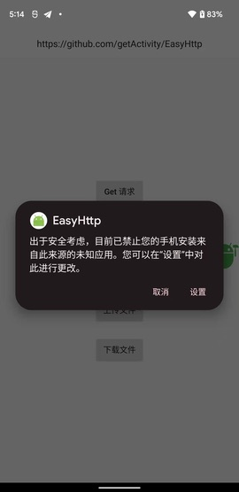
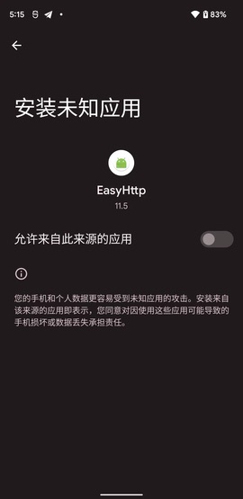
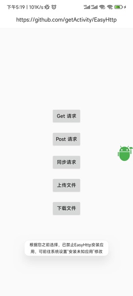

#### 目录

* [Android 11 定位权限适配](#android-11-定位权限适配)

* [Android 11 存储权限适配](#android-11-存储权限适配)

* [什么情况下需要适配分区存储特性](#什么情况下需要适配分区存储特性)

* [Android 11 授予了安装权限之后为什么应用重启了](#android-11-授予了安装权限之后为什么应用重启了)

* [为什么授予了存储权限但是权限设置页还是显示未授权](#为什么授予了存储权限但是权限设置页还是显示未授权)

* [我想在申请前和申请后统一弹对话框该怎么处理](#我想在申请前和申请后统一弹对话框该怎么处理)

* [如何在回调中知道哪些权限被永久拒绝了](#如何在回调中知道哪些权限被永久拒绝了)

* [为什么不兼容 Android 6.0 以下的危险权限申请](#为什么不兼容-android-60-以下的危险权限申请)

* [新版框架为什么移除了自动申请清单权限的功能](#新版框架为什么移除了自动申请清单权限的功能)

* [新版框架为什么移除了不断申请权限的功能](#新版框架为什么移除了不断申请权限的功能)

* [新版框架为什么移除了国产手机权限设置页功能](#新版框架为什么移除了国产手机权限设置页功能)

* [为什么不用 ActivityResultContract 来申请权限](#为什么不用-activityresultcontract-来申请权限)

* [怎么处理权限请求成功但是返回空白通行证的问题](#怎么处理权限请求成功但是返回空白通行证的问题)

* [为什么授权了还是无法访问 Android/data 目录下的文件](#为什么授权了还是无法访问-android-data-目录下的文件)

* [跳过安装权限申请然后直接安装 apk 会有什么问题吗](#跳过安装权限申请然后直接安装-apk-会有什么问题吗)

* [如何应对国内某些应用商店在明确拒绝权限后 48 小时内不允许再次申请的问题](#如何应对国内某些应用商店在明确拒绝权限后-48-小时内不允许再次申请的问题)

#### Android 11 定位权限适配

* 在 Android 10 上面，定位权限被划分为前台权限（精确和模糊）和后台权限，而到了 Android 11 上面，需要分别申请这两种权限，如果同时申请这两种权限会**惨遭系统无情拒绝**，连权限申请对话框都不会弹，立马被系统拒绝，直接导致定位权限申请失败。

* 如果你使用的是 **XXPermissions** 最新版本，那么**恭喜你**，直接将前台定位权限和后台定位权限全部传给框架即可，框架已经自动帮你把这两种权限分开申请了，整个适配过程**零成本**。

* 但是需要注意的是：申请过程分为两个步骤，第一步是申请前台定位权限，第二步是申请后台定位权限，用户必须要先同意前台定位权限才能进入后台定位权限的申请。同意前台定位权限的方式有两种：勾选 `仅在使用该应用时允许` 或 `仅限这一次`，而到了后台定位权限申请中，用户必须要勾选 `始终允许`，只有这样后台定位权限才能申请通过。

* 还有如果你的应用只需要在前台使用定位功能， 而不需要在后台中使用定位功能，那么请不要连带申请 `Permission.ACCESS_BACKGROUND_LOCATION` 权限。

 

#### Android 11 存储权限适配

* 如果你的项目需要适配 Android 11 存储权限，那么需要先将 targetSdkVersion 进行升级

```groovy
android 
    defaultConfig {
        targetSdkVersion 30
    }
}
```

* 再添加 Android 11 存储权限注册到清单文件中

```xml
<uses-permission android:name="android.permission.MANAGE_EXTERNAL_STORAGE" />
```

* 需要注意的是，旧版的存储权限也需要在清单文件中注册，因为在低于 Android 11 的环境下申请存储权限，框架会自动切换到旧版的申请方式

```xml
<uses-permission android:name="android.permission.READ_EXTERNAL_STORAGE" />
<uses-permission android:name="android.permission.WRITE_EXTERNAL_STORAGE" />
```

* 还需要在清单文件中加上这个属性，否则在 Android 10 的设备上将无法正常读写外部存储上的文件

```xml
<application
    android:requestLegacyExternalStorage="true">
```
    
* 最后直接调用下面这句代码

```java
XXPermissions.with(MainActivity.this)
        // 适配 Android 11 分区存储这样写
        //.permission(Permission.Group.STORAGE)
        // 不适配 Android 11 分区存储这样写
        .permission(Permission.MANAGE_EXTERNAL_STORAGE)
        .request(new OnPermissionCallback() {

            @Override
            public void onGranted(@NonNull List<String> permissions, boolean allGranted) {
                if (allGranted) {
                    toast("获取存储权限成功");
                }
            }
        });
```


#### 什么情况下需要适配分区存储特性

* 如果你的应用需要上架 GooglePlay，那么需要详细查看：[谷歌应用商店政策（需要翻墙）](https://support.google.com/googleplay/android-developer/answer/9956427)、[Google Play 通知](https://developer.android.google.cn/training/data-storage/manage-all-files#all-files-access-google-play)

* 分区存储的由来：谷歌之前收到了很多用户投诉，说很多应用都在 SD 卡下创建目录和文件，导致用户管理手机文件非常麻烦（强迫症的外国网友真多，哈哈），所以在 Android 10 版本更新中，谷歌要求所有开发者将媒体文件存放在自己内部目录或者 SD 卡内部目录中，不过谷歌在一版本上采取了宽松政策，在清单文件中加入 `android:requestLegacyExternalStorage="true"` 即可跳过这一特性的适配，不过在 Android 11 上面，你有两种选择：

    1. 适配分区存储：这个是谷歌推荐的一种方式，但是会增加工作量，因为分区存储适配起来十分麻烦，我个人感觉是这样的。不过对于一些特定应用，例如文件管理器、备份和恢复应用、防病毒应用、文档管理应用、设备上的文件搜索、磁盘和文件加密、设备到设备数据迁移等这类应用它们就一定需要用到外部存储，这个时候就需要用第二种方式来实现了。

    2. 申请外部存储权限：这个是谷歌不推荐的一种方式，只需要 `MANAGE_EXTERNAL_STORAGE` 权限即可，适配起来基本无压力，但是会存在一个问题，就是上架谷歌应用市场的时候，要经过 Google Play 审核和批准。

* 这两种总结下来，我觉得各有好坏，不过我可以跟大家谈谈我的看法

    1. 如果你的应用需要上架谷歌应用市场，需要尽快适配分区存储，因为谷歌这次来真的了

    2. 如果你的应用只上架国内的应用市场，并且后续也没有上架谷歌应用市场的需要，那么你也可以直接申请 `MANAGE_EXTERNAL_STORAGE` 权限来读写外部存储

#### Android 11 授予了安装权限之后为什么应用重启了

* [Android 11 特性调整，安装外部来源应用需要重启 App](https://cloud.tencent.com/developer/news/637591)

* 先说结论，这个问题是 Android 11 的新特性，并非框架的问题导致的，当然这个问题是没有办法规避的，因为应用是被系统杀死的，应用的等级肯定不如系统的高，目前行业对这块也没有解决方案，如果你有好的解决方案，欢迎你提供给我。

* 另外经过实践，这个问题在 Android 12 上面已经不会再出现，证明问题已经被谷歌修复了。

#### 为什么授予了存储权限但是权限设置页还是显示未授权

* 首先我需要先纠正大家一个错误的想法，`READ_EXTERNAL_STORAGE`、`WRITE_EXTERNAL_STORAGE` 这两个权限和 `MANAGE_EXTERNAL_STORAGE` 权限是两码事，虽然都叫存储权限，但是属于两种完全不同的权限，你如果申请的是 `MANAGE_EXTERNAL_STORAGE` 权限，并且授予了权限，但是在权限设置页并没有看到已授予，请注意这种情况是正常的，因为你在权限设置页看到的是存储授予状态是 `READ_EXTERNAL_STORAGE`、`WRITE_EXTERNAL_STORAGE` 权限状态的，而不是 `MANAGE_EXTERNAL_STORAGE` 权限状态的，但是这个时候已经获取到存储权限了，你大可不必管权限设置页显示的权限状态，直接读写文件即可，不会有权限问题的。

* 还有一个问题，为什么只在 Android 11 以上的设备出现？首先 `MANAGE_EXTERNAL_STORAGE` 权限是 Android 11 才有权限，Android 10 及之前的版本是没有这个权限的，你如果在低版本设备上申请了 `MANAGE_EXTERNAL_STORAGE` 权限，那么框架会帮你做向下兼容，会自动帮你替换成 `READ_EXTERNAL_STORAGE`、`WRITE_EXTERNAL_STORAGE` 权限去申请，这个时候你看到权限设置页的存储权限状态肯定是正常的，这就是为什么你只在 Android 11 以上的设备才会看到这个问题。

#### 我想在申请前和申请后统一弹对话框该怎么处理

* 框架内部有提供一个拦截器接口，通过实现框架中提供的 [IPermissionInterceptor](/library/src/main/java/com/hjq/permissions/IPermissionInterceptor.java) 接口即可，具体实现可参考 Demo 中提供的 [PermissionInterceptor](app/src/main/java/com/hjq/permissions/demo/PermissionInterceptor.java) 类，建议下载源码后进行阅读，再将代码引入到项目中

* 使用拦截的方式也很简单，具体有两种设置方式，一种针对局部设置，另外一种是全局设置

```java
XXPermissions.with(this)
        .permission(Permission.XXX)
        // 设置权限请求拦截器（局部设置）
        .interceptor(new PermissionInterceptor())
        .request(new OnPermissionCallback() {

            @Override
            public void onGranted(@NonNull List<String> permissions, boolean allGranted) {
                ......
            }

            @Override
            public void onDenied(@NonNull List<String> permissions, boolean doNotAskAgain) {
                ......
            }
        });
```

```java
public class XxxApplication extends Application {

    @Override
    public void onCreate() {
        super.onCreate();
        
        // 设置权限请求拦截器（全局设置）
        XXPermissions.setInterceptor(new PermissionInterceptor());
    }
}
```

#### 如何在回调中知道哪些权限被永久拒绝了

* 需求场景：假设同时申请日历权限和录音权限，结果都被用户拒绝了，但是这两组权限中有一组权限被永久拒绝了，如何判断某一组权限有没有被永久拒绝？这里给出代码示例：

```java
XXPermissions.with(this)
        .permission(Permission.RECORD_AUDIO)
        .permission(Permission.Group.CALENDAR)
        .request(new OnPermissionCallback() {

            @Override
            public void onGranted(@NonNull List<String> permissions, boolean allGranted) {
                if (allGranted) {
                    toast("获取录音和日历权限成功");
                }
            }

            @Override
            public void onDenied(@NonNull List<String> permissions, boolean doNotAskAgain) {
                if (doNotAskAgain && permissions.contains(Permission.RECORD_AUDIO) &&
                        XXPermissions.isDoNotAskAgainPermissions(MainActivity.this, Permission.RECORD_AUDIO)) {
                    toast("录音权限请求被拒绝了，并且用户勾选了不再询问");
                }
            }
        });
```

#### 为什么不兼容 Android 6.0 以下的危险权限申请

* 因为 Android 6.0 以下的危险权限管理是手机厂商做的，那个时候谷歌还没有统一危险权限管理的方案，所以就算我们的应用没有适配也不会有任何问题，因为手机厂商对这块有自己的处理，但是有一点是肯定的，就算用户拒绝了授权，也不会导致应用崩溃，只会返回空白的通行证。

* 如果 **XXPermissions** 做这块的适配也可以做到，通过反射系统服务 AppOpsManager 类中的字段即可，但是并不能保证权限判断的准确性，可能会存在一定的误差，其次是适配的成本太高，因为国内手机厂商太多，对这块的改动参差不齐。

* 考虑到 Android 6.0 以下的设备占比很低，后续也会越来越少，会逐步退出历史的舞台，所以我的决定是不对这块做适配。

#### 新版框架为什么移除了自动申请清单权限的功能

> [【issue】建议恢复跳转权限设置页和获取AndroidManifest的所有权限两个实用功能](https://github.com/getActivity/XXPermissions/issues/54)

* 获取清单权限并申请的功能，这个虽然非常方便，但是存在一些隐患，因为 apk 中的清单文件最终是由多个 module 的清单文件合并而成，会变得不可控，这样会使我们无法预估申请的权限，并且还会掺杂一些不需要的权限，所以经过慎重考虑移除该功能。

#### 新版框架为什么移除了不断申请权限的功能

> [【issue】关于拒绝权限后一直请求获取的优化问题](https://github.com/getActivity/XXPermissions/issues/39)

* 假设用户拒绝了权限，如果框架再次申请，那么用户会授予的可能性也是比较小，同时某些应用商店已经禁用了这种行为，经过慎重考虑，对这个功能相关的 API 进行移除。

* 如果你还想用这种方式来申请权限，其实并不是没有办法，可以参考以下方式来实现

```java
public class PermissionActivity extends AppCompatActivity implements OnPermissionCallback {

    @Override
    public void onClick(View view) {
        requestCameraPermission();
    }

    private void requestCameraPermission() {
        XXPermissions.with(this)
                .permission(Permission.CAMERA)
                .request(this);
    }

    @Override
    public void onGranted(@NonNull List<String> permissions, boolean allGranted) {
        if (allGranted) {
            toast("获取拍照权限成功");
        }
    }

    @Override
    public void onDenied(@NonNull List<String> permissions, boolean doNotAskAgain) {
        if (doNotAskAgain) {
            toast("被永久拒绝授权，请手动授予拍照权限");
            // 如果是被永久拒绝就跳转到应用权限系统设置页面
            XXPermissions.startPermissionActivity(MainActivity.this, permissions);
        } else {
            requestCameraPermission();
        }
    }
    
    @Override
    protected void onActivityResult(int requestCode, int resultCode, @Nullable Intent data) {
        super.onActivityResult(requestCode, resultCode, data);
        if (requestCode != XXPermissions.REQUEST_CODE) {
            return;
        }
        toast("检测到你刚刚从权限设置界面返回回来");
    }
}
```

#### 新版框架为什么移除了国产手机权限设置页功能

> [【issue】权限拒绝并不再提示的问题](https://github.com/getActivity/XXPermissions/issues/99)

> [【issue】小米手机权限拒绝后，库中判断的小米权限设置界面开启无效](https://github.com/getActivity/XXPermissions/issues/38)

> [【issue】正常申请存储权限时，永久拒绝，然后再应用设置页开启权限询问，系统权限申请弹窗未显示](https://github.com/getActivity/XXPermissions/issues/100)

* **XXPermissions** 9.0 及之前是有存在这一功能的，但是我在后续的版本上面将这个功能移除了，原因是有很多人跟我反馈这个功能其实存在很大的缺陷，例如在一些华为新机型上面可能跳转的页面不是应用的权限设置页，而是所有应用的权限管理列表界面。

* 其实不止华为有问题，小米同样有问题，有很多人跟我反馈过同一个问题，**XXPermissions** 跳转到国产手机权限设置页，用户正常授予了权限之后返回仍然检测到权限仍然是拒绝的状态，这个问题反馈的次数很多，但是迟迟不能排查到原因，终于在最后一次得到答案了，[有人](https://github.com/getActivity/XXPermissions/issues/38)帮我排查到是 miui 优化开关的问题（小米手机 ---> 开发者选项 ---> 启用 miui 优化），那么问题来了，这个开关有什么作用？是如何影响到 **XXPermissions** 的？


* 首先这个问题要从 **XXPermissions** 跳转到国产手机设置页的原理讲起，从谷歌提供的原生 API 我们最多只能跳转到应用详情页，并不能直接跳转到权限设置页，而需要用户在应用详情页再次点击才能进入权限设置页。如果从用户体验的角度上看待这个问题，肯定是直接跳转到权限设置页是最好的，但是这种方式是不受谷歌支持的，当然也有方法实现，网上都有一个通用的答案，就是直接捕获某个品牌手机的权限设置页 `Activity` 包名然后进行跳转。这种想法的起点是好的，但是存在许多问题，并不能保证每个品牌的所有机型都能适配到位，手机产商更改这个 `Activity` 的包名的次数和频率比较高，在最近发布的一些新的华为机型上面几乎已经全部失效，也就是 `startActivity` 的时候会报 `ActivityNotFoundException` 或 `SecurityException` 异常，当然这些异常是可以被捕捉到的，但是仅仅只能捕获到崩溃，一些非崩溃的行为我们并不能从中得知和处理，例如我刚刚讲过的华为和小米的问题，这些问题并不能导致崩溃，但是会导致功能出现异常。

* 而 miui 优化开关是小米工程师预留的切换 miui 和原生的功能开关，例如在这个开关开启的时候，在应用详情页点击权限管理会跳转到小米的权限设置页，如果这个开关是关闭状态（默认是开启状态），在应用详情页点击权限管理会跳转到谷歌原生的权限设置页，具体效果如图：


* 最大的问题在于：这两个界面是不同的 Activity，一个是小米定制的权限设置页，第二个是谷歌原生的权限设置页，当 miui 优化开启的时候，在小米定制的权限设置页授予权限才能有效果，当这个 miui 优化关闭的时候，在谷歌原生的权限设置页授予权限才能有效果。而跳转到国产手机页永远只会跳转到小米定制的那个权限设置页，所以就会导致当 miui 优化关闭的时候，使用代码跳转到小米权限设置页授予了权限之后返回仍然显示失败的问题。

* 有人可能会说，解决这个问题的方式很简单，判断 miui 优化开关，如果是开启状态就跳转到小米定制的权限设置页，如果是关闭状态就跳转到谷歌原生的权限设置页，这样不就可以了？其实这个解决方案我也有尝试过，我曾委托联系到在小米工作的 miui 工程师，也有人帮我反馈这个问题给小米那边，最后得到答复都是一致的。


* 另外值得一提的是 [Android 11 对软件包可见性进行了限制](https://developer.android.google.cn/about/versions/11/privacy/package-visibility)，所以这种跳包名的方式在未来将会完全不可行。

* 最终决定：这个功能的出发点是好的，但是我们没办法做好它，经过慎重考虑，决定将这个功能在 [9.2](https://github.com/getActivity/XXPermissions/releases/tag/9.2) 及之后的版本进行移除。

#### 为什么不用 ActivityResultContract 来申请权限

> [【issue】是否有考虑 onActivityResult 回调的权限申请切换成 ActivityResultContract](https://github.com/getActivity/XXPermissions/issues/103)

* ActivityResultContract 是 Activity `1.2.0-alpha02` 和 Fragment `1.3.0-alpha02` 中新追加的新 API，有一定的使用门槛，必须要求项目是基于 AndroidX，并且 AndroidX 的版本还要是 `1.3.0-alpha01` 以上才可以，如果替换成 `ActivityResultContract` 来实现，那么就会导致一部分开发者用不了 **XXPermissions**，这是一个比较严重的问题，但实际上换成 ActivityResultContract 来实现本身没有带来任何的效益，例如我之前解决过的 Fragment 屏幕旋转及后台申请的问题，所以更换的意义又在哪里呢？有人可能会说官方已经将 onActivityResult 标记成过时，大家不必担心，之所以标记成过时只不过是谷歌为了推广新技术，但是可以明确说，官方是一定不会删掉这个 API 的，更准确来说是一定不敢，至于为什么？大家可以去看看 ActivityResultContract 是怎么实现的？它也是通过重写 Activity 的 `onActivityResult`、`onRequestPermissionsResult` 方法回调实现的，具体大家可以去看 `androidx.activity.ComponentActivity` 类中这两个方法的实现就会明白了，这里不再赘述。

#### 怎么处理权限请求成功但是返回空白通行证的问题

* 此问题无解，权限请求框架只能帮你申请权限，至于你申请权限做什么操作，框架无法知道，也无法干预，还有返回空白通行证是厂商自己的行为，目的就是为了保护用户的隐私，因为在某些应用上面不给权限就不能用，返回空白通行证是为了规避这种情况的发生。你要问我怎么办？我只能说胳膊拗不过大腿，别做一些无谓的抵抗。

#### 为什么授权了还是无法访问 Android/data 目录下的文件

* 首先无论你申请了哪种存储权限，在 Android 11 上面就是无法直接读取 Android/data 目录的，这个是 Android 11 上的新特性，需要你进行额外适配，具体适配流程可以参考这个开源项目 [https://github.com/getActivity/AndroidVersionAdapter](https://github.com/getActivity/AndroidVersionAdapter)

#### 跳过安装权限申请然后直接安装 apk 会有什么问题吗

* 有细心的同学可能发现了，不需要安装权限也可以直接调起安装 apk，那我为什么还要申请 `REQUEST_INSTALL_PACKAGES` 权限？这不是脱裤子放屁，多此一举吗？

* 在这里我想说的是，并不是你想象的那样，接下来让我们试验一下，这里选用了 `Google piexl 3XL（Android 12）` 和 `小米手机 12（Android 12）` 分别做一下测试

```java
Intent intent = new Intent(Intent.ACTION_VIEW);
Uri uri;
if (Build.VERSION.SDK_INT >= Build.VERSION_CODES.N) {
    uri = FileProvider.getUriForFile(context, context.getPackageName() + ".provider", file);
} else {
    uri = Uri.fromFile(file);
}

intent.setDataAndType(uri, "application/vnd.android.package-archive");
intent.addFlags(Intent.FLAG_ACTIVITY_NEW_TASK);
intent.addFlags(Intent.FLAG_GRANT_READ_URI_PERMISSION | Intent.FLAG_GRANT_WRITE_URI_PERMISSION);
context.startActivity(intent);
```

 

 

* 看到这里，我相信大家已经发现了一些差异，同样是跳转到安装 apk 页面，在 Android 原生系统上面，会显示 `取消` 和 `设置` 的选项，点击 `取消` 的选项会取消安装，只有点击 `设置` 的选项，才会让你授予安装包权限，授予了才能进行安装，而在 miui 上面，会显示 `允许` 和 `禁止` 的选项，另外还有一个 `记住我的选择` 的选项，如果用户勾选了这个 `记住我的选择` 并且点击了 `禁止` 的选项，那么应用下次跳转到安装 apk 页面会被系统直接拒绝，并且只会显示一个 toast 提示，问题结论是：可以直接跳转到安装 apk 页面，但是不建议那么做，因为在有些手机上面，系统可能会直接拒绝这个安装 apk 的请求，所以标准的写法应该是，先判断有没有安装权限，没有的话就申请，有的话再去跳转到安装 apk 的页面。

#### 如何应对国内某些应用商店在明确拒绝权限后 48 小时内不允许再次申请的问题

* 首先这种属于业务逻辑的问题，框架本身是不会做这种事情的，但并非不能实现，这得益于框架良好的设计，框架内部提供了一个叫 IPermissionInterceptor 的拦截器类，当前有权限申请的时候，会走 requestPermissions 方法的回调，你可以重写这个方法的逻辑，先去判断要申请的权限是否在 48 小时内已经申请过了一次了，如果没有的话，就走权限申请的流程，如果有的话，那么就直接回调权限申请失败的方法。

```java
public final class PermissionInterceptor implements IPermissionInterceptor {

    private static final String SP_NAME_PERMISSION_REQUEST_TIME_RECORD = "permission_request_time_record";

    @Override
    public void launchPermissionRequest(@NonNull Activity activity, @NonNull List<String> allPermissions,
                                        @Nullable OnPermissionCallback callback) {
        SharedPreferences sharedPreferences = activity.getSharedPreferences(SP_NAME_PERMISSION_REQUEST_TIME_RECORD, Context.MODE_PRIVATE);
        String permissionKey = String.valueOf(allPermissions);
        long lastRequestPermissionTime = sharedPreferences.getLong(permissionKey, 0);
        if (System.currentTimeMillis() - lastRequestPermissionTime <= 1000 * 60 * 60 * 24 * 2) {
            List<String> deniedPermissions = XXPermissions.getDenied(activity, allPermissions);
            List<String> grantedPermissions = new ArrayList<>(allPermissions);
            grantedPermissions.removeAll(deniedPermissions);
            deniedPermissions(activity, allPermissions, deniedPermissions, true, callback);
            if (!grantedPermissions.isEmpty()) {
                grantedPermissions(activity, allPermissions, grantedPermissions, false, callback);
            }
            return;
        }
        sharedPreferences.edit().putLong(permissionKey, System.currentTimeMillis()).apply();
        // 如果之前没有申请过权限，或者距离上次申请已经超过了 48 个小时，则进行申请权限
        IPermissionInterceptor.super.requestPermissions(activity, allPermissions, callback);
    }
    
    @Override
    public void grantedPermissionRequest(@NonNull Activity activity, @NonNull List<String> allPermissions,
                                         @NonNull List<String> grantedPermissions, boolean allGranted,
                                         @Nullable OnPermissionCallback callback) {
        if (callback == null) {
            return;
        }
        callback.onGranted(grantedPermissions, allGranted);
    }

    @Override
    public void deniedPermissionRequest(@NonNull Activity activity, @NonNull List<String> allPermissions,
                                        @NonNull List<String> deniedPermissions, boolean doNotAskAgain,
                                        @Nullable OnPermissionCallback callback) {
        if (callback == null) {
            return;
        }
        callback.onDenied(deniedPermissions, doNotAskAgain);
    }
}
```