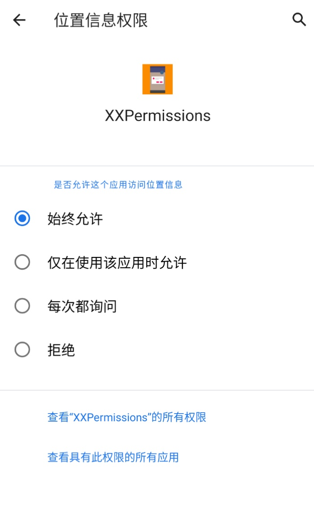

#### 目录

* [Android 11 定位权限适配](#android-11-定位权限适配)

* [Android 11 存储权限适配](#android-11-存储权限适配)

* [什么情况下需要适配分区存储特性](#什么情况下需要适配分区存储特性)

* [我想在申请前和申请后统一弹对话框该怎么处理](#我想在申请前和申请后统一弹对话框该怎么处理)

* [如何在回调中判断哪些权限被永久拒绝了](#如何在回调中判断哪些权限被永久拒绝了)

* [框架为什么不兼容 Android 6 以下的权限申请](#框架为什么不兼容-android-6-以下的权限申请)

* [新版框架为什么移除了自动申请清单权限的功能](#新版框架为什么移除了自动申请清单权限的功能)

* [新版框架为什么移除了不断申请权限的功能](#新版框架为什么移除了不断申请权限的功能)

* [新版框架为什么移除了国产手机权限设置页功能](#新版框架为什么移除了国产手机权限设置页功能)

#### Android 11 定位权限适配

* 在 Android 10 上面，定位权限被划分为前台权限（精确和模糊）和后台权限，而到了 Android 11 上面，需要分别申请这两种权限，如果同时申请这两种权限会**惨遭系统无情拒绝**，连权限申请对话框都不会弹，立马被系统拒绝，直接导致定位权限申请失败。

* 如果你使用的是 XXPermissions 最新版本，那么**恭喜你**，直接将前台定位权限和后台定位权限全部传给框架即可，框架已经自动帮你把这两种权限分开申请了，整个适配过程**零成本**。

* 但是需要注意的是：申请过程分为两个步骤，第一步是申请前台定位权限，第二步是申请后台定位权限，用户必须要先同意前台定位权限才能进入后台定位权限的申请。同意前台定位权限的方式有两种：勾选 `仅在使用该应用时允许` 或 `仅限这一次`，而到了后台定位权限申请中，用户必须要勾选 `始终允许`，只有这样后台定位权限才能申请通过。

* 还有如果你的应用只需要在前台使用定位功能， 而不需要在后台中使用定位功能，那么请不要连带申请 `Permission.ACCESS_BACKGROUND_LOCATION` 权限。




#### Android 11 存储权限适配

* 如果你的项目需要适配 Android 11 存储权限，那么需要先将 targetSdkVersion 进行升级

```groovy
android 
    defaultConfig {
        targetSdkVersion 30
    }
}
```

* 再添加 Android 11 存储权限注册到清单文件中

```xml
<uses-permission android:name="android.permission.MANAGE_EXTERNAL_STORAGE" />
```

* 需要注意的是，旧版的存储权限也需要在清单文件中注册，因为在低于 Android 11 的环境下申请存储权限，框架会自动切换到旧版的申请方式

```xml
<uses-permission android:name="android.permission.READ_EXTERNAL_STORAGE" />
<uses-permission android:name="android.permission.WRITE_EXTERNAL_STORAGE" />
```

* 还需要在清单文件中加上这个属性，否则在 Android 10 的设备上将无法正常读写外部存储上的文件

```xml
<application
    android:requestLegacyExternalStorage="true">
```
    
* 最后直接调用下面这句代码

```java
XXPermissions.with(this)
        // 不适配 Android 11 可以这样写
        //.permission(Permission.Group.STORAGE)
        // 适配 Android 11 需要这样写，这里无需再写 Permission.Group.STORAGE
        .permission(Permission.MANAGE_EXTERNAL_STORAGE)
        .request(new OnPermissionCallback() {

            @Override
            public void onGranted(List<String> permissions, boolean all) {
                if (all) {
                    toast("获取存储权限成功");
                }
            }

            @Override
            public void onDenied(List<String> permissions, boolean never) {
                if (never) {
                    toast("被永久拒绝授权，请手动授予存储权限");
                    // 如果是被永久拒绝就跳转到应用权限系统设置页面
                    XXPermissions.startPermissionActivity(MainActivity.this, permissions);
                } else {
                    toast("获取存储权限失败");
                }
            }
        });
```


#### 什么情况下需要适配分区存储特性

* 如果你的应用需要上架 GooglePlay，那么需要详细查看：[谷歌应用商店政策（需要翻墙）](https://support.google.com/googleplay/android-developer/answer/9956427)

* 分区存储的由来：谷歌之前收到了很多用户投诉，说很多应用都在 SD 卡下创建目录和文件，导致用户管理手机文件非常麻烦（强迫症的外国网友真多，哈哈），所以在 Android 10 版本更新中，谷歌要求所有开发者将媒体文件存放在自己内部目录或者 SD 卡内部目录中，不过谷歌在一版本上采取了宽松政策，在清单文件中加入 `android:requestLegacyExternalStorage="true"` 即可跳过这一特性的适配，不过在 Android 11 上面，你有两种选择：

    1. 适配分区存储：这个是谷歌推荐的一种方式，但是会增加工作量，因为分区存储适配起来十分麻烦，我个人感觉是这样的。不过对于一些特定应用，例如文件管理器，文件备份工具，防病毒应用等这类应用它们就一定需要用到外部存储，这个时候就需要用第二种方式来实现了。

    2. 申请外部存储权限：这个是谷歌不推荐的一种方式，只需要 `MANAGE_EXTERNAL_STORAGE` 权限即可，适配起来基本无压力，但是会存在一个问题，就是上架谷歌应用市场的时候，要经过 Google Play 审核和批准。

* 这两种总结下来，我觉得各有好坏，不过我可以跟大家谈谈我的看法

    1. 如果你的应用需要上架谷歌应用市场，需要尽快适配分区存储，因为谷歌这次来真的了

    2. 如果你的应用只上架国内的应用市场，并且后续也没有上架谷歌应用市场的需要，那么你也可以直接申请 `MANAGE_EXTERNAL_STORAGE` 权限来读写外部存储

#### 我想在申请前和申请后统一弹对话框该怎么处理

* 在 Application 初始化的时候配置

```java
public class XxxApplication extends Application {

    @Override
    public void onCreate() {
        super.onCreate();
        // 设置权限申请拦截器
        XXPermissions.setInterceptor(new PermissionInterceptor());
    }
}
```

* PermissionInterceptor 源码实现

```java
public class PermissionInterceptor implements IPermissionInterceptor {

    @Override
    public void requestPermissions(Activity activity, OnPermissionCallback callback, List<String> permissions) {
        new AlertDialog.Builder(activity)
                .setTitle("授权提示")
                .setMessage("使用此功能需要先授予权限")
                .setPositiveButton("授予", new DialogInterface.OnClickListener() {

                    @Override
                    public void onClick(DialogInterface dialog, int which) {
                        dialog.dismiss();
                        PermissionFragment.beginRequest(activity, new ArrayList<>(permissions), callback);
                    }
                })
                .setNegativeButton("取消", new DialogInterface.OnClickListener() {

                    @Override
                    public void onClick(DialogInterface dialog, int which) {
                        dialog.dismiss();
                    }
                })
                .show();
    }

    @Override
    public void grantedPermissions(Activity activity, OnPermissionCallback callback, List<String> permissions, boolean all) {
        // 回调授权成功的方法
        callback.onGranted(permissions, all);
    }

    @Override
    public void deniedPermissions(Activity activity, OnPermissionCallback callback, List<String> permissions, boolean never) {
        // 回调授权失败的方法
        callback.onDenied(permissions, never);
        if (never) {
            showPermissionDialog(activity, permissions);
            return;
        }

        if (permissions.size() == 1 && Permission.ACCESS_BACKGROUND_LOCATION.equals(permissions.get(0))) {
            ToastUtils.show("没有授予后台定位权限，请您选择\"始终允许\"");
            return;
        }

        ToastUtils.show("授权失败，请正确授予权限");
    }

    /**
     * 显示授权对话框
     */
    protected void showPermissionDialog(Activity activity, List<String> permissions) {
        new AlertDialog.Builder(activity)
                .setTitle("授权提醒")
                .setMessage(getPermissionHint(activity, permissions))
                .setPositiveButton("前往授权", new DialogInterface.OnClickListener() {

                    @Override
                    public void onClick(DialogInterface dialog, int which) {
                        dialog.dismiss();
                        XXPermissions.startPermissionActivity(activity, permissions);
                    }
                })
                .setNegativeButton("取消", new DialogInterface.OnClickListener() {

                    @Override
                    public void onClick(DialogInterface dialog, int which) {
                        dialog.dismiss();
                    }
                })
                .show();
    }

    /**
     * 根据权限获取提示
     */
    protected String getPermissionHint(Context context, List<String> permissions) {
        // 具体实现请看 Demo 源码
    }
}
```

#### 如何在回调中判断哪些权限被永久拒绝了？

* 需求场景：假设同时申请日历权限和录音权限，结果都被用户拒绝了，但是这两组权限中有一组权限被永久拒绝了，如何判断某一组权限有没有被永久拒绝？这里给出代码示例：

```java
XXPermissions.with(this)
        .permission(Permission.RECORD_AUDIO)
        .permission(Permission.Group.CALENDAR)
        .request(new OnPermissionCallback() {

            @Override
            public void onGranted(List<String> permissions, boolean all) {
                if (all) {
                    toast("获取录音和日历权限成功");
                }
            }

            @Override
            public void onDenied(List<String> permissions, boolean never) {
                if (never && permissions.contains(Permission.RECORD_AUDIO) &&
                        XXPermissions.isPermanentDenied(MainActivity.this, Permission.RECORD_AUDIO)) {
                    toast("录音权限被永久拒绝了");
                }
            }
        });
```

#### 框架为什么不兼容 Android 6 以下的权限申请

* 因为 Android 6.0 以下的权限管理是手机厂商做的，那个时候谷歌还没有统一权限管理的方案，所以就算我们的应用没有适配也不会有任何问题，因为手机厂商对这块有自己的处理，但是有一点是肯定的，就算用户拒绝了授权，也不会导致应用崩溃，只会返回空白的通行证。

* 如果 XXPermissions 做这块的适配也可以做到，通过反射系统服务 AppOpsManager 类中的字段即可，但是并不能保证权限判断的准确性，可能会存在一定的误差，其次是适配的成本太高，因为国内手机厂商太多，对这块的改动参差不齐。

* 考虑到 Android 6.0 以下的设备占比很低，后续也会越来越少，会逐步退出历史的舞台，所以我的决定是不对这块做适配。

#### 新版框架为什么移除了自动申请清单权限的功能

* 获取清单权限并申请的功能，这个虽然非常方便，但是存在一些隐患，因为 apk 中的清单文件最终是由多个 module 的清单文件合并而成，会变得不可控，这样会使我们无法预估申请的权限，并且还会掺杂一些不需要的权限，所以经过慎重考虑移除该功能。

#### 新版框架为什么移除了不断申请权限的功能

* [【issue】建议恢复跳转权限设置页和获取AndroidManifest的所有权限两个实用功能](https://github.com/getActivity/XXPermissions/issues/54)

* 假设用户拒绝了权限，如果框架再次申请，那么用户会授予的可能性也是比较小，同时某些应用商店已经禁用了这种行为，经过慎重考虑，对这个功能相关的 API 进行移除。

* 如果你还想用这种方式来申请权限，其实并不是没有办法，可以参考以下方式来实现

```java
public class PermissionActivity extends AppCompatActivity implements OnPermissionCallback {

    @Override
    public void onClick(View view) {
        requestCameraPermission();
    }

    private void requestCameraPermission() {
        XXPermissions.with(this)
                .permission(Permission.CAMERA)
                .request(this);
    }

    @Override
    public void onGranted(List<String> permissions, boolean all) {
        if (all) {
            toast("获取拍照权限成功");
        }
    }

    @Override
    public void onDenied(List<String> permissions, boolean never) {
        if (never) {
            toast("被永久拒绝授权，请手动授予拍照权限");
            // 如果是被永久拒绝就跳转到应用权限系统设置页面
            XXPermissions.startPermissionActivity(MainActivity.this, permissions);
        } else {
            requestCameraPermission();
        }
    }
    
    @Override
    protected void onActivityResult(int requestCode, int resultCode, @Nullable Intent data) {
        super.onActivityResult(requestCode, resultCode, data);
        if (requestCode == XXPermissions.REQUEST_CODE) {
            toast("检测到你刚刚从权限设置界面返回回来");
        }
    }
}
```

#### 新版框架为什么移除了国产手机权限设置页功能

* XXPermissions 9.0 及之前是有存在这一功能的，但是我在后续的版本上面将这个功能移除了，原因是有很多人跟我反馈这个功能其实存在很大的缺陷，例如在一些华为新机型上面可能跳转的页面不是应用的权限设置页，而是所有应用的权限管理列表界面。

* 其实不止华为有问题，小米同样有问题，有很多人跟我反馈过同一个问题，XXPermissions 跳转到国产手机权限设置页，用户正常授予了权限之后返回仍然检测到权限仍然是拒绝的状态，这个问题反馈的次数很多，但是迟迟不能排查到原因，终于在最后一次得到答案了，[有人](https://github.com/getActivity/XXPermissions/issues/38)帮我排查到是 miui 优化开关的问题（小米手机 ---> 开发者选项 ---> 启用 miui 优化），那么问题来了，这个开关有什么作用？是如何影响到 XXPermissions 的？

* 首先这个问题要从 XXPermissions 跳转到国产手机设置页的原理讲起，从谷歌提供的原生 API 我们最多只能跳转到应用详情页，并不能直接跳转到权限设置页，而需要用户在应用详情页再次点击才能进入权限设置页。如果从用户体验的角度上看待这个问题，肯定是直接跳转到权限设置页是最好的，但是这种方式是不受谷歌支持的，当然也有方法实现，网上都有一个通用的答案，就是直接捕获某个品牌手机的权限设置页 `Activity` 包名然后进行跳转。这种想法的起点是好的，但是存在许多问题，并不能保证每个品牌的所有机型都能适配到位，手机产商更改这个 `Activity` 的包名的次数和频率比较高，在最近发布的一些新的华为机型上面几乎已经全部失效，也就是 `startActivity` 的时候会报 `ActivityNotFoundException` 或 `SecurityException` 异常，当然这些异常是可以被捕捉到的，但是仅仅只能捕获到崩溃，一些非崩溃的行为我们并不能从中得知和处理，例如我刚刚讲过的华为和小米的问题，这些问题并不能导致崩溃，但是会导致功能出现异常。

* 而 miui 优化开关是小米工程师预留的切换 miui 和原生的功能开关，例如在这个开关开启的时候，在应用详情页点击权限管理会跳转到小米的权限设置页，如果这个开关是关闭状态（默认是开启状态），在应用详情页点击权限管理会跳转到谷歌原生的权限设置页，具体效果如图：


* 最大的问题在于：这两个界面是不同的 Activity，一个是小米定制的权限设置页，第二个是谷歌原生的权限设置页，当 miui 优化开启的时候，在小米定制的权限设置页授予权限才能有效果，当这个 miui 优化关闭的时候，在谷歌原生的权限设置页授予权限才能有效果。而跳转到国产手机页永远只会跳转到小米定制的那个权限设置页，所以就会导致当 miui 优化关闭的时候，使用代码跳转到小米权限设置页授予了权限之后返回仍然显示失败的问题。

* 有人可能会说，解决这个问题的方式很简单，判断 miui 优化开关，如果是开启状态就跳转到小米定制的权限设置页，如果是关闭状态就跳转到谷歌原生的权限设置页，这样不就可以了？其实这个解决方案我也有尝试过，我曾委托联系到在小米工作的 miui 工程师，也有人帮我反馈这个问题给小米那边，最后得到答复都是一致的。


* 另外值得一提的是 [Android 11 对软件包可见性进行了限制](https://developer.android.google.cn/about/versions/11/privacy/package-visibility)，所以这种跳包名的方式在未来将会完全不可行。

* 最终决定：这个功能的出发点是好的，但是我们没办法做好它，经过慎重考虑，决定将这个功能在 XXPermissions 9.2 版本及之后的版本进行移除。

