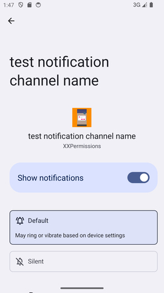
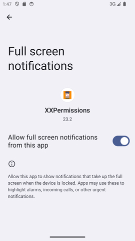
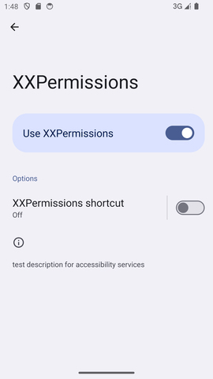
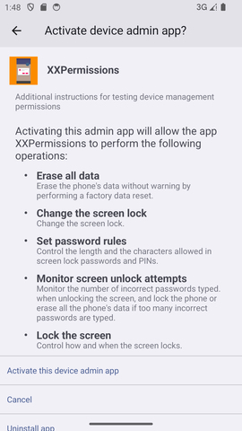
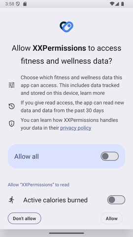
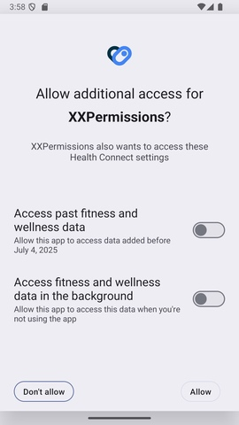

# [中文文档](README.md)

# Permission request framework


* project address: [Github](https://github.com/getActivity/XXPermissions)

* [Click here to download demo apk directly](https://github.com/getActivity/XXPermissions/releases/download/26.5/XXPermissions.apk)

  

   

   

   

   

  

 

#### Integration steps

* If your project Gradle configuration is in `7.0` below, needs to be in `build.gradle` file added

```groovy
allprojects {
    repositories {
        // JitPack remote repository：https://jitpack.io
        maven { url 'https://jitpack.io' }
    }
}
```

* If your Gradle configuration is `7.0` or above, needs to be in `settings.gradle` file added

```groovy
dependencyResolutionManagement {
    repositories {
        // JitPack remote repository：https://jitpack.io
        maven { url 'https://jitpack.io' }
    }
}
```

* After configuring the remote warehouse, under the project app module `build.gradle` Add remote dependencies to the file

```groovy
android {
    // Support JDK 1.8
    compileOptions {
        targetCompatibility JavaVersion.VERSION_1_8
        sourceCompatibility JavaVersion.VERSION_1_8
    }
}

dependencies {
    // Device compatibility framework：https://github.com/getActivity/DeviceCompat
    implementation 'com.github.getActivity:DeviceCompat:2.3'
    // Permission request framework：https://github.com/getActivity/XXPermissions
    implementation 'com.github.getActivity:XXPermissions:26.5'
}
```

#### Support library compatible

* If the project is based on **AndroidX** package, please in the item `gradle.properties` file added, if you have already joined, you can ignore it

```text
# Indicates the use of AndroidX
android.useAndroidX = true
# Indicates migration of third-party libraries to AndroidX
android.enableJetifier = true
```

* If the project is based on **Support** Packages do not need to be added to this configuration

#### scoped storage

* If the project has been adapted to the Android 10 scoped storage feature, please go to`AndroidManifest.xml`join in

```xml
<manifest>

    <application>

        <!-- Inform XXPermissions that the current project has adapted to the scoped storage feature -->
        <meta-data
            android:name="ScopedStorage"
            android:value="true" />

    </application>

</manifest>
```

* If the current project does not adapt to this feature, then this step can be ignored

* It should be noted that this option is used by the framework to determine whether the current project is adapted to scoped storage. It should be noted that if your project has been adapted to the scoped storage feature, you can use`READ_EXTERNAL_STORAGE`、`WRITE_EXTERNAL_STORAGE`To apply for permission, if your project has not yet adapted to the partition feature, even if you apply`READ_EXTERNAL_STORAGE`、`WRITE_EXTERNAL_STORAGE`The permissions will also cause the files on the external storage to be unable to be read normally. If your project is not suitable for scoped storage, please use`MANAGE_EXTERNAL_STORAGE`To apply for permission, so that the files on the external storage can be read normally. If you want to know more about the features of Android 10 partition storage, you can[Click here to view and learn](https://github.com/getActivity/AndroidVersionAdapter#android-100).

#### Frame obfuscation rules

The framework has automatically added the framework's obfuscation rules for you internally. When you add the framework's dependent remote libraries, the framework's obfuscation rules will also be carried into your project. You don't need to add them manually yourself. Specific obfuscation rule content [Click here to view](library/proguard-permissions.pro)

#### One code to get permission request has never been easier

* Java code example

```java
XXPermissions.with(this)
    // Request multiple permission
    .permission(PermissionLists.getRecordAudioPermission())
    .permission(PermissionLists.getCameraPermission())
    // Setting does not trigger error detection mechanism (local setting)
    //.unchecked()
    .request(new OnPermissionCallback() {

        @Override
        public void onResult(@NonNull List<IPermission> grantedList, @NonNull List<IPermission> deniedList) {
            boolean allGranted = deniedList.isEmpty();
            if (!allGranted) {
                // Determine whether the permissions that failed requests have been checked by the user to no longer ask
                boolean doNotAskAgain = XXPermissions.isDoNotAskAgainPermissions(activity, deniedList);
                // The logic for failing to handle permission requests here
                ......
                return;
            }
            // The logic for handling permission requests here is successful
            ......
        }
    });
```

* Kotlin code example

```kotlin

XXPermissions.with(this)
    // Request multiple permission
    .permission(PermissionLists.getRecordAudioPermission())
    .permission(PermissionLists.getCameraPermission())
    // Setting does not trigger error detection mechanism (local setting)
    //.unchecked()
    .request(object : OnPermissionCallback {

        override fun onResult(grantedList: MutableList<IPermission>, deniedList: MutableList<IPermission>) {
            val allGranted = deniedList.isEmpty()
            if (!allGranted) {
                // Determine whether the permissions that failed requests have been checked by the user to no longer ask
                val doNotAskAgain = XXPermissions.isDoNotAskAgainPermissions(activity, deniedList)
                // The logic for failing to handle permission requests here
                // ......
                return
            }
            // The logic for handling permission requests here is successful
            // ......
        }
    })
```

#### Introduction to other APIs of the framework

```java
// Check if a single permission is granted
XXPermissions.isGrantedPermission(@NonNull Context context, @NonNull IPermission permission);
XXPermissions.isGrantedPermissions(@NonNull Context context, @NonNull IPermission[] permissions);
XXPermissions.isGrantedPermissions(@NonNull Context context, @NonNull List<IPermission> permissions);

// Get the granted permissions from a permission list
XXPermissions.getGrantedPermissions(@NonNull Context context, @NonNull IPermission[] permissions);
XXPermissions.getGrantedPermissions(@NonNull Context context, @NonNull List<IPermission> permissions);

// Get the denied permissions from a permission list
XXPermissions.getDeniedPermissions(@NonNull Context context, @NonNull IPermission[] permissions);
XXPermissions.getDeniedPermissions(@NonNull Context context, @NonNull List<IPermission> permissions);

// Determine whether the two permissions are equal
XXPermissions.equalsPermission(@NonNull IPermission permission, @NonNull IPermission permission2);
XXPermissions.equalsPermission(@NonNull IPermission permission, @NonNull String permissionName);
XXPermissions.equalsPermission(@NonNull String permissionName1, @NonNull String permissionName2);

// Determine whether a certain permission is included in the permission list
XXPermissions.containsPermission(@NonNull List<IPermission> permissions, @NonNull IPermission permission);
XXPermissions.containsPermission(@NonNull List<IPermission> permissions, @NonNull String permissionName);

// Check if a permission is a health permission
XXPermissions.isHealthPermission(@NonNull IPermission permission);

// Check if a permission has been denied with the "Never ask again" option selected 
// (Must be called within the permission request callback to be effective)
XXPermissions.isDoNotAskAgainPermission(@NonNull Activity activity, @NonNull IPermission permission);
XXPermissions.isDoNotAskAgainPermissions(@NonNull Activity activity, @NonNull IPermission[] permissions);
XXPermissions.isDoNotAskAgainPermissions(@NonNull Activity activity, @NonNull List<IPermission> permissions);

// Navigate to the permission settings page (Context version)
XXPermissions.startPermissionActivity(@NonNull Context context);
XXPermissions.startPermissionActivity(@NonNull Context context, @NonNull IPermission... permissions);
XXPermissions.startPermissionActivity(@NonNull Context context, @NonNull List<IPermission> permissions);

// Navigate to the permission settings page (Activity version)
XXPermissions.startPermissionActivity(@NonNull Activity activity);
XXPermissions.startPermissionActivity(@NonNull Activity activity, @NonNull IPermission... permissions);
XXPermissions.startPermissionActivity(@NonNull Activity activity, @NonNull List<IPermission> permissions);
XXPermissions.startPermissionActivity(@NonNull Activity activity, @NonNull List<IPermission> permissions, @IntRange(from = 1, to = 65535) int requestCode);
XXPermissions.startPermissionActivity(@NonNull Activity activity, @NonNull IPermission permission, @Nullable OnPermissionCallback callback);
XXPermissions.startPermissionActivity(@NonNull Activity activity, @NonNull List<IPermission> permissions, @Nullable OnPermissionCallback callback);

// Navigate to the permission settings page (App Fragment version)
XXPermissions.startPermissionActivity(@NonNull Fragment appFragment);
XXPermissions.startPermissionActivity(@NonNull Fragment appFragment, @NonNull IPermission... permissions);
XXPermissions.startPermissionActivity(@NonNull Fragment appFragment, @NonNull List<IPermission> permissions);
XXPermissions.startPermissionActivity(@NonNull Fragment appFragment, @NonNull List<IPermission> permissions, @IntRange(from = 1, to = 65535) int requestCode);
XXPermissions.startPermissionActivity(@NonNull Fragment appFragment, @NonNull IPermission permission, @Nullable OnPermissionCallback callback);
XXPermissions.startPermissionActivity(@NonNull Fragment appFragment, @NonNull List<IPermission> permissions, @Nullable OnPermissionCallback callback);

// Navigate to the permission settings page (Support Fragment version)
XXPermissions.startPermissionActivity(@NonNull android.support.v4.app.Fragment supportFragment);
XXPermissions.startPermissionActivity(@NonNull android.support.v4.app.Fragment supportFragment, @NonNull IPermission... permissions);
XXPermissions.startPermissionActivity(@NonNull android.support.v4.app.Fragment supportFragment, @NonNull List<IPermission> permissions);
XXPermissions.startPermissionActivity(@NonNull android.support.v4.app.Fragment supportFragment, @NonNull List<IPermission> permissions, @IntRange(from = 1, to = 65535) int requestCode);
XXPermissions.startPermissionActivity(@NonNull android.support.v4.app.Fragment supportFragment, @NonNull IPermission permission, @Nullable OnPermissionCallback callback);
XXPermissions.startPermissionActivity(@NonNull android.support.v4.app.Fragment supportFragment, @NonNull List<IPermission> permissions, @Nullable OnPermissionCallback callback);

// Set the permission description provider (Global setting)
XXPermissions.setPermissionDescription(Class<? extends OnPermissionDescription> clazz);

// Set the permission request interceptor (Global setting)
XXPermissions.setPermissionInterceptor(Class<? extends OnPermissionInterceptor> clazz);

// Set whether to enable error detection mode (Global setting)
XXPermissions.setCheckMode(boolean checkMode);
```

#### Comparison between similar permission request frameworks

|                       Adaptation details                     | [XXPermissions](https://github.com/getActivity/XXPermissions)  | [AndPermission](https://github.com/yanzhenjie/AndPermission) | [PermissionX](https://github.com/guolindev/PermissionX) |  [AndroidUtilCode-PermissionUtils](https://github.com/Blankj/AndroidUtilCode)   | [PermissionsDispatcher](https://github.com/permissions-dispatcher/PermissionsDispatcher) | [RxPermissions](https://github.com/tbruyelle/RxPermissions) |  [EasyPermissions](https://github.com/googlesamples/easypermissions) |  [Dexter](https://github.com/Karumi/Dexter) |
|:------------------------------------------------------------:| :------------: | :------------: | :------------: | :------------: | :------------: | :------------: | :------------: | :------------: |
|                     Corresponding version                    |  26.5 |  2.0.3  |  1.8.1    |  1.31.0    |   4.9.2  |  0.12   |  3.0.0   |  6.2.3   |
|                        Number of issues                      |  [](https://github.com/getActivity/XXPermissions/issues)  |  [](https://github.com/yanzhenjie/AndPermission/issues)  |  [](https://github.com/guolindev/PermissionX/issues)  |  [](https://github.com/Blankj/AndroidUtilCode/issues)  |  [](https://github.com/permissions-dispatcher/PermissionsDispatcher/issues)  |  [](https://github.com/tbruyelle/RxPermissions/issues)  |  [](https://github.com/googlesamples/easypermissions/issues)  |  [](https://github.com/Karumi/Dexter/issues)  |
|                  Framework Maintenance Status                |**In maintenance**|  stop maintenance | stop maintenance |  stop maintenance | stop maintenance | stop maintenance | stop maintenance | stop maintenance |
|                     `SCHEDULE_EXACT_ALARM`                   |  ✅  |  ❌  |  ❌  |  ❌  |  ❌  |  ❌  |  ❌  |  ❌  |
|                   `MANAGE_EXTERNAL_STORAGE`                  |  ✅  |  ❌  |  ✅  |  ❌  |  ❌  |  ❌  |  ❌  |  ❌  |
|                   `REQUEST_INSTALL_PACKAGES`                 |  ✅  |  ✅  |  ✅  |  ❌  |  ❌  |  ❌  |  ❌  |  ❌  |
|                      `PICTURE_IN_PICTURE`                    |  ✅  |  ❌  |  ❌  |  ❌  |  ❌  |  ❌  |  ❌  |  ❌  |
|                     `SYSTEM_ALERT_WINDOW`                    |  ✅  |  ✅  |  ✅  |  ✅  |  ✅  |  ❌  |  ❌  |  ❌  |
|                        `WRITE_SETTINGS`                      |  ✅  |  ✅  |  ✅  |  ✅  |  ✅  |  ❌  |  ❌  |  ❌  |
|                     `NOTIFICATION_SERVICE`                   |  ✅  |  ✅  |  ❌  |  ❌  |  ❌  |  ❌  |  ❌  |  ❌  |
|                `NOTIFICATION_SERVICE`(Channel)               |  ✅  |  ❌  |  ❌  |  ❌  |  ❌  |  ❌  |  ❌  |  ❌  |
|              `BIND_NOTIFICATION_LISTENER_SERVICE`            |  ✅  |  ✅  |  ❌  |  ❌  |  ❌  |  ❌  |  ❌  |  ❌  |
|                  `ACCESS_NOTIFICATION_POLICY`                |  ✅  |  ❌  |  ❌  |  ❌  |  ❌  |  ❌  |  ❌  |  ❌  |
|             `REQUEST_IGNORE_BATTERY_OPTIMIZATIONS`           |  ✅  |  ❌  |  ❌  |  ❌  |  ❌  |  ❌  |  ❌  |  ❌  |
|                     `PACKAGE_USAGE_STATS`                    |  ✅  |  ❌  |  ❌  |  ❌  |  ❌  |  ❌  |  ❌  |  ❌  |
|                    `USE_FULL_SCREEN_INTENT`                  |  ✅  |  ❌  |  ❌  |  ❌  |  ❌  |  ❌  |  ❌  |  ❌  |
|                       `BIND_VPN_SERVICE`                     |  ✅  |  ❌  |  ❌  |  ❌  |  ❌  |  ❌  |  ❌  |  ❌  |
|                  `BIND_ACCESSIBILITY_SERVICE`                |  ✅  |  ❌  |  ❌  |  ❌  |  ❌  |  ❌  |  ❌  |  ❌  |
|                      `BIND_DEVICE_ADMIN`                     |  ✅  |  ❌  |  ❌  |  ❌  |  ❌  |  ❌  |  ❌  |  ❌  |
|                        `MANAGE_MEDIA`                        |  ✅  |  ❌  |  ❌  |  ❌  |  ❌  |  ❌  |  ❌  |  ❌  |
|             Intent Extreme Jump Fallback Mechanism           |  ✅  |  ❌  |  ❌  |  ❌  |  ❌  |  ❌  |  ❌  |  ❌  |
|     Compatibility with Permission Request API Crash Issues   |  ✅  |  ❌  |  ❌  |  ❌  |  ❌  |  ❌  |  ❌  |  ❌  |
|    Avoiding System Permission Callback Null Pointer Issues   |  ✅  |   ✅  |  ❌  |  ❌  |  ❌  |  ❌  |  ❌  |  ❌  |
|              Automatic Permission Split Requests             |  ✅  |  ❌  |  ❌  |  ❌  |  ❌  |  ❌  |  ❌  |  ❌  |
|            Framework Completely Separates UI Layer           |  ✅  |  ❌  |  ❌  |  ❌  |  ❌  |  ❌  |  ❌  |  ❌  |
|    Core Logic and Specific Permissions Completely Decoupled  |  ✅  |  ❌  |  ❌  |  ❌  |  ❌  |  ✅  |  ✅  |  ✅  |
|           Automatic Background Permission Adaptation         |  ✅  |  ❌  |  ❌  |  ❌  |  ❌  |  ❌  |  ❌  |  ❌  |
|          Support for Cross-Platform Environment Calls        |  ✅  |  ✅  |  ❌  |  ✅  |  ❌  |  ❌  |  ✅  |  ✅  |
|           Callback Lifecycle Synchronized with Host          |  ✅  |  ❌  |  ❌  |  ❌  |  ❌  |  ❌  |  ❌  |  ❌  |
|             Support for Custom Permission Requests           |  ✅  |  ❌  |  ❌  |  ❌  |  ❌  |  ❌  |  ❌  |  ❌  |
|     New Version Permissions Support Backward Compatibility   |  ✅  |  ❌  |  ❌  |  ❌  |  ❌  |  ❌  |  ❌  |  ❌  |
|              Screen Rotation Scenario Adaptation             |  ✅  |  ❌  |  ✅  |  ❌ |  ❌  |  ❌   |  ❌  |  ❌  |
|       Background Permission Request Scenario Adaptation      |  ✅  |  ❌  |  ❌  |  ❌  |  ❌  |  ❌  |  ❌  |  ❌  |
|                Fix Android 12 Memory Leak Issue              |  ✅  |  ❌  |  ❌  |  ❌  |  ❌  |  ❌  |  ❌  |  ❌  |
|                Support for Code Error Detection              |  ✅  |  ❌  |  ❌  |  ❌  |  ❌  |  ❌  |  ❌  |  ❌  |

#### [For specific implementation details, please click here to view](Details-en.md)

#### [For other frequently asked questions, please click here](HelpDoc-en.md)

#### Framework highlights

* Take the lead: the first permission request framework adapted to Android 16

* Concise and easy to use: using the method of chain call, only one line of code is needed to use

* Comprehensive support: the first and only permission request framework that adapts to all Android versions

* Overcoming technical difficulties: the first framework to solve system memory leaks in Android 12 for permission applications

* Adapt to extreme situations: No matter how extreme and harsh the environment is to apply for permissions, the framework is still strong

* Downward Compatibility: New permissions can be applied normally in the old system, and the framework will automatically adapt without the caller's adaptation

* Automatic error detection: If an error occurs, the framework will actively throw an exception to the caller (only judged under Debug, and kill the bug in the cradle)

#### Author's other open source projects

* Android middle office: [AndroidProject](https://github.com/getActivity/AndroidProject)

* Android middle office kt version: [AndroidProject-Kotlin](https://github.com/getActivity/AndroidProject-Kotlin)

* Toast framework: [Toaster](https://github.com/getActivity/Toaster)

* Network framework: [EasyHttp](https://github.com/getActivity/EasyHttp)

* Title bar framework: [TitleBar](https://github.com/getActivity/TitleBar)

* Floating window framework: [EasyWindow](https://github.com/getActivity/EasyWindow)

* Device compatibility framework：[DeviceCompat](https://github.com/getActivity/DeviceCompat)  

* Shape view framework: [ShapeView](https://github.com/getActivity/ShapeView)

* Shape drawable framework: [ShapeDrawable](https://github.com/getActivity/ShapeDrawable)

* Language switching framework: [Multi Languages](https://github.com/getActivity/MultiLanguages)

* Gson parsing fault tolerance: [GsonFactory](https://github.com/getActivity/GsonFactory)

* Logcat viewing framework: [Logcat](https://github.com/getActivity/Logcat)

* Nested scrolling layout framework：[NestedScrollLayout](https://github.com/getActivity/NestedScrollLayout)  

* Android version guide: [AndroidVersionAdapter](https://github.com/getActivity/AndroidVersionAdapter)

* Android code standard: [AndroidCodeStandard](https://github.com/getActivity/AndroidCodeStandard)

* Android resource summary：[AndroidIndex](https://github.com/getActivity/AndroidIndex)  

* Android open source leaderboard: [AndroidGithubBoss](https://github.com/getActivity/AndroidGithubBoss)

* Studio boutique plugins: [StudioPlugins](https://github.com/getActivity/StudioPlugins)

* Emoji collection: [EmojiPackage](https://github.com/getActivity/EmojiPackage)

* China provinces json: [ProvinceJson](https://github.com/getActivity/ProvinceJson)

* Markdown documentation：[MarkdownDoc](https://github.com/getActivity/MarkdownDoc)  

## License

```text
Copyright 2018 Huang JinQun

Licensed under the Apache License, Version 2.0 (the "License");
you may not use this file except in compliance with the License.
You may obtain a copy of the License at

   http://www.apache.org/licenses/LICENSE-2.0

Unless required by applicable law or agreed to in writing, software
distributed under the License is distributed on an "AS IS" BASIS,
WITHOUT WARRANTIES OR CONDITIONS OF ANY KIND, either express or implied.
See the License for the specific language governing permissions and
limitations under the License.
```