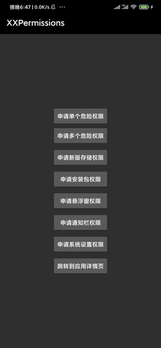
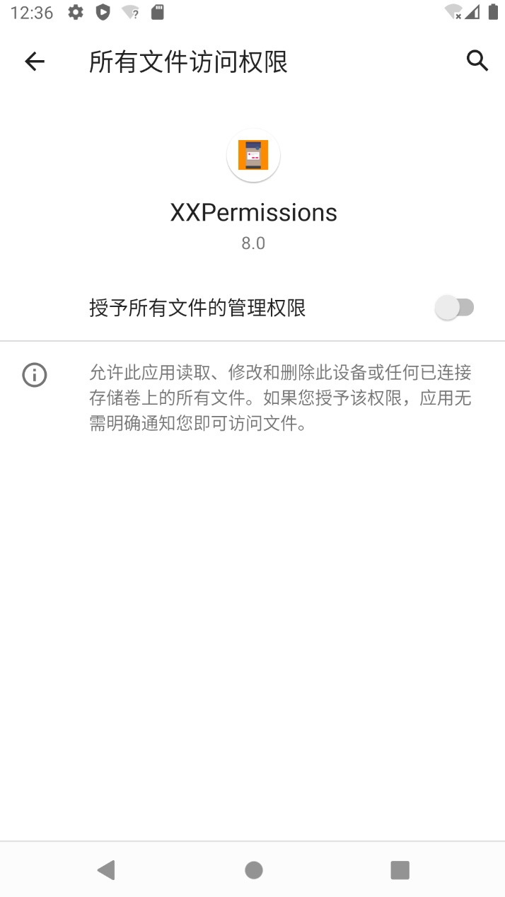

# Permission Request Framework
<p align="center">
  <a href="https://github.com/getActivity/XXPermissions/releases/download/16.2/XXPermissions.apk" style="text-decoration:none" area-label="Android">
    
  </a>
</p>


-   project address:[Github](https://github.com/getActivity/XXPermissions)

-   Blog address:[It's never been easier to get permission requests with a single line of code](https://www.jianshu.com/p/c69ff8a445ed)

-   You can scan the code to download the Demo for demonstration or testing. If the scan code cannot be downloaded,[Click here to download directly](https://github.com/getActivity/XXPermissions/releases/download/16.2/XXPermissions.apk)


-   In addition, if you want to know more about Android 6.0 permissions, you can read this article[Android 6.0 runtime permission resolution](https://www.jianshu.com/p/6a4dff744031)







#### Integration steps

-   If your project Gradle configuration is in`7.0 以下`, needs to be in`build.gradle`file added

```groovy
allprojects {
    repositories {
        // JitPack 远程仓库：https://jitpack.io
        maven { url 'https://jitpack.io' }
    }
}
```

-   If your Gradle configuration is`7.0 及以上`, you need to`settings.gradle`file added

```groovy
dependencyResolutionManagement {
    repositories {
        // JitPack 远程仓库：https://jitpack.io
        maven { url 'https://jitpack.io' }
    }
}
```

-   After configuring the remote warehouse, under the project app module`build.gradle`Add remote dependencies to the file

```groovy
android {
    // 支持 JDK 1.8
    compileOptions {
        targetCompatibility JavaVersion.VERSION_1_8
        sourceCompatibility JavaVersion.VERSION_1_8
    }
}

dependencies {
    // 权限请求框架：https://github.com/getActivity/XXPermissions
    implementation 'com.github.getActivity:XXPermissions:16.2'
}
```

#### AndroidX compatible

-   If the project is based on**AndroidX**package, please in the item`gradle.properties`file added

```text
# 表示将第三方库迁移到 AndroidX
android.enableJetifier = true
```

-   If the project is based on**Support**Packages do not need to be added to this configuration

#### partition storage

-   If the project has been adapted to the Android 10 partition storage feature, please go to`AndroidManifest.xml`join in

```xml
<manifest>

    <application>

        <!-- 表示当前项目已经适配了分区存储特性 -->
        <meta-data
            android:name="ScopedStorage"
            android:value="true" />

    </application>

</manifest>
```

-   If the current project does not adapt to this feature, then this step can be ignored

-   It should be noted that this option is used by the framework to determine whether the current project is adapted to partition storage. It should be noted that if your project has been adapted to the partition storage feature, you can use`READ_EXTERNAL_STORAGE`、`WRITE_EXTERNAL_STORAGE`To apply for permission, if your project has not yet adapted to the partition feature, even if you apply`READ_EXTERNAL_STORAGE`、`WRITE_EXTERNAL_STORAGE`The permissions will also cause the files on the external storage to be unable to be read normally. If your project is not suitable for partition storage, please use`MANAGE_EXTERNAL_STORAGE`To apply for permission, so that the files on the external storage can be read normally. If you want to know more about the features of Android 10 partition storage, you can[Click here to view and learn](https://github.com/getActivity/AndroidVersionAdapter#android-100)。

#### It's never been easier to get permission requests with a single line of code

-   Java usage example

```java
XXPermissions.with(this)
        // 申请单个权限
        .permission(Permission.RECORD_AUDIO)
        // 申请多个权限
        .permission(Permission.Group.CALENDAR)
        // 设置权限请求拦截器（局部设置）
        //.interceptor(new PermissionInterceptor())
        // 设置不触发错误检测机制（局部设置）
        //.unchecked()
        .request(new OnPermissionCallback() {

            @Override
            public void onGranted(List<String> permissions, boolean all) {
                if (!all) {
                    toast("获取部分权限成功，但部分权限未正常授予");
                    return;
                }
                toast("获取录音和日历权限成功");
            }

            @Override
            public void onDenied(List<String> permissions, boolean never) {
                if (never) {
                    toast("被永久拒绝授权，请手动授予录音和日历权限");
                    // 如果是被永久拒绝就跳转到应用权限系统设置页面
                    XXPermissions.startPermissionActivity(context, permissions);
                } else {
                    toast("获取录音和日历权限失败");
                }
            }
        });
```

-   Kotlin usage example

```kotlin
XXPermissions.with(this)
    // 申请单个权限
    .permission(Permission.RECORD_AUDIO)
    // 申请多个权限
    .permission(Permission.Group.CALENDAR)
    // 设置权限请求拦截器（局部设置）
    //.interceptor(new PermissionInterceptor())
    // 设置不触发错误检测机制（局部设置）
    //.unchecked()
    .request(object : OnPermissionCallback {

        override fun onGranted(permissions: MutableList<String>, all: Boolean) {
            if (!all) {
                toast("获取部分权限成功，但部分权限未正常授予")
                return
            }
            toast("获取录音和日历权限成功")
        }

        override fun onDenied(permissions: MutableList<String>, never: Boolean) {
            if (never) {
                toast("被永久拒绝授权，请手动授予录音和日历权限")
                // 如果是被永久拒绝就跳转到应用权限系统设置页面
                XXPermissions.startPermissionActivity(context, permissions)
            } else {
                toast("获取录音和日历权限失败")
            }
        }
    })
```

#### Introduction to other APIs of the framework

```java
// 判断一个或多个权限是否全部授予了
XXPermissions.isGranted(Context context, String... permissions);

// 获取没有授予的权限
XXPermissions.getDenied(Context context, String... permissions);

// 判断某个权限是否为特殊权限
XXPermissions.isSpecial(String permission);

// 判断一个或多个权限是否被永久拒绝了
XXPermissions.isPermanentDenied(Activity activity, String... permissions);

// 跳转到应用权限设置页
XXPermissions.startPermissionActivity(Context context, String... permissions);
XXPermissions.startPermissionActivity(Activity activity, String... permissions);
XXPermissions.startPermissionActivity(Activity activity, String... permission, OnPermissionPageCallback callback);
XXPermissions.startPermissionActivity(Fragment fragment, String... permissions);
XXPermissions.startPermissionActivity(Fragment fragment, String... permissions, OnPermissionPageCallback callback);

// 设置不触发错误检测机制（全局设置）
XXPermissions.setCheckMode(false);
// 设置权限申请拦截器（全局设置）
XXPermissions.setInterceptor(new IPermissionInterceptor() {});
```

#### About the permission monitoring callback parameter description

-   We all know that if the user grants all it will only call**onGranted**method, which will only be called if the user rejects all**onDenied**method.

-   But there is another situation. If multiple permissions are requested, these permissions are not all granted or all denied, but some of the authorizations are partially denied. How will the framework handle the callback?

-   The framework will call first**onDenied**method, then call**onGranted**method. of which we can pass**onGranted**in the method**all**parameters to determine whether all permissions are granted.

-   If you want to know whether a permission in the callback is granted or denied, you can call**List**in class**contains(Permission.XXX)**method to determine whether this permission is included in this collection.

## [For other frequently asked questions, please click here](HelpDoc.md)

#### Comparison between similar permission request frameworks

|                      Adaptation details                     |                                  [XXPermissions](https://github.com/getActivity/XXPermissions)                                 |                                 [AndPermission](https://github.com/yanzhenjie/AndPermission)                                 |                                 [PermissionX](https://github.com/guolindev/PermissionX)                                |                              [Android UTIL code](https://github.com/Blankj/AndroidUtilCode)                              |                                       [PermissionsDispatcher](https://github.com/permissions-dispatcher/PermissionsDispatcher)                                       |                                 [RxPermissions](https://github.com/tbruyelle/RxPermissions)                                |                                   [EasyPermissions](https://github.com/googlesamples/easypermissions)                                  |
| :---------------------------------------------------------: | :----------------------------------------------------------------------------------------------------------------------------: | :--------------------------------------------------------------------------------------------------------------------------: | :--------------------------------------------------------------------------------------------------------------------: | :----------------------------------------------------------------------------------------------------------------------: | :------------------------------------------------------------------------------------------------------------------------------------------------------------------: | :------------------------------------------------------------------------------------------------------------------------: | :------------------------------------------------------------------------------------------------------------------------------------: |
|                    corresponding version                    |                                                              16.2                                                              |                                                             2.0.3                                                            |                                                          1.6.4                                                         |                                                          1.31.0                                                          |                                                                                 4.9.2                                                                                |                                                            0.12                                                            |                                                                  3.0.0                                                                 |
|                       number of issues                      | [](https://github.com/getActivity/XXPermissions/issues) | [](https://github.com/yanzhenjie/AndPermission/issues) | [](https://github.com/guolindev/PermissionX/issues) | [](https://github.com/Blankj/AndroidUtilCode/issues) | [](https://github.com/permissions-dispatcher/PermissionsDispatcher/issues) | [](https://github.com/tbruyelle/RxPermissions/issues) | [](https://github.com/googlesamples/easypermissions/issues) |
|                         frame volume                        |                                                              52 KB                                                             |                                                            127 KB                                                            |                                                          90 KB                                                         |                                                          500 KB                                                          |                                                                                 99 KB                                                                                |                                                            28 KB                                                           |                                                                  48 KB                                                                 |
|                 Framework Maintenance Status                |                                                       **In maintenance**                                                       |                                                       stop maintenance                                                       |                                                   **In maintenance**                                                   |                                                     stop maintenance                                                     |                                                                           stop maintenance                                                                           |                                                      stop maintenance                                                      |                                                            stop maintenance                                                            |
|                  Alarm reminder permission                  |                                                                ✅                                                               |                                                               ❌                                                              |                                                            ❌                                                           |                                                             ❌                                                            |                                                                                   ❌                                                                                  |                                                              ❌                                                             |                                                                    ❌                                                                   |
|               All file management permissions               |                                                                ✅                                                               |                                                               ❌                                                              |                                                            ✅                                                           |                                                             ❌                                                            |                                                                                   ❌                                                                                  |                                                              ❌                                                             |                                                                    ❌                                                                   |
|                 Install package permissions                 |                                                                ✅                                                               |                                                               ✅                                                              |                                                            ✅                                                           |                                                             ❌                                                            |                                                                                   ❌                                                                                  |                                                              ❌                                                             |                                                                    ❌                                                                   |
|                Picture-in-picture permissions               |                                                                ✅                                                               |                                                               ❌                                                              |                                                            ❌                                                           |                                                             ❌                                                            |                                                                                   ❌                                                                                  |                                                              ❌                                                             |                                                                    ❌                                                                   |
|                 Floating window permissions                 |                                                                ✅                                                               |                                                               ✅                                                              |                                                            ✅                                                           |                                                             ✅                                                            |                                                                                   ✅                                                                                  |                                                              ❌                                                             |                                                                    ❌                                                                   |
|                  System setting permissions                 |                                                                ✅                                                               |                                                               ✅                                                              |                                                            ✅                                                           |                                                             ✅                                                            |                                                                                   ✅                                                                                  |                                                              ❌                                                             |                                                                    ❌                                                                   |
|                 Notification bar permissions                |                                                                ✅                                                               |                                                               ✅                                                              |                                                            ❌                                                           |                                                             ❌                                                            |                                                                                   ❌                                                                                  |                                                              ❌                                                             |                                                                    ❌                                                                   |
|            Notification bar monitoring permission           |                                                                ✅                                                               |                                                               ✅                                                              |                                                            ❌                                                           |                                                             ❌                                                            |                                                                                   ❌                                                                                  |                                                              ❌                                                             |                                                                    ❌                                                                   |
|                  Do not disturb permission                  |                                                                ✅                                                               |                                                               ❌                                                              |                                                            ❌                                                           |                                                             ❌                                                            |                                                                                   ❌                                                                                  |                                                              ❌                                                             |                                                                    ❌                                                                   |
|            Ignore battery optimization permission           |                                                                ✅                                                               |                                                               ❌                                                              |                                                            ❌                                                           |                                                             ❌                                                            |                                                                                   ❌                                                                                  |                                                              ❌                                                             |                                                                    ❌                                                                   |
|                  View app usage permission                  |                                                                ✅                                                               |                                                               ❌                                                              |                                                            ❌                                                           |                                                             ❌                                                            |                                                                                   ❌                                                                                  |                                                              ❌                                                             |                                                                    ❌                                                                   |
|                       VPN permissions                       |                                                                ✅                                                               |                                                               ❌                                                              |                                                            ❌                                                           |                                                             ❌                                                            |                                                                                   ❌                                                                                  |                                                              ❌                                                             |                                                                    ❌                                                                   |
|               Android 13 Dangerous Permissions              |                                                                ✅                                                               |                                                               ❌                                                              |                                                            ❌                                                           |                                                             ❌                                                            |                                                                                   ❌                                                                                  |                                                              ❌                                                             |                                                                    ❌                                                                   |
|               Android 12 Dangerous Permissions              |                                                                ✅                                                               |                                                               ❌                                                              |                                                            ✅                                                           |                                                             ❌                                                            |                                                                                   ❌                                                                                  |                                                              ❌                                                             |                                                                    ❌                                                                   |
|               Android 11 Dangerous Permissions              |                                                                ✅                                                               |                                                               ❌                                                              |                                                            ✅                                                           |                                                             ❌                                                            |                                                                                   ❌                                                                                  |                                                              ❌                                                             |                                                                    ❌                                                                   |
|               Android 10 Dangerous Permissions              |                                                                ✅                                                               |                                                               ✅                                                              |                                                            ✅                                                           |                                                             ❌                                                            |                                                                                   ✅                                                                                  |                                                              ❌                                                             |                                                                    ❌                                                                   |
|              Android 9.0 Dangerous Permissions              |                                                                ✅                                                               |                                                               ❌                                                              |                                                            ✅                                                           |                                                             ❌                                                            |                                                                                   ✅                                                                                  |                                                              ❌                                                             |                                                                    ❌                                                                   |
|              Android 8.0 Dangerous Permissions              |                                                                ✅                                                               |                                                               ✅                                                              |                                                            ✅                                                           |                                                             ❌                                                            |                                                                                   ✅                                                                                  |                                                              ❌                                                             |                                                                    ❌                                                                   |
| New permissions automatically compatible with older devices |                                                                ✅                                                               |                                                               ❌                                                              |                                                            ❌                                                           |                                                             ❌                                                            |                                                                                   ❌                                                                                  |                                                              ❌                                                             |                                                                    ❌                                                                   |
|         Screen orientation rotation scene adaptation        |                                                                ✅                                                               |                                                               ✅                                                              |                                                            ✅                                                           |                                                             ❌                                                            |                                                                                   ✅                                                                                  |                                                              ❌                                                             |                                                                    ❌                                                                   |
|    Background application permission scenario adaptation    |                                                                ✅                                                               |                                                               ❌                                                              |                                                            ❌                                                           |                                                             ❌                                                            |                                                                                   ❌                                                                                  |                                                              ❌                                                             |                                                                    ❌                                                                   |
|                Android 12 memory leak bug fix               |                                                                ✅                                                               |                                                               ❌                                                              |                                                            ❌                                                           |                                                             ❌                                                            |                                                                                   ❌                                                                                  |                                                              ❌                                                             |                                                                    ❌                                                                   |
|                  Error detection mechanism                  |                                                                ✅                                                               |                                                               ❌                                                              |                                                            ❌                                                           |                                                             ❌                                                            |                                                                                   ❌                                                                                  |                                                              ❌                                                             |                                                                    ❌                                                                   |

#### Introduction of new permissions automatically compatible with old devices

-   With the continuous update of Android versions, dangerous permissions and special permissions are also increasing, so there will be a version compatibility problem at this time. High-version Android devices support applying for lower-version permissions, but lower-version Android devices do not support applying for A higher version of the permissions, then there will be a compatibility problem at this time.

-   After verification, other permission frameworks have chosen the simplest and most rude way, that is, they do not do compatibility, but leave it to the outer caller for compatibility. The caller needs to judge the Android version in the outer layer first, and pass in the higher version. The new permission is given to the framework, and the old permission is passed to the framework on the lower version. This method seems simple and rude, but the development experience is poor. At the same time, it also hides a pit. The outer callers know that the new permission corresponds to Which is the old permission? I don't think everyone knows it, and once the perception is wrong, it will inevitably lead to wrong results.

-   I think the best way is to leave it to the framework to do it,**XXPermissions**This is exactly what is done. When the outer caller applies for a higher version permission, the lower version device will automatically add the lower version permission to apply. For the simplest example, the Android 11 appeared`MANAGE_EXTERNAL_STORAGE`New permission, if it is applied for this permission on Android 10 and below devices, the framework will automatically add it`READ_EXTERNAL_STORAGE`and`WRITE_EXTERNAL_STORAGE`To apply, on Android 10 and below devices, we can directly put`MANAGE_EXTERNAL_STORAGE`as`READ_EXTERNAL_STORAGE`and`WRITE_EXTERNAL_STORAGE`to use, because`MANAGE_EXTERNAL_STORAGE`What can be done, on Android 10 and below devices, use`READ_EXTERNAL_STORAGE`and`WRITE_EXTERNAL_STORAGE`to do it.

-   So everyone is using**XXPermissions**When you want to apply for a new permission, you don’t need to care about the compatibility of the old and new permissions at all. The framework will automatically handle it for you. Unlike other frameworks, what I want to do more is to let everyone write a code. Get permission requests, the framework can do, all to the framework for processing.

#### Screen rotation scene adaptation introduction

-   When the system permission application dialog box pops up and the Activity is rotated on the screen, the permission application callback will be invalid, because the screen rotation will cause the Fragment in the framework to be destroyed and rebuilt, which will cause the callback object in it to be recycled directly, and eventually cause the callback to be abnormal. There are several solutions, one is to add in the manifest file`android:configChanges="orientation"`Attribute, so that the Activity and Fragment will not be destroyed and rebuilt when the screen is rotated. The second is to fix the direction of the Activity display directly in the manifest file, but the above two solutions must be handled by people who use the framework, which is obviously not flexible enough. Still need to tie the bell, the problem of the frame should be solved by the frame, and**RxPermissions**The solution is to set the PermissionFragment object`fragment.setRetainInstance(true)`, so even if the screen is rotated, the Activity object will be destroyed and rebuilt, and the Fragment will not be destroyed and rebuilt, and the previous object will still be reused, but there is a problem, if the Activity is rewritten**onSaveInstanceState**The method will directly lead to the failure of this method, which is obviously only a temporary solution, but not the root cause.**XXPermissions**way would be more direct, in**PermissionFragment**When bound to an Activity, the current Activity's**screen orientation fixed**, after the permission application ends,**reset the screen orientation**。

-   In all permission request frameworks, this problem occurs as long as Fragment is used to apply for permissions, and AndPermission actually applies for permissions by creating a new Activity, so this problem does not occur. PermissionsDispatcher uses the form of APT-generated code to Apply for permission, so there is no such problem, and PermissionX directly draws on the solution of XXPermissions, please see[XXPermissions/issues/49](https://github.com/getActivity/XXPermissions/issues/49)、[PermissionX/issues/51](https://github.com/guolindev/PermissionX/issues/51)。

#### Background application permission scenario introduction

-   When we apply for permissions after doing time-consuming operations (for example, obtain the privacy agreement on the splash screen page and then apply for permissions), return the Activity to the desktop (back to the background) during the network request process, and then cause the permission request to be in the background state At this time, the permission application may be abnormal, and the authorization dialog box will not be displayed. Improper handling will also lead to a crash, such as[RxPeremission/issues/249](https://github.com/tbruyelle/RxPermissions/issues/249). The reason is that the PermissionFragment in the framework is in**commit / commitNow**When it arrives at the Activity, a detection will be made. If the state of the Activity is invisible, an exception will be thrown, and**RxPeremission**exactly used**commitNow**will cause a crash, use**commitAllowingStateLoss / commitNowAllowingStateLoss**You can avoid this detection, although this can avoid crashes, but there will be another problem, the system provides**requestPermissions**Calling the API when the Activity is not visible will not pop up the authorization dialog,**XXPermissions**The solution is to put**requestPermissions**timing from**create**moved to**resume**, because the lifecycle methods of Activity and Fragment are bundled together, if the Activity is invisible, then even if the Fragment is created, it will only be called**onCreate**method without calling its**Onless**method, and finally when the Activity returns from the background to the foreground, not only will it trigger**Activity.onResume**method, which also triggers**PermissionFragment**of**Onless**method, applying for permission in this method can guarantee the final**requestPermissions**The timing of the call is in the Activity**in visible state**Down.

#### Android 12 memory leak problem repair introduction

-   Someone recently asked me about a memory leak[XXPermissions/issues/133](https://github.com/getActivity/XXPermissions/issues/133), I confirmed that this problem really exists after practice, but by looking at the code stack, I found that this problem is caused by the code of the system, and the following conditions are required to cause this problem:

    1.  Use on Android 12 devices

    2.  called`Activity.shouldShowRequestPermissionRationale`

    3.  After that, the activity.finish method was actively called in the code

-   The process of investigation: After tracing the code, it is found that the code call stack is like this

    -   Activity.shouldShowRequestPermissionRationale

    -   PackageManager.shouldShowRequestPermissionRationale (the implementation object is ApplicationPackageManager)

    -   PermissionManager.shouldShowRequestPermissionRationale

    -   new PermissionManager(Context context)

    -   new PermissionUsageHelper(Context context)

    -   AppOpsManager.startWatchingStarted

-   The culprit is actually**PermissionUsageHelper**Hold the Context object as a field and call it in the constructor`AppOpsManager.startWatchingStarted`Turn on listening so the PermissionUsageHelper object will be added to the`AppOpsManager#mStartedWatchers`In the collection, this results in that when the Activity actively calls finish, stopWatchingStarted is not used to remove the monitoring, resulting in the Activity object being kept`AppOpsManager#mStartedWatchers`It is held in the collection, so the Activity object cannot be recycled by the system indirectly.

-   The handling of this problem is also very simple and rude, that is, it will be passed in from the outer layer.**Context**parameter from**Activity**object is replaced with**Application**The object is enough, some people may say, only in the Activity`shouldShowRequestPermissionRationale`method, what if there is no such method in Application? Looking at the implementation of this method, in fact, that method will eventually call`PackageManager.shouldShowRequestPermissionRationale`method(**Hide API, but not in blacklist**), so as long as you can get**PackageManager**The object is enough, and finally use reflection to execute this method, so as to avoid memory leaks.

-   Fortunately, Google did not include PackageManager.shouldShowRequestPermissionRationale in the reflection blacklist, otherwise there is no way to wipe Google's ass this time, otherwise it can only be implemented by modifying the system source code, but this method can only be implemented by Google in the follow-up The Android version of Android has been fixed above, but fortunately, after the version of Android 12 L, this problem has been fixed,[The specific submission record can be viewed by clicking here](https://cs.android.com/android/_/android/platform/frameworks/base/+/0d47a03bfa8f4ca54b883ff3c664cd4ea4a624d9:core/java/android/permission/PermissionUsageHelper.java;dlc=cec069482f80019c12f3c06c817d33fc5ad6151f), but for Android 12, this is still a legacy issue.

-   It is worth noting that XXPermissions is currently the first and only framework of its kind to fix this problem. In addition, for this problem, I also gave Google[AndroidX](https://github.com/androidx/androidx/pull/435)The project has provided a solution for free, and Merge Request has now been merged into the main branch. I believe that through this move, the memory leak problem on nearly 1 billion Android 12 devices around the world will be solved.

#### Introduction to Error Detection Mechanism

-   In the daily maintenance of the framework, many people have reported to me that there are bugs in the framework, but after investigation and positioning, it is found that 95% of the problems are caused by some irregular operations of the caller, which not only caused me a lot of problems. trouble, and also a great waste of time and energy of many friends, so I added a lot of review elements to the framework, in the**debug mode**、**debug mode**、**debug mode**Once some operations do not conform to the specification, the framework will directly throw an exception to the caller, and correctly guide the caller to correct the error in the exception information, for example:

    -   The incoming Context instance is not an Activity object, the framework will throw an exception, or the state of the incoming Activity is abnormal (already**Finishing**or**Destroyed**), this situation is generally caused by asynchronously applying for permissions, and the framework will also throw an exception. Please apply for the permission at the right time. If the timing of the application cannot be estimated, please make a good judgment on the activity status at the outer layer before applying for the permission.

    -   If the caller applies for permissions without passing in any permissions, the framework will throw an exception, or if the permissions passed in by the caller are not dangerous permissions or special permissions, the framework will also throw an exception, because some people will use ordinary permissions When a dangerous permission is passed to the framework, the system will directly deny it.

    -   If the current project is not suitable for partition storage, apply for`READ_EXTERNAL_STORAGE`and`WRITE_EXTERNAL_STORAGE`permission

        -   when the project`targetSdkVersion >= 29`, it needs to be registered in the manifest file`android:requestLegacyExternalStorage="true"`Attribute, otherwise the framework will throw an exception. If it is not added, it will cause a problem. Obviously, the storage permission has been obtained, but the files on the external storage cannot be read and written normally on the Android 10 device.

        -   when the project`targetSdkVersion >= 30`, you cannot apply`READ_EXTERNAL_STORAGE`and`WRITE_EXTERNAL_STORAGE`permission, but should apply for`MANAGE_EXTERNAL_STORAGE`permission

        -   If the current project has been adapted to partition storage, then you only need to register a meta-data attribute in the manifest file:`<meta-data android:name="ScopedStorage" android:value="true" />`

    -   If the requested permission includes background positioning permission, then it cannot include permissions unrelated to positioning, otherwise the framework will throw an exception, because`ACCESS_BACKGROUND_LOCATION`If the application is mixed with other non-location permissions, the application will be directly rejected on Android 11.

    -   If the requested permission and the project's**targetSdkVersion**No, the framework throws an exception because**targetSdkVersion**It represents which Android version the project is adapted to, and the system will automatically make backward compatibility. It is assumed that the permission applied for is only available in Android 11, but**targetSdkVersion**If it still stays at 29, then the application on some models will have an authorization exception, that is, the user has clearly authorized, but the system will always return false.

    -   If the dynamically requested permission is not in`AndroidManifest.xml`If you do not do this, you can apply for permission, but the authorization pop-up window will not appear, and it will be directly rejected by the system, and the system will not give any pop-up windows and prompts, and this problem on every model**must-see**。

    -   If the dynamically requested permission has`AndroidManifest.xml`registered in the , but an inappropriate`android:maxSdkVersion`property value, the framework will throw an exception, for example:`<uses-permission android:name="xxxx" android:maxSdkVersion="29" />`, such a setting will result in Android 11 (`Build.VERSION.SDK_INT >= 30`) and above devices to apply for permission, the system will consider that the permission is not registered in the manifest file, and will directly reject the permission application this time, and will not give any pop-up windows and prompts. This problem is also inevitable.

    -   If you apply at the same time`MANAGE_EXTERNAL_STORAGE`、`READ_EXTERNAL_STORAGE`、`WRITE_EXTERNAL_STORAGE`For these three permissions, the framework will throw an exception, telling you not to apply for these three permissions at the same time, this is because on Android 11 and above devices, the application`MANAGE_EXTERNAL_STORAGE`permission, no application`READ_EXTERNAL_STORAGE`、`WRITE_EXTERNAL_STORAGE`The permission is necessary, this is because the application`MANAGE_EXTERNAL_STORAGE`Permission is equivalent to having more than`READ_EXTERNAL_STORAGE`、`WRITE_EXTERNAL_STORAGE`More powerful capabilities, if you insist on doing so, it will be counterproductive. Assuming that the framework allows, there will be two authorization methods at the same time, one is the pop-up window authorization, and the other is the jump page authorization. The user has to perform two authorizations. But in fact there is`MANAGE_EXTERNAL_STORAGE`The permission is sufficient for use. At this time, you may have a question in your mind. You do not apply.`READ_EXTERNAL_STORAGE`、`WRITE_EXTERNAL_STORAGE`Permissions, not below Android 11`MANAGE_EXTERNAL_STORAGE`Wouldn't that be a problem with this permission? You can rest assured about this issue, the framework will make judgments, if you apply`MANAGE_EXTERNAL_STORAGE`Permissions will be added automatically in frameworks below Android 11`READ_EXTERNAL_STORAGE`、`WRITE_EXTERNAL_STORAGE`Come to apply, so it will not be unavailable due to lack of permissions in the lower version.

    -   If you don't need the above tests, you can do this by calling`unchecked`method to turn off, but it should be noted that I do not recommend you to turn off this detection, because in**release mode**When it is closed, you do not need to close it manually, and it is only in the**debug mode**These detections will only be triggered.

-   The reason for these problems is that we are not very familiar with these mechanisms, and if the framework does not limit it, all kinds of strange problems will appear. As the author of the framework, not only you are very painful, but also very painful as the framework author. Injuried. Because these problems are not caused by the framework, but caused by some irregular operations of the caller. I think the best solution to this problem is to have the framework do a unified check, because I am the author of the framework, and I have knowledge about permission application.**Strong professional ability and sufficient experience**, know what to do and what not to do, so that you can intercept these salacious operations one by one.

-   When there is a problem with the permission application, do you hope that someone can come to remind you and tell you what went wrong? How to correct it? However, these XXPermissions do it. Of all the permission request frameworks, I am the first to do this, I think**make a frame**It is not only to do a good job in functions, but also to deal with complex scenarios, and more importantly, to**people oriented**, because the framework itself is to serve people, what we need to do is not only to solve everyone's needs, but also to help everyone avoid detours in this process.

#### Frame Highlights

-   The first permission request framework for Android 13

-   The first and only permission request framework for all Android versions

-   Concise and easy to use: use the method of chain call, use only one line of code

-   Impressive volume: the function is the most complete in the same kind of frame, but the frame volume is the bottom

-   Adapt to extreme situations: no matter how extreme the environment is to apply for permission, the framework is still strong

-   Downward compatibility attribute: new permissions can be applied for in the old system normally, and the framework will automatically adapt without the need for the caller to adapt

-   Automatically detect errors: if there is an error, the framework will actively throw an exception to the caller (only judged under Debug, kill the bug in the cradle)

#### Author's other open source projects

-   Android technology center:[AndroidProject](https://github.com/getActivity/AndroidProject)

-   Android technology middle platform Kt version:[AndroidProject-Kotlin](https://github.com/getActivity/AndroidProject-Kotlin)

-   Toast frame:[ToastUtils](https://github.com/getActivity/ToastUtils)

-   Web framework:[EasyHttp](https://github.com/getActivity/EasyHttp)

-   Title block frame:[TitleBar](https://github.com/getActivity/TitleBar)

-   Floating window frame:[XToast](https://github.com/getActivity/XToast)

-   Shape frame:[ShapeView](https://github.com/getActivity/ShapeView)

-   Language switching framework:[Multi Languages](https://github.com/getActivity/MultiLanguages)

-   Gson parsing fault tolerance:[GsonFactory](https://github.com/getActivity/GsonFactory)

-   Log viewing framework:[Logcat](https://github.com/getActivity/Logcat)

-   Android version adaptation:[AndroidVersionAdapter](https://github.com/getActivity/AndroidVersionAdapter)

-   Android code specification:[AndroidCodeStandard](https://github.com/getActivity/AndroidCodeStandard)

-   Android open source leaderboard:[AndroidGithubBoss](https://github.com/getActivity/AndroidGithubBoss)

-   Studio boutique plugins:[StudioPlugins](https://github.com/getActivity/StudioPlugins)

-   A large collection of expression packs:[emoji pa c shadow](https://github.com/getActivity/EmojiPackage)

-   Json data of provinces and cities:[ProvinceJson](https://github.com/getActivity/ProvinceJson)

#### WeChat public account: Android wheel brother


#### Android technology Q group: 10047167

#### If you think my open source library has helped you save a lot of development time, please scan the QR code below to give a reward, if you can give a reward 10.24 :monkey_face: it would be too :thumbsup:. Your support will encourage me to continue creating :octocat:


#### [Click to view donation list](https://github.com/getActivity/Donate)

## License

```text
Copyright 2018 Huang JinQun

Licensed under the Apache License, Version 2.0 (the "License");
you may not use this file except in compliance with the License.
You may obtain a copy of the License at

   http://www.apache.org/licenses/LICENSE-2.0

Unless required by applicable law or agreed to in writing, software
distributed under the License is distributed on an "AS IS" BASIS,
WITHOUT WARRANTIES OR CONDITIONS OF ANY KIND, either express or implied.
See the License for the specific language governing permissions and
limitations under the License.
```
