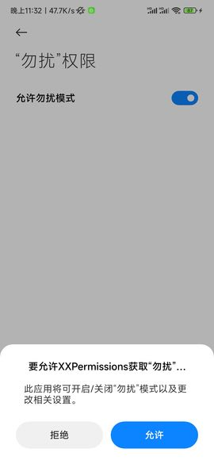

# अनुमति अनुरोध फ्रेमवर्क


-   परियोजना का पता:[Github](https://github.com/getActivity/XXPermissions)

-   ब्लॉग का पता:[अनुमति अनुरोध प्राप्त करने के लिए एक कोड इतना आसान कभी नहीं रहा](https://www.jianshu.com/p/c69ff8a445ed)

-   आप प्रदर्शन या परीक्षण के लिए डेमो डाउनलोड करने के लिए कोड को स्कैन कर सकते हैं। यदि स्कैन कोड डाउनलोड नहीं किया जा सकता है,[सीधे डाउनलोड करने के लिए यहां क्लिक करें](https://github.com/getActivity/XXPermissions/releases/download/16.2/XXPermissions.apk)


-   इसके अलावा, यदि आप Android 6.0 अनुमतियों के बारे में अधिक जानना चाहते हैं, तो आप इस लेख को पढ़ सकते हैं[एंड्रॉइड 6.0 रनटाइम अनुमति संकल्प](https://www.jianshu.com/p/6a4dff744031)





#### एकीकरण कदम

-   यदि आपका प्रोजेक्ट ग्रैडल कॉन्फ़िगरेशन में है`7.0 以下`, में होना चाहिए`build.gradle`फ़ाइल जोड़ी गई

```groovy
allprojects {
    repositories {
        // JitPack 远程仓库：https://jitpack.io
        maven { url 'https://jitpack.io' }
    }
}
```

-   यदि आपका ग्रैडल कॉन्फ़िगरेशन है`7.0 及以上`, आपको`settings.gradle`फ़ाइल जोड़ी गई

```groovy
dependencyResolutionManagement {
    repositories {
        // JitPack 远程仓库：https://jitpack.io
        maven { url 'https://jitpack.io' }
    }
}
```

-   प्रोजेक्ट ऐप मॉड्यूल के तहत रिमोट वेयरहाउस को कॉन्फ़िगर करने के बाद`build.gradle`फ़ाइल में दूरस्थ निर्भरताएँ जोड़ें

```groovy
android {
    // 支持 JDK 1.8
    compileOptions {
        targetCompatibility JavaVersion.VERSION_1_8
        sourceCompatibility JavaVersion.VERSION_1_8
    }
}

dependencies {
    // 权限请求框架：https://github.com/getActivity/XXPermissions
    implementation 'com.github.getActivity:XXPermissions:16.2'
}
```

#### AndroidX संगत

-   यदि परियोजना पर आधारित है**AndroidX**पैकेज, कृपया आइटम में`gradle.properties`फ़ाइल जोड़ी गई

```text
# 表示将第三方库迁移到 AndroidX
android.enableJetifier = true
```

-   यदि परियोजना पर आधारित है**सहायता**पैकेज को इस कॉन्फ़िगरेशन में जोड़ने की आवश्यकता नहीं है

#### विभाजन भंडारण

-   अगर प्रोजेक्ट को Android 10 पार्टीशन स्टोरेज फीचर के लिए अनुकूलित किया गया है, तो कृपया यहां जाएं`AndroidManifest.xml`में शामिल हों

```xml
<manifest>

    <application>

        <!-- 表示当前项目已经适配了分区存储特性 -->
        <meta-data
            android:name="ScopedStorage"
            android:value="true" />

    </application>

</manifest>
```

-   यदि वर्तमान परियोजना इस सुविधा के अनुकूल नहीं है, तो इस चरण को अनदेखा किया जा सकता है

-   यह ध्यान दिया जाना चाहिए कि इस विकल्प का उपयोग फ्रेमवर्क द्वारा यह निर्धारित करने के लिए किया जाता है कि क्या वर्तमान परियोजना विभाजन भंडारण के लिए अनुकूल है। यह ध्यान दिया जाना चाहिए कि यदि आपकी परियोजना को विभाजन भंडारण सुविधा के लिए अनुकूलित किया गया है, तो आप इसका उपयोग कर सकते हैं`READ_EXTERNAL_STORAGE`、`WRITE_EXTERNAL_STORAGE`अनुमति के लिए आवेदन करने के लिए, यदि आपका प्रोजेक्ट अभी तक विभाजन सुविधा के अनुकूल नहीं हुआ है, भले ही आप आवेदन करें`READ_EXTERNAL_STORAGE`、`WRITE_EXTERNAL_STORAGE`अनुमतियों के कारण बाहरी संग्रहण पर फ़ाइलें सामान्य रूप से पढ़ने में असमर्थ होंगी। यदि आपका प्रोजेक्ट विभाजन भंडारण के लिए उपयुक्त नहीं है, तो कृपया उपयोग करें`MANAGE_EXTERNAL_STORAGE`अनुमति के लिए आवेदन करने के लिए, ताकि बाह्य संग्रहण पर फ़ाइलें सामान्य रूप से पढ़ी जा सकें। यदि आप Android 10 विभाजन संग्रहण की विशेषताओं के बारे में अधिक जानना चाहते हैं, तो आप कर सकते हैं[देखने और सीखने के लिए यहां क्लिक करें](https://github.com/getActivity/AndroidVersionAdapter#android-100)。

#### अनुमति अनुरोध प्राप्त करने के लिए एक कोड इतना आसान कभी नहीं रहा

-   जावा उपयोग उदाहरण

```java
XXPermissions.with(this)
        // 申请单个权限
        .permission(Permission.RECORD_AUDIO)
        // 申请多个权限
        .permission(Permission.Group.CALENDAR)
        // 设置权限请求拦截器（局部设置）
        //.interceptor(new PermissionInterceptor())
        // 设置不触发错误检测机制（局部设置）
        //.unchecked()
        .request(new OnPermissionCallback() {

            @Override
            public void onGranted(List<String> permissions, boolean all) {
                if (!all) {
                    toast("获取部分权限成功，但部分权限未正常授予");
                    return;
                }
                toast("获取录音和日历权限成功");
            }

            @Override
            public void onDenied(List<String> permissions, boolean never) {
                if (never) {
                    toast("被永久拒绝授权，请手动授予录音和日历权限");
                    // 如果是被永久拒绝就跳转到应用权限系统设置页面
                    XXPermissions.startPermissionActivity(context, permissions);
                } else {
                    toast("获取录音和日历权限失败");
                }
            }
        });
```

-   कोटलिन उपयोग उदाहरण

```kotlin
XXPermissions.with(this)
    // 申请单个权限
    .permission(Permission.RECORD_AUDIO)
    // 申请多个权限
    .permission(Permission.Group.CALENDAR)
    // 设置权限请求拦截器（局部设置）
    //.interceptor(new PermissionInterceptor())
    // 设置不触发错误检测机制（局部设置）
    //.unchecked()
    .request(object : OnPermissionCallback {

        override fun onGranted(permissions: MutableList<String>, all: Boolean) {
            if (!all) {
                toast("获取部分权限成功，但部分权限未正常授予")
                return
            }
            toast("获取录音和日历权限成功")
        }

        override fun onDenied(permissions: MutableList<String>, never: Boolean) {
            if (never) {
                toast("被永久拒绝授权，请手动授予录音和日历权限")
                // 如果是被永久拒绝就跳转到应用权限系统设置页面
                XXPermissions.startPermissionActivity(context, permissions)
            } else {
                toast("获取录音和日历权限失败")
            }
        }
    })
```

#### ढांचे के अन्य एपीआई का परिचय

```java
// 判断一个或多个权限是否全部授予了
XXPermissions.isGranted(Context context, String... permissions);

// 获取没有授予的权限
XXPermissions.getDenied(Context context, String... permissions);

// 判断某个权限是否为特殊权限
XXPermissions.isSpecial(String permission);

// 判断一个或多个权限是否被永久拒绝了
XXPermissions.isPermanentDenied(Activity activity, String... permissions);

// 跳转到应用权限设置页
XXPermissions.startPermissionActivity(Context context, String... permissions);
XXPermissions.startPermissionActivity(Activity activity, String... permissions);
XXPermissions.startPermissionActivity(Activity activity, String... permission, OnPermissionPageCallback callback);
XXPermissions.startPermissionActivity(Fragment fragment, String... permissions);
XXPermissions.startPermissionActivity(Fragment fragment, String... permissions, OnPermissionPageCallback callback);

// 设置不触发错误检测机制（全局设置）
XXPermissions.setCheckMode(false);
// 设置权限申请拦截器（全局设置）
XXPermissions.setInterceptor(new IPermissionInterceptor() {});
```

#### अनुमति निगरानी कॉलबैक के पैरामीटर विवरण के बारे में

-   हम सभी जानते हैं कि यदि उपयोगकर्ता सभी को अनुदान देता है तो वह केवल कॉल करेगा**ऑन ग्रांटेड**विधि, जिसे केवल तभी कहा जाएगा जब उपयोगकर्ता सभी को अस्वीकार कर दे**पर अस्वीकृत**तरीका।

-   लेकिन एक और स्थिति है। यदि कई अनुमतियों का अनुरोध किया जाता है, तो ये अनुमतियाँ सभी प्रदान नहीं की जाती हैं या सभी को अस्वीकार कर दिया जाता है, लेकिन कुछ प्राधिकरणों को आंशिक रूप से अस्वीकार कर दिया जाता है। फ्रेमवर्क कॉलबैक को कैसे संभालेगा?

-   ढांचा पहले कॉल करेगा**पर अस्वीकृत**विधि, फिर कॉल करें**ऑन ग्रांटेड**तरीका। जिनमें से हम पास कर सकते हैं**ऑन ग्रांटेड**विधि में**सब**पैरामीटर यह निर्धारित करने के लिए कि सभी अनुमतियां दी गई हैं या नहीं।

-   यदि आप जानना चाहते हैं कि कॉलबैक में अनुमति दी गई है या अस्वीकार की गई है, तो आप कॉल कर सकते हैं**सूची**कक्षा में**शामिल है (अनुमति। XXX)**यह निर्धारित करने की विधि कि क्या यह अनुमति इस संग्रह में शामिल है।

## [अन्य अक्सर पूछे जाने वाले प्रश्नों के लिए, कृपया यहां क्लिक करें](HelpDoc.md)

#### समान अनुमति अनुरोध ढांचे के बीच तुलना

|                        अनुकूलन विवरण                        |                                   [XXअनुमतियां](https://github.com/getActivity/XXPermissions)                                  |                                    [औरअनुमति](https://github.com/yanzhenjie/AndPermission)                                   |                                   [अनुमतिX](https://github.com/guolindev/PermissionX)                                  |                            [एंड्रॉइड यूटीआईएल कोड](https://github.com/Blankj/AndroidUtilCode)                            |                                         [अनुमतियाँ डिस्पैचर](https://github.com/permissions-dispatcher/PermissionsDispatcher)                                        |                                [आरएक्सअनुमतियां](https://github.com/tbruyelle/RxPermissions)                               |                                   [आसान अनुमतियां](https://github.com/googlesamples/easypermissions)                                   |
| :---------------------------------------------------------: | :----------------------------------------------------------------------------------------------------------------------------: | :--------------------------------------------------------------------------------------------------------------------------: | :--------------------------------------------------------------------------------------------------------------------: | :----------------------------------------------------------------------------------------------------------------------: | :------------------------------------------------------------------------------------------------------------------------------------------------------------------: | :------------------------------------------------------------------------------------------------------------------------: | :------------------------------------------------------------------------------------------------------------------------------------: |
|                         संगत संस्करण                        |                                                              16.2                                                              |                                                             2.0.3                                                            |                                                          1.6.4                                                         |                                                          1.31.0                                                          |                                                                                 4.9.2                                                                                |                                                            0.12                                                            |                                                                  3.0.0                                                                 |
|                      मुद्दों की संख्या                      | [](https://github.com/getActivity/XXPermissions/issues) | [](https://github.com/yanzhenjie/AndPermission/issues) | [](https://github.com/guolindev/PermissionX/issues) | [](https://github.com/Blankj/AndroidUtilCode/issues) | [](https://github.com/permissions-dispatcher/PermissionsDispatcher/issues) | [](https://github.com/tbruyelle/RxPermissions/issues) | [](https://github.com/googlesamples/easypermissions/issues) |
|                         फ्रेम मात्रा                        |                                                             52 केबी                                                            |                                                           127 केबी                                                           |                                                         90 केबी                                                        |                                                         500 केबी                                                         |                                                                                99 केबी                                                                               |                                                           28 केबी                                                          |                                                                 48 केबी                                                                |
|                  फ्रेमवर्क रखरखाव की स्थिति                 |                                                         **रखरखाव में**                                                         |                                                        रखरखाव बंद करो                                                        |                                                     **रखरखाव में**                                                     |                                                      रखरखाव बंद करो                                                      |                                                                            रखरखाव बंद करो                                                                            |                                                       रखरखाव बंद करो                                                       |                                                             रखरखाव बंद करो                                                             |
|                   अलार्म अनुस्मारक अनुमति                   |                                                                ✅                                                               |                                                               ❌                                                              |                                                            ❌                                                           |                                                             ❌                                                            |                                                                                   ❌                                                                                  |                                                              ❌                                                             |                                                                    ❌                                                                   |
|                 सभी फ़ाइल प्रबंधन अनुमतियाँ                 |                                                                ✅                                                               |                                                               ❌                                                              |                                                            ✅                                                           |                                                             ❌                                                            |                                                                                   ❌                                                                                  |                                                              ❌                                                             |                                                                    ❌                                                                   |
|                 पैकेज अनुमतियाँ स्थापित करें                |                                                                ✅                                                               |                                                               ✅                                                              |                                                            ✅                                                           |                                                             ❌                                                            |                                                                                   ❌                                                                                  |                                                              ❌                                                             |                                                                    ❌                                                                   |
|                  पिक्चर-इन-पिक्चर अनुमतियां                 |                                                                ✅                                                               |                                                               ❌                                                              |                                                            ❌                                                           |                                                             ❌                                                            |                                                                                   ❌                                                                                  |                                                              ❌                                                             |                                                                    ❌                                                                   |
|                  फ़्लोटिंग विंडो अनुमतियां                  |                                                                ✅                                                               |                                                               ✅                                                              |                                                            ✅                                                           |                                                             ✅                                                            |                                                                                   ✅                                                                                  |                                                              ❌                                                             |                                                                    ❌                                                                   |
|                   सिस्टम सेटिंग अनुमतियां                   |                                                                ✅                                                               |                                                               ✅                                                              |                                                            ✅                                                           |                                                             ✅                                                            |                                                                                   ✅                                                                                  |                                                              ❌                                                             |                                                                    ❌                                                                   |
|                    अधिसूचना बार अनुमतियाँ                   |                                                                ✅                                                               |                                                               ✅                                                              |                                                            ❌                                                           |                                                             ❌                                                            |                                                                                   ❌                                                                                  |                                                              ❌                                                             |                                                                    ❌                                                                   |
|                अधिसूचना बार निगरानी की अनुमति               |                                                                ✅                                                               |                                                               ✅                                                              |                                                            ❌                                                           |                                                             ❌                                                            |                                                                                   ❌                                                                                  |                                                              ❌                                                             |                                                                    ❌                                                                   |
|                  अनुमति को डिस्टर्ब न करें                  |                                                                ✅                                                               |                                                               ❌                                                              |                                                            ❌                                                           |                                                             ❌                                                            |                                                                                   ❌                                                                                  |                                                              ❌                                                             |                                                                    ❌                                                                   |
|             बैटरी अनुकूलन अनुमति पर ध्यान न दें             |                                                                ✅                                                               |                                                               ❌                                                              |                                                            ❌                                                           |                                                             ❌                                                            |                                                                                   ❌                                                                                  |                                                              ❌                                                             |                                                                    ❌                                                                   |
|                   ऐप उपयोग की अनुमति देखें                  |                                                                ✅                                                               |                                                               ❌                                                              |                                                            ❌                                                           |                                                             ❌                                                            |                                                                                   ❌                                                                                  |                                                              ❌                                                             |                                                                    ❌                                                                   |
|                       वीपीएन अनुमतियां                      |                                                                ✅                                                               |                                                               ❌                                                              |                                                            ❌                                                           |                                                             ❌                                                            |                                                                                   ❌                                                                                  |                                                              ❌                                                             |                                                                    ❌                                                                   |
|                 Android 13 खतरनाक अनुमतियां                 |                                                                ✅                                                               |                                                               ❌                                                              |                                                            ❌                                                           |                                                             ❌                                                            |                                                                                   ❌                                                                                  |                                                              ❌                                                             |                                                                    ❌                                                                   |
|                 Android 12 खतरनाक अनुमतियां                 |                                                                ✅                                                               |                                                               ❌                                                              |                                                            ✅                                                           |                                                             ❌                                                            |                                                                                   ❌                                                                                  |                                                              ❌                                                             |                                                                    ❌                                                                   |
|                 Android 11 खतरनाक अनुमतियां                 |                                                                ✅                                                               |                                                               ❌                                                              |                                                            ✅                                                           |                                                             ❌                                                            |                                                                                   ❌                                                                                  |                                                              ❌                                                             |                                                                    ❌                                                                   |
|                 Android 10 खतरनाक अनुमतियां                 |                                                                ✅                                                               |                                                               ✅                                                              |                                                            ✅                                                           |                                                             ❌                                                            |                                                                                   ✅                                                                                  |                                                              ❌                                                             |                                                                    ❌                                                                   |
|                 Android 9.0 खतरनाक अनुमतियां                |                                                                ✅                                                               |                                                               ❌                                                              |                                                            ✅                                                           |                                                             ❌                                                            |                                                                                   ✅                                                                                  |                                                              ❌                                                             |                                                                    ❌                                                                   |
|                 Android 8.0 खतरनाक अनुमतियां                |                                                                ✅                                                               |                                                               ✅                                                              |                                                            ✅                                                           |                                                             ❌                                                            |                                                                                   ✅                                                                                  |                                                              ❌                                                             |                                                                    ❌                                                                   |
| नई अनुमतियां पुराने उपकरणों के साथ स्वचालित रूप से संगत हैं |                                                                ✅                                                               |                                                               ❌                                                              |                                                            ❌                                                           |                                                             ❌                                                            |                                                                                   ❌                                                                                  |                                                              ❌                                                             |                                                                    ❌                                                                   |
|            स्क्रीन ओरिएंटेशन रोटेशन दृश्य अनुकूलन           |                                                                ✅                                                               |                                                               ✅                                                              |                                                            ✅                                                           |                                                             ❌                                                            |                                                                                   ✅                                                                                  |                                                              ❌                                                             |                                                                    ❌                                                                   |
|         पृष्ठभूमि अनुप्रयोग अनुमति परिदृश्य अनुकूलन         |                                                                ✅                                                               |                                                               ❌                                                              |                                                            ❌                                                           |                                                             ❌                                                            |                                                                                   ❌                                                                                  |                                                              ❌                                                             |                                                                    ❌                                                                   |
|                Android 12 मेमोरी लीक बग फिक्स               |                                                                ✅                                                               |                                                               ❌                                                              |                                                            ❌                                                           |                                                             ❌                                                            |                                                                                   ❌                                                                                  |                                                              ❌                                                             |                                                                    ❌                                                                   |
|                 त्रुटि का पता लगाने का तंत्र                |                                                                ✅                                                               |                                                               ❌                                                              |                                                            ❌                                                           |                                                             ❌                                                            |                                                                                   ❌                                                                                  |                                                              ❌                                                             |                                                                    ❌                                                                   |

#### पुराने उपकरणों के साथ स्वचालित रूप से संगत नई अनुमतियों का परिचय

-   Android संस्करणों के निरंतर अद्यतन के साथ, खतरनाक अनुमतियाँ और विशेष अनुमतियाँ भी बढ़ रही हैं, इसलिए इस समय एक संस्करण संगतता समस्या होगी। उच्च-संस्करण Android डिवाइस निम्न-संस्करण अनुमतियों के लिए आवेदन करने का समर्थन करते हैं, लेकिन निम्न-संस्करण Android डिवाइस नहीं करते हैं अनुमतियों के एक उच्च संस्करण के लिए आवेदन करने में सहायता, तो इस समय एक संगतता समस्या होगी।

-   सत्यापन के बाद, अन्य अनुमति ढांचे ने सबसे सरल और सबसे कठोर तरीका चुना है, यानी, वे संगतता नहीं करते हैं, लेकिन इसे बाहरी कॉलर को संगतता के लिए छोड़ देते हैं। कॉलर को पहले बाहरी परत में एंड्रॉइड संस्करण का न्याय करना होगा, और पास करना होगा उच्च संस्करण में। ढांचे को नई अनुमति दी जाती है, और पुरानी अनुमति निचले संस्करण पर ढांचे को दी जाती है। यह विधि सरल और कठोर लगती है, लेकिन विकास का अनुभव खराब है। साथ ही, यह भी छुपाता है एक गड्ढा बाहरी कॉल करने वालों को पता है कि नई अनुमति पुरानी अनुमति से मेल खाती है? मुझे नहीं लगता कि हर कोई इसे जानता है, और एक बार धारणा गलत हो जाने पर, यह अनिवार्य रूप से गलत परिणाम देगा।

-   मुझे लगता है कि इसे करने के लिए इसे ढांचे पर छोड़ना सबसे अच्छा तरीका है,**XXअनुमतियां**यह वही है जो किया जाता है। जब बाहरी कॉलर उच्च संस्करण अनुमति के लिए आवेदन करता है, तो निचला संस्करण डिवाइस स्वचालित रूप से निचले संस्करण की अनुमति को लागू करने के लिए जोड़ देगा। सबसे सरल उदाहरण के लिए, एंड्रॉइड 11 दिखाई दिया`MANAGE_EXTERNAL_STORAGE`नई अनुमति, अगर इसे एंड्रॉइड 10 और उससे नीचे के उपकरणों पर इस अनुमति के लिए लागू किया जाता है, तो ढांचा स्वचालित रूप से इसे जोड़ देगा`READ_EXTERNAL_STORAGE`तथा`WRITE_EXTERNAL_STORAGE`आवेदन करने के लिए, Android 10 और उससे नीचे के उपकरणों पर, हम सीधे डाल सकते हैं`MANAGE_EXTERNAL_STORAGE`जैसा`READ_EXTERNAL_STORAGE`तथा`WRITE_EXTERNAL_STORAGE`उपयोग करने के लिए, क्योंकि`MANAGE_EXTERNAL_STORAGE`क्या किया जा सकता है, Android 10 और उससे नीचे के उपकरणों पर, उपयोग करें`READ_EXTERNAL_STORAGE`तथा`WRITE_EXTERNAL_STORAGE`करने के लिए।

-   तो हर कोई उपयोग कर रहा है**XXअनुमतियां**जब आप एक नई अनुमति के लिए आवेदन करना चाहते हैं, तो आपको पुरानी और नई अनुमतियों की संगतता के बारे में बिल्कुल भी परवाह करने की आवश्यकता नहीं है। ढांचा स्वचालित रूप से आपके लिए इसे संभाल लेगा। अन्य ढांचे के विपरीत, मैं और क्या करना चाहता हूं सभी को एक कोड लिखने दें। अनुमति अनुरोध प्राप्त करें, ढांचा कर सकता है, सभी प्रसंस्करण के लिए ढांचे के लिए।

#### स्क्रीन रोटेशन दृश्य अनुकूलन परिचय

-   सिस्टम अनुमति एप्लिकेशन डायलॉग बॉक्स पॉप अप होने के बाद गतिविधि की स्क्रीन को घुमाने से अनुमति एप्लिकेशन कॉलबैक विफल हो जाएगा, क्योंकि स्क्रीन रोटेशन के कारण फ्रेमवर्क में फ्रैगमेंट नष्ट हो जाएगा और फिर से बनाया जाएगा, जिससे इसमें कॉलबैक ऑब्जेक्ट होगा। सीधे पुनर्नवीनीकरण किया जा सकता है, और अंततः कॉलबैक असामान्य होने का कारण बनता है। कई समाधान हैं, एक है मेनिफेस्ट फ़ाइल में जोड़ना`android:configChanges="orientation"`विशेषता, ताकि स्क्रीन घुमाए जाने पर गतिविधि और टुकड़ा नष्ट न हो और पुनर्निर्माण न हो। दूसरा यह है कि गतिविधि प्रदर्शन की दिशा सीधे मेनिफेस्ट फ़ाइल में तय की जाए, लेकिन उपरोक्त दो समाधानों को उन लोगों द्वारा नियंत्रित किया जाना चाहिए जो इसका उपयोग करते हैं ढांचा, जो स्पष्ट रूप से पर्याप्त लचीला नहीं है। अभी भी घंटी बांधने की जरूरत है, फ्रेम की समस्या को फ्रेम द्वारा हल किया जाना चाहिए, और**आरएक्सअनुमतियां**समाधान PermissionFragment ऑब्जेक्ट सेट करना है`fragment.setRetainInstance(true)`, इसलिए भले ही स्क्रीन घुमाई गई हो, गतिविधि वस्तु नष्ट हो जाएगी और फिर से बनाई जाएगी, और टुकड़ा नष्ट और पुनर्निर्माण नहीं किया जाएगा, और पिछली वस्तु का पुन: उपयोग किया जाएगा, लेकिन एक समस्या है, अगर गतिविधि को फिर से लिखा जाता है**onSaveInstanceState**विधि सीधे इस पद्धति की विफलता की ओर ले जाएगी, जो स्पष्ट रूप से केवल एक अस्थायी समाधान है, लेकिन मूल कारण नहीं है।**XXअनुमतियां**रास्ता अधिक प्रत्यक्ष होगा, in**अनुमति टुकड़ा**किसी गतिविधि के लिए बाध्य होने पर, वर्तमान गतिविधि का**स्क्रीन ओरिएंटेशन फिक्स्ड**, अनुमति आवेदन समाप्त होने के बाद,**स्क्रीन ओरिएंटेशन रीसेट करें**。

-   सभी अनुमति अनुरोध ढांचे में, यह समस्या तब तक होती है जब तक अनुमतियों के लिए आवेदन करने के लिए फ्रैगमेंट का उपयोग किया जाता है, और एंडप्रमिशन वास्तव में एक नई गतिविधि बनाकर अनुमतियों के लिए लागू होता है, इसलिए यह समस्या नहीं होती है। अनुमतियां डिस्पैचर कोड उत्पन्न करने के लिए एपीटी का उपयोग करती है। अनुमति के लिए आवेदन करें, इसलिए ऐसी कोई समस्या नहीं है, और PermissionX सीधे XXPermissions के समाधान पर आधारित है। विवरण के लिए, कृपया देखें[XXअनुमतियां/मुद्दे/49](https://github.com/getActivity/XXPermissions/issues/49)、[अनुमतिX/मुद्दों/51](https://github.com/guolindev/PermissionX/issues/51)。

#### पृष्ठभूमि आवेदन अनुमति परिदृश्य परिचय

-   जब हम समय लेने वाली कार्रवाई करने के बाद अनुमति के लिए आवेदन करते हैं (उदाहरण के लिए, स्प्लैश स्क्रीन पेज पर गोपनीयता समझौता प्राप्त करें और फिर अनुमतियों के लिए आवेदन करें), नेटवर्क अनुरोध प्रक्रिया के दौरान गतिविधि को डेस्कटॉप पर (पृष्ठभूमि पर वापस) लौटाएं, और फिर अनुमति अनुरोध को पृष्ठभूमि स्थिति में होने का कारण बनता है, इस समय, अनुमति आवेदन असामान्य हो सकता है, और प्राधिकरण संवाद बॉक्स प्रदर्शित नहीं होगा। अनुचित हैंडलिंग भी एक दुर्घटना का कारण बनेगी, जैसे कि[आरएक्स अनुमति/मुद्दे/249](https://github.com/tbruyelle/RxPermissions/issues/249). इसका कारण यह है कि फ्रेमवर्क में PermissionFragment है**कमिट / कमिट नाउ**जब यह गतिविधि पर आता है, तो एक पता लगाया जाएगा। यदि गतिविधि की स्थिति अदृश्य है, तो एक अपवाद फेंक दिया जाएगा, और**आरएक्स अनुमति**बिल्कुल इस्तेमाल किया**कमिट नाउ**दुर्घटना का कारण होगा, उपयोग करें**CommitAllowingStateLoss / commitNowAllowingStateLoss**आप इस पहचान से बच सकते हैं, हालांकि यह क्रैश से बच सकता है, लेकिन एक और समस्या होगी, सिस्टम प्रदान करता है**अनुरोधअनुमतियाँ**जब गतिविधि दिखाई नहीं दे रही हो तो एपीआई कॉल प्राधिकरण संवाद को पॉप अप नहीं करेगा,**XXअनुमतियां**समाधान डालना है**अनुरोधअनुमतियाँ**से समय**सृजन करना**में ले जाया गया**फिर शुरू करना**, क्योंकि गतिविधि और टुकड़े के जीवनचक्र के तरीकों को एक साथ बंडल किया जाता है, यदि गतिविधि अदृश्य है, तो भले ही टुकड़ा बनाया गया हो, इसे केवल कहा जाएगा**ऑनक्रिएट**इसके कॉल किए बिना विधि**कम पर**विधि, और अंत में जब गतिविधि पृष्ठभूमि से अग्रभूमि में वापस आती है, न केवल यह ट्रिगर होगी**गतिविधि.फिर से शुरू करें**विधि, जो ट्रिगर भी करती है**अनुमति टुकड़ा**का**कम पर**विधि, इस विधि में अनुमति के लिए आवेदन करना अंतिम की गारंटी दे सकता है**अनुरोधअनुमतियाँ**कॉल का समय गतिविधि में है**दृश्य अवस्था में**नीचे।

#### Android 12 मेमोरी लीक समस्या की मरम्मत का परिचय

-   किसी ने हाल ही में मुझसे स्मृति रिसाव के बारे में पूछा[XXअनुमतियां/मुद्दे/133](https://github.com/getActivity/XXPermissions/issues/133), मैंने पुष्टि की कि यह समस्या वास्तव में अभ्यास के बाद मौजूद है, लेकिन कोड स्टैक को देखकर, मैंने पाया कि यह समस्या सिस्टम के कोड के कारण होती है, और इस समस्या का कारण बनने के लिए निम्नलिखित स्थितियों की आवश्यकता होती है:

    1.  Android 12 उपकरणों पर उपयोग करें

    2.  बुलाया`Activity.shouldShowRequestPermissionRationale`

    3.  उसके बाद, कोड में गतिविधि.फिनिश विधि को सक्रिय रूप से बुलाया गया था

-   जांच की प्रक्रिया: कोड को ट्रेस करने के बाद पता चलता है कि कोड कॉल स्टैक इस प्रकार है

    -   गतिविधि.चाहिए

    -   PackageManager. shouldShowRequestPermissionRationale (कार्यान्वयन वस्तु ApplicationPackageManager है)

    -   PermissionManager. shouldShowRequestPermissionRationale

    -   नया अनुमति प्रबंधक (संदर्भ संदर्भ)

    -   नई अनुमति उपयोग हेल्पर (संदर्भ संदर्भ)

    -   AppOpsManager.startदेखना प्रारंभ किया गया

-   अपराधी वास्तव में है**अनुमति उपयोग हेल्पर**Context ऑब्जेक्ट को फ़ील्ड के रूप में पकड़ें और इसे कंस्ट्रक्टर में कॉल करें`AppOpsManager.startWatchingStarted`सुनना चालू करें ताकि PermissionUsageHelper ऑब्जेक्ट को इसमें जोड़ा जा सके`AppOpsManager#mStartedWatchers`संग्रह में, इसका परिणाम यह होता है कि जब गतिविधि सक्रिय रूप से समाप्त होती है, तो निगरानी को हटाने के लिए स्टॉपवॉचिंगस्टार्ट का उपयोग नहीं किया जाता है, जिसके परिणामस्वरूप गतिविधि ऑब्जेक्ट को रखा जाता है`AppOpsManager#mStartedWatchers`इसे संग्रह में रखा जाता है, इसलिए गतिविधि वस्तु को अप्रत्यक्ष रूप से सिस्टम द्वारा पुनर्नवीनीकरण नहीं किया जा सकता है।

-   इस समस्या से निपटना भी बहुत ही सरल और कठोर है, यानी इसे बाहरी परत से पास किया जाएगा।**संदर्भ**से पैरामीटर**गतिविधि**वस्तु के साथ प्रतिस्थापित किया जाता है**आवेदन पत्र**वस्तु पर्याप्त है, कुछ लोग कह सकते हैं, केवल गतिविधि में`shouldShowRequestPermissionRationale`विधि, क्या होगा यदि आवेदन में ऐसी कोई विधि नहीं है? इस पद्धति के कार्यान्वयन को देखते हुए, वास्तव में, वह विधि अंततः कॉल करेगी`PackageManager.shouldShowRequestPermissionRationale`तरीका(**एपीआई छुपाएं, लेकिन ब्लैकलिस्ट में नहीं**), इसलिए जब तक आप प्राप्त कर सकते हैं**पैकेज प्रबंधक**ऑब्जेक्ट पर्याप्त है, और अंत में इस विधि को निष्पादित करने के लिए प्रतिबिंब का उपयोग करें, ताकि मेमोरी लीक से बचा जा सके।

-   सौभाग्य से, Google ने PackageManager. shouldShowRequestPermissionRationale को प्रतिबिंब ब्लैकलिस्ट में शामिल नहीं किया, अन्यथा इस बार Google के गधे को पोंछने का कोई तरीका नहीं है, अन्यथा इसे केवल सिस्टम स्रोत कोड को संशोधित करके लागू किया जा सकता है, लेकिन यह विधि केवल Google द्वारा लागू की जा सकती है। अनुवर्ती Android का Android संस्करण ऊपर तय किया गया है, लेकिन सौभाग्य से, Android 12 L के संस्करण के बाद, यह समस्या ठीक हो गई है,[विशिष्ट सबमिशन रिकॉर्ड यहां क्लिक करके देखा जा सकता है](https://cs.android.com/android/_/android/platform/frameworks/base/+/0d47a03bfa8f4ca54b883ff3c664cd4ea4a624d9:core/java/android/permission/PermissionUsageHelper.java;dlc=cec069482f80019c12f3c06c817d33fc5ad6151f), लेकिन Android 12 के लिए, यह अभी भी एक विरासती समस्या है।

-   यह ध्यान देने योग्य है कि XXPermissions वर्तमान में इस समस्या को ठीक करने के लिए अपनी तरह का पहला और एकमात्र ढांचा है। इसके अलावा, इस समस्या के लिए, मैंने Google को भी दिया[AndroidX](https://github.com/androidx/androidx/pull/435)परियोजना ने मुफ्त में एक समाधान प्रदान किया है, और मर्ज अनुरोध को अब मुख्य शाखा में मिला दिया गया है। मेरा मानना ​​है कि इस कदम के माध्यम से, दुनिया भर में लगभग 1 बिलियन एंड्रॉइड 12 उपकरणों पर मेमोरी लीक की समस्या हल हो जाएगी।

#### त्रुटि जांच तंत्र का परिचय

-   ढांचे के दैनिक रखरखाव में, कई लोगों ने मुझे बताया है कि ढांचे में बग हैं, लेकिन जांच और स्थिति के बाद, यह पाया गया है कि 95% समस्याएं कॉलर के कुछ अनियमित संचालन के कारण होती हैं, जो न केवल मुझे बहुत सारी समस्याओं का कारण बना। परेशानी, और कई दोस्तों के समय और ऊर्जा की एक बड़ी बर्बादी, इसलिए मैंने ढांचे में बहुत सारे समीक्षा तत्व जोड़े, में**डिबग मोड**、**डिबग मोड**、**डिबग मोड**एक बार जब कुछ संचालन विनिर्देश के अनुरूप नहीं होते हैं, तो ढांचा सीधे कॉलर को अपवाद फेंक देगा, और अपवाद जानकारी में त्रुटि को ठीक करने के लिए कॉलर को सही ढंग से मार्गदर्शन करेगा, उदाहरण के लिए:

    -   आने वाला संदर्भ उदाहरण एक गतिविधि वस्तु नहीं है, ढांचा एक अपवाद फेंक देगा, या आने वाली गतिविधि की स्थिति असामान्य है (पहले से ही**परिष्करण**या**नष्ट हो गए**), यह स्थिति आम तौर पर अनुमतियों के लिए अतुल्यकालिक रूप से आवेदन करने के कारण होती है, और ढांचा भी एक अपवाद फेंक देगा। कृपया सही समय पर अनुमति के लिए आवेदन करें। यदि आवेदन के समय का अनुमान नहीं लगाया जा सकता है, तो कृपया गतिविधि पर एक अच्छा निर्णय लें अनुमति के लिए आवेदन करने से पहले बाहरी परत पर स्थिति।

    -   यदि कॉलर बिना किसी अनुमति के अनुमति के लिए आवेदन करता है, तो ढांचा एक अपवाद फेंक देगा, या यदि कॉलर द्वारा पारित अनुमतियां खतरनाक अनुमतियां या विशेष अनुमतियां नहीं हैं, तो ढांचा भी अपवाद फेंक देगा, क्योंकि कुछ लोग सामान्य का उपयोग करेंगे अनुमतियाँ जब ढांचे को एक खतरनाक अनुमति दी जाती है, तो सिस्टम सीधे इसे अस्वीकार कर देगा।

    -   यदि वर्तमान परियोजना विभाजन भंडारण के लिए उपयुक्त नहीं है, तो इसके लिए आवेदन करें`READ_EXTERNAL_STORAGE`तथा`WRITE_EXTERNAL_STORAGE`अनुमति

        -   जब परियोजना`targetSdkVersion >= 29`, इसे मेनिफेस्ट फ़ाइल में पंजीकृत करने की आवश्यकता है`android:requestLegacyExternalStorage="true"`विशेषता, अन्यथा ढांचा एक अपवाद फेंक देगा। यदि इसे जोड़ा नहीं गया है, तो यह एक समस्या पैदा करेगा। जाहिर है, भंडारण की अनुमति प्राप्त कर ली गई है, लेकिन बाहरी भंडारण की फ़ाइलों को एंड्रॉइड 10 डिवाइस पर सामान्य रूप से पढ़ा और लिखा नहीं जा सकता है।

        -   जब परियोजना`targetSdkVersion >= 30`, आप आवेदन नहीं कर सकते`READ_EXTERNAL_STORAGE`तथा`WRITE_EXTERNAL_STORAGE`अनुमति है, लेकिन इसके लिए आवेदन करना चाहिए`MANAGE_EXTERNAL_STORAGE`अनुमति

        -   यदि वर्तमान प्रोजेक्ट को विभाजन भंडारण के लिए अनुकूलित किया गया है, तो आपको केवल मेनिफेस्ट फ़ाइल में मेटा-डेटा विशेषता पंजीकृत करने की आवश्यकता है:`<meta-data android:name="ScopedStorage" android:value="true" />`

    -   यदि अनुरोधित अनुमति में बैकग्राउंड पोजिशनिंग अनुमति शामिल है, तो इसमें पोजिशनिंग से असंबंधित अनुमतियां शामिल नहीं हो सकती हैं, अन्यथा फ्रेमवर्क एक अपवाद फेंक देगा, क्योंकि`ACCESS_BACKGROUND_LOCATION`यदि एप्लिकेशन को अन्य गैर-स्थान अनुमतियों के साथ मिलाया जाता है, तो एप्लिकेशन को सीधे Android 11 पर अस्वीकार कर दिया जाएगा।

    -   यदि अनुरोधित अनुमति और परियोजना की**लक्ष्यएसडीकेसंस्करण**नहीं, ढांचा एक अपवाद फेंकता है क्योंकि**लक्ष्यएसडीकेसंस्करण**यह दर्शाता है कि परियोजना को किस Android संस्करण के लिए अनुकूलित किया गया है, और सिस्टम स्वचालित रूप से पिछड़ा संगतता बना देगा। यह माना जाता है कि जिस अनुमति के लिए आवेदन किया गया है वह केवल Android 11 में उपलब्ध है, लेकिन**लक्ष्यएसडीकेसंस्करण**अभी भी 29 पर रहना, फिर कुछ मॉडलों पर एप्लिकेशन में एक प्राधिकरण अपवाद होगा, अर्थात, उपयोगकर्ता ने स्पष्ट रूप से अधिकृत किया है, लेकिन सिस्टम हमेशा गलत होता है।

    -   यदि गतिशील रूप से अनुरोधित अनुमति अंदर नहीं है`AndroidManifest.xml`यदि आप ऐसा नहीं करते हैं, तो आप अनुमति के लिए आवेदन कर सकते हैं, लेकिन प्राधिकरण पॉप-अप विंडो दिखाई नहीं देगी, और इसे सिस्टम द्वारा सीधे अस्वीकार कर दिया जाएगा, और सिस्टम कोई पॉप-अप विंडो और संकेत नहीं देगा, और यह हर मॉडल पर समस्या**देखना होगा**。

    -   यदि गतिशील रूप से अनुरोधित अनुमति है`AndroidManifest.xml`में पंजीकृत है, लेकिन एक अनुपयुक्त`android:maxSdkVersion`संपत्ति मूल्य, ढांचा एक अपवाद फेंक देगा, उदाहरण के लिए:`<uses-permission android:name="xxxx" android:maxSdkVersion="29" />`, ऐसी सेटिंग का परिणाम Android 11 (`Build.VERSION.SDK_INT >= 30`) और ऊपर के उपकरणों को अनुमति के लिए आवेदन करने के लिए, सिस्टम विचार करेगा कि अनुमति मेनिफेस्ट फ़ाइल में पंजीकृत नहीं है, और सीधे इस अनुमति आवेदन को अस्वीकार कर देगा, और कोई पॉप-अप विंडो और संकेत नहीं देगा, यह समस्या भी अपरिहार्य है।

    -   यदि आप एक ही समय में आवेदन करते हैं`MANAGE_EXTERNAL_STORAGE`、`READ_EXTERNAL_STORAGE`、`WRITE_EXTERNAL_STORAGE`इन तीन अनुमतियों के लिए, फ्रेमवर्क एक अपवाद फेंक देगा, जो आपको एक ही समय में इन तीन अनुमतियों के लिए आवेदन न करने के लिए कहेगा, ऐसा इसलिए है क्योंकि Android 11 और इसके बाद के संस्करण उपकरणों पर, एप्लिकेशन`MANAGE_EXTERNAL_STORAGE`अनुमति, कोई आवेदन नहीं`READ_EXTERNAL_STORAGE`、`WRITE_EXTERNAL_STORAGE`अनुमति आवश्यक है, ऐसा इसलिए है क्योंकि आवेदन`MANAGE_EXTERNAL_STORAGE`अनुमति से अधिक होने के बराबर है`READ_EXTERNAL_STORAGE`、`WRITE_EXTERNAL_STORAGE`अधिक शक्तिशाली क्षमताएं, यदि आप ऐसा करने पर जोर देते हैं, तो यह प्रतिकूल होगा। यह मानते हुए कि ढांचा अनुमति देता है, एक ही समय में दो प्राधिकरण विधियां होंगी, एक पॉप-अप विंडो प्राधिकरण है, और दूसरा जंप पेज प्राधिकरण है उपयोगकर्ता को दो प्राधिकरण करने होंगे। लेकिन वास्तव में वहाँ है`MANAGE_EXTERNAL_STORAGE`उपयोग के लिए अनुमति पर्याप्त है। इस समय, आपके मन में एक प्रश्न हो सकता है। आप आवेदन न करें।`READ_EXTERNAL_STORAGE`、`WRITE_EXTERNAL_STORAGE`अनुमतियां, कोई Android 11 या उससे कम नहीं`MANAGE_EXTERNAL_STORAGE`क्या इस अनुमति में कोई समस्या नहीं होगी? आप इस मुद्दे के बारे में निश्चिंत हो सकते हैं, यदि आप आवेदन करते हैं तो ढांचा निर्णय करेगा`MANAGE_EXTERNAL_STORAGE`Android 11 के नीचे के फ़्रेमवर्क में अनुमतियां अपने आप जुड़ जाएंगी`READ_EXTERNAL_STORAGE`、`WRITE_EXTERNAL_STORAGE`आवेदन करने के लिए आएं, इसलिए निचले संस्करण में अनुमतियों की कमी के कारण यह अनुपलब्ध नहीं होगा।

    -   यदि आपको उपरोक्त परीक्षणों की आवश्यकता नहीं है, तो आप इसे कॉल करके कर सकते हैं`unchecked`बंद करने की विधि, लेकिन यह ध्यान दिया जाना चाहिए कि मैं आपको इस पहचान को बंद करने की अनुशंसा नहीं करता, क्योंकि में**रिलीज मोड**जब यह बंद हो जाता है, तो आपको इसे मैन्युअल रूप से बंद करने की आवश्यकता नहीं होती है, और यह केवल में है**डिबग मोड**ये पहचान केवल ट्रिगर की जाएंगी।

-   इन समस्याओं का कारण यह है कि हम इन तंत्रों से बहुत परिचित नहीं हैं, और यदि रूपरेखा इसे सीमित नहीं करती है, तो सभी प्रकार की अजीब समस्याएं सामने आएंगी। रूपरेखा के लेखक के रूप में, आप न केवल बहुत दर्दनाक हैं, बल्कि बहुत दर्दनाक भी हैं। ढांचे के लेखक के रूप में दर्दनाक। घायल। क्योंकि ये समस्याएं फ्रेमवर्क के कारण नहीं होती हैं, बल्कि कॉलर के कुछ अनियमित संचालन के कारण होती हैं। मुझे लगता है कि इस समस्या का सबसे अच्छा समाधान यह है कि ढांचा एक एकीकृत जांच करे, क्योंकि मैं ढांचे का लेखक हूं, और मुझे अनुमति आवेदन के बारे में ज्ञान है।**मजबूत पेशेवर क्षमता और पर्याप्त अनुभव**, जानें क्या करें और क्या न करें, ताकि आप एक-एक करके इन महत्वपूर्ण कार्यों को रोक सकें।

-   जब अनुमति आवेदन में कोई समस्या होती है, तो क्या आप उम्मीद करते हैं कि कोई आपको याद दिलाने के लिए आ सकता है और आपको बता सकता है कि क्या गलत हुआ? इसे कैसे ठीक करें? हालांकि, ये XXPermissions इसे करते हैं। सभी अनुमति अनुरोध ढांचे में से, मैं ऐसा करने वाला पहला व्यक्ति हूं, मुझे लगता है**एक फ्रेम बनाओ**यह न केवल कार्यों में अच्छा काम करने के लिए है, बल्कि जटिल परिदृश्यों से निपटने के लिए भी है, और इससे भी महत्वपूर्ण बात यह है कि**लोगों को उन्मुख**, क्योंकि ढांचा ही लोगों की सेवा करने के लिए है, हमें जो करने की आवश्यकता है वह न केवल सभी की जरूरतों को हल करने के लिए है, बल्कि इस प्रक्रिया में सभी को चक्कर से बचने में मदद करने के लिए भी है।

#### फ़्रेम हाइलाइट्स

-   Android 13 . के लिए पहला अनुमति अनुरोध ढांचा

-   सभी Android संस्करणों के लिए पहला और एकमात्र अनुमति अनुरोध ढांचा

-   संक्षिप्त और उपयोग में आसान: चेन कॉल की विधि का उपयोग करें, कोड की केवल एक पंक्ति का उपयोग करें

-   प्रभावशाली वॉल्यूम: फ़ंक्शन एक ही प्रकार के फ़्रेम में सबसे पूर्ण है, लेकिन फ़्रेम वॉल्यूम नीचे है

-   चरम स्थितियों के अनुकूल: अनुमति के लिए आवेदन करने के लिए वातावरण कितना भी चरम क्यों न हो, ढांचा अभी भी मजबूत है

-   डाउनवर्ड संगतता विशेषता: पुरानी प्रणाली में सामान्य रूप से नई अनुमतियां लागू की जा सकती हैं, और कॉलर को अनुकूलित करने की आवश्यकता के बिना ढांचा स्वचालित रूप से अनुकूलित हो जाएगा

-   स्वचालित रूप से त्रुटियों का पता लगाएं: यदि कोई त्रुटि है, तो ढांचा सक्रिय रूप से कॉलर को अपवाद फेंक देगा (केवल डीबग के तहत न्याय किया जाता है, पालने में बग को मारें)

#### लेखक के अन्य ओपन सोर्स प्रोजेक्ट

-   Android प्रौद्योगिकी केंद्र:[एंड्रॉइडप्रोजेक्ट](https://github.com/getActivity/AndroidProject)

-   Android प्रौद्योगिकी मध्य मंच Kt संस्करण:[Androidप्रोजेक्ट-कोटलिन](https://github.com/getActivity/AndroidProject-Kotlin)

-   टोस्ट फ्रेम:[टोस्ट यूटिल्स](https://github.com/getActivity/ToastUtils)

-   वेब ढांचा:[आसान एचटीपी](https://github.com/getActivity/EasyHttp)

-   शीर्षक ब्लॉक फ्रेम:[शीर्षक पट्टी](https://github.com/getActivity/TitleBar)

-   फ्लोटिंग विंडो फ्रेम:[एक्स टोस्ट](https://github.com/getActivity/XToast)

-   आकार फ्रेम:[आकार दृश्य](https://github.com/getActivity/ShapeView)

-   भाषा स्विचिंग ढांचा:[कई भाषाएं](https://github.com/getActivity/MultiLanguages)

-   Gson पार्सिंग दोष सहिष्णुता:[GsonFactory](https://github.com/getActivity/GsonFactory)

-   लॉग देखने की रूपरेखा:[लोगकैट](https://github.com/getActivity/Logcat)

-   Android संस्करण अनुकूलन:[Android संस्करण एडेप्टर](https://github.com/getActivity/AndroidVersionAdapter)

-   एंड्रॉइड कोड विनिर्देश:[AndroidCodeStandard](https://github.com/getActivity/AndroidCodeStandard)

-   एंड्रॉइड ओपन सोर्स लीडरबोर्ड:[AndroidGithubबॉस](https://github.com/getActivity/AndroidGithubBoss)

-   स्टूडियो बुटीक प्लगइन्स:[स्टूडियो प्लगइन्स](https://github.com/getActivity/StudioPlugins)

-   अभिव्यक्ति पैक का एक बड़ा संग्रह:[इमोजी पीए सी छाया](https://github.com/getActivity/EmojiPackage)

-   प्रांतों और शहरों का Json डेटा:[प्रांतजॉन](https://github.com/getActivity/ProvinceJson)

#### WeChat सार्वजनिक खाता: Android पहिया भाई


#### Android तकनीक Q समूह: 10047167

#### अगर आपको लगता है कि मेरी ओपन सोर्स लाइब्रेरी ने आपको विकास के समय को बचाने में मदद की है, तो कृपया इनाम देने के लिए नीचे दिए गए क्यूआर कोड को स्कैन करें, अगर आप 10.24 इनाम दे सकते हैं: बंदर\_फेस: यह भी होगा: थम्सअप:। आपका समर्थन मुझे बनाना जारी रखने के लिए प्रोत्साहित करेगा :octocat:


#### [दान सूची देखने के लिए क्लिक करें](https://github.com/getActivity/Donate)

## लाइसेंस

```text
Copyright 2018 Huang JinQun

Licensed under the Apache License, Version 2.0 (the "License");
you may not use this file except in compliance with the License.
You may obtain a copy of the License at

   http://www.apache.org/licenses/LICENSE-2.0

Unless required by applicable law or agreed to in writing, software
distributed under the License is distributed on an "AS IS" BASIS,
WITHOUT WARRANTIES OR CONDITIONS OF ANY KIND, either express or implied.
See the License for the specific language governing permissions and
limitations under the License.
```
