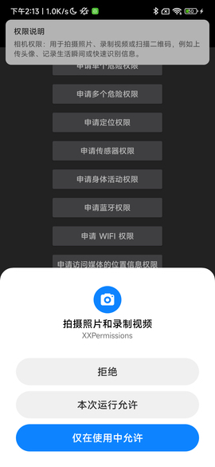
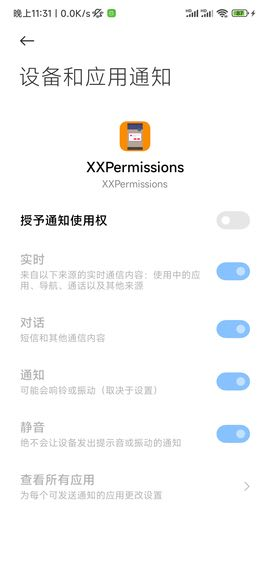

# [English Doc](README-en.md)

# 权限请求框架


* 项目地址：[Github](https://github.com/getActivity/XXPermissions)

* 博文地址：[一句代码搞定权限请求，从未如此简单](https://www.jianshu.com/p/c69ff8a445ed)

* 可以扫码下载 Demo 进行演示或者测试，如果扫码下载不了的，[点击此处可直接下载](https://github.com/getActivity/XXPermissions/releases/download/18.3/XXPermissions.apk)


* 另外想对 Android 6.0 权限需要深入了解的，可以看这篇文章[Android 6.0 运行权限解析](https://www.jianshu.com/p/6a4dff744031)

  

  

  

  

  

#### 集成步骤

* 如果你的项目 Gradle 配置是在 `7.0` 以下，需要在 `build.gradle` 文件中加入

```groovy
allprojects {
    repositories {
        // JitPack 远程仓库：https://jitpack.io
        maven { url 'https://jitpack.io' }
    }
}
```

* 如果你的 Gradle 配置是 `7.0` 及以上，则需要在 `settings.gradle` 文件中加入

```groovy
dependencyResolutionManagement {
    repositories {
        // JitPack 远程仓库：https://jitpack.io
        maven { url 'https://jitpack.io' }
    }
}
```

* 配置完远程仓库后，在项目 app 模块下的 `build.gradle` 文件中加入远程依赖

```groovy
android {
    // 支持 JDK 1.8 及以上
    compileOptions {
        targetCompatibility JavaVersion.VERSION_1_8
        sourceCompatibility JavaVersion.VERSION_1_8
    }
}

dependencies {
    // 权限请求框架：https://github.com/getActivity/XXPermissions
    implementation 'com.github.getActivity:XXPermissions:18.3'
}
```

#### AndroidX 兼容

* 如果项目是基于 **AndroidX** 包，请在项目 `gradle.properties` 文件中加入

```text
# 表示将第三方库迁移到 AndroidX
android.enableJetifier = true
```

* 如果项目是基于 **Support** 包则不需要加入此配置

#### 分区存储

* 如果项目已经适配了 Android 10 分区存储特性，请在 `AndroidManifest.xml` 中加入

```xml
<manifest>

    <application>

        <!-- 告知 XXPermissions 当前项目已经适配了分区存储特性 -->
        <meta-data
            android:name="ScopedStorage"
            android:value="true" />

    </application>

</manifest>
```

* 如果当前项目没有适配这特性，那么这一步骤可以忽略

* 需要注意的是：这个选项是框架用于判断当前项目是否适配了分区存储，需要注意的是，如果你的项目已经适配了分区存储特性，可以使用 `READ_EXTERNAL_STORAGE`、`WRITE_EXTERNAL_STORAGE` 来申请权限，如果你的项目还没有适配分区特性，就算申请了 `READ_EXTERNAL_STORAGE`、`WRITE_EXTERNAL_STORAGE` 权限也会导致无法正常读取外部存储上面的文件，如果你的项目没有适配分区存储，请使用 `MANAGE_EXTERNAL_STORAGE` 来申请权限，这样才能正常读取外部存储上面的文件，你如果想了解更多关于 Android 10 分区存储的特性，可以[点击此处查看和学习](https://github.com/getActivity/AndroidVersionAdapter#android-100)。

#### 一句代码搞定权限请求，从未如此简单

* Java 用法示例

```java
XXPermissions.with(this)
        // 申请单个权限
        .permission(Permission.RECORD_AUDIO)
        // 申请多个权限
        .permission(Permission.Group.CALENDAR)
        // 设置权限请求拦截器（局部设置）
        //.interceptor(new PermissionInterceptor())
        // 设置不触发错误检测机制（局部设置）
        //.unchecked()
        .request(new OnPermissionCallback() {

            @Override
            public void onGranted(@NonNull List<String> permissions, boolean allGranted) {
                if (!allGranted) {
                    toast("获取部分权限成功，但部分权限未正常授予");
                    return;
                }
                toast("获取录音和日历权限成功");
            }

            @Override
            public void onDenied(@NonNull List<String> permissions, boolean doNotAskAgain) {
                if (doNotAskAgain) {
                    toast("被永久拒绝授权，请手动授予录音和日历权限");
                    // 如果是被永久拒绝就跳转到应用权限系统设置页面
                    XXPermissions.startPermissionActivity(context, permissions);
                } else {
                    toast("获取录音和日历权限失败");
                }
            }
        });
```

* Kotlin 用法示例

```kotlin
XXPermissions.with(this)
    // 申请单个权限
    .permission(Permission.RECORD_AUDIO)
    // 申请多个权限
    .permission(Permission.Group.CALENDAR)
    // 设置权限请求拦截器（局部设置）
    //.interceptor(new PermissionInterceptor())
    // 设置不触发错误检测机制（局部设置）
    //.unchecked()
    .request(object : OnPermissionCallback {

        override fun onGranted(permissions: MutableList<String>, allGranted: Boolean) {
            if (!allGranted) {
                toast("获取部分权限成功，但部分权限未正常授予")
                return
            }
            toast("获取录音和日历权限成功")
        }

        override fun onDenied(permissions: MutableList<String>, doNotAskAgain: Boolean) {
            if (doNotAskAgain) {
                toast("被永久拒绝授权，请手动授予录音和日历权限")
                // 如果是被永久拒绝就跳转到应用权限系统设置页面
                XXPermissions.startPermissionActivity(context, permissions)
            } else {
                toast("获取录音和日历权限失败")
            }
        }
    })
```

#### 框架其他 API 介绍

```java
// 判断一个或多个权限是否全部授予了
XXPermissions.isGranted(Context context, String... permissions);

// 获取没有授予的权限
XXPermissions.getDenied(Context context, String... permissions);

// 判断某个权限是否为特殊权限
XXPermissions.isSpecial(String permission);

// 判断一个或多个权限是否被永久拒绝了（一定要在权限申请的回调方法中调用才有效果）
XXPermissions.isPermanentDenied(Activity activity, String... permissions);

// 跳转到应用权限设置页
XXPermissions.startPermissionActivity(Context context, String... permissions);
XXPermissions.startPermissionActivity(Activity activity, String... permissions);
XXPermissions.startPermissionActivity(Activity activity, String... permission, OnPermissionPageCallback callback);
XXPermissions.startPermissionActivity(Fragment fragment, String... permissions);
XXPermissions.startPermissionActivity(Fragment fragment, String... permissions, OnPermissionPageCallback callback);

// 设置不触发错误检测机制（全局设置）
XXPermissions.setCheckMode(false);
// 设置权限申请拦截器（全局设置）
XXPermissions.setInterceptor(new IPermissionInterceptor() {});
```

#### 框架混淆规则

* 在混淆规则文件 `proguard-rules.pro` 中加入

```text
-keep class com.hjq.permissions.** {*;}
```

#### 关于权限监听回调参数说明

* 我们都知道，如果用户全部授予只会调用 `onGranted` 方法，如果用户全部拒绝只会调用 `onDenied` 方法。

* 但是还有一种情况，如果在请求多个权限的情况下，这些权限不是被全部授予或者全部拒绝了，而是部分授权部分拒绝这种情况，框架会如何处理回调呢？

* 框架会先调用 `onDenied` 方法，再调用 `onGranted` 方法。其中我们可以通过 `onGranted` 方法中的 `allGranted` 参数来判断权限是否全部授予了。

* 如果想知道回调中的某个权限是否被授权或者拒绝，可以调用 `List` 类中的 `contains(Permission.XXX)` 方法来判断这个集合中是否包含了这个权限。

## [其他常见疑问请点击此处查看](HelpDoc-zh.md)

#### 同类权限请求框架之间的对比

|     适配细节    | [XXPermissions](https://github.com/getActivity/XXPermissions)  | [AndPermission](https://github.com/yanzhenjie/AndPermission) | [PermissionX](https://github.com/guolindev/PermissionX) |  [AndroidUtilCode-PermissionUtils](https://github.com/Blankj/AndroidUtilCode)   | [PermissionsDispatcher](https://github.com/permissions-dispatcher/PermissionsDispatcher) | [RxPermissions](https://github.com/tbruyelle/RxPermissions) |  [EasyPermissions](https://github.com/googlesamples/easypermissions) |
| :--------: | :------------: | :------------: | :------------: | :------------: | :------------: | :------------: | :------------: |
|    对应版本  |  18.3 |  2.0.3  |  1.7.1    |  1.31.0    |   4.9.2  |  0.12   |  3.0.0   |
|    issues 数   |  [](https://github.com/getActivity/XXPermissions/issues)  |  [](https://github.com/yanzhenjie/AndPermission/issues)  |  [](https://github.com/guolindev/PermissionX/issues)  |  [](https://github.com/Blankj/AndroidUtilCode/issues)  |  [](https://github.com/permissions-dispatcher/PermissionsDispatcher/issues)  |  [](https://github.com/tbruyelle/RxPermissions/issues)  |  [](https://github.com/googlesamples/easypermissions/issues)  |
|    框架体积  |  82 KB  | 127 KB  |  97 KB  |   500 KB |  99 KB  | 28 KB  | 48 KB |
|  框架维护状态 |**维护中**|  停止维护 | 停止维护 |  停止维护 | 停止维护 | 停止维护 | 停止维护 |
|       闹钟提醒权限       |  ✅  |  ❌  |  ❌  |  ❌  |  ❌  |  ❌  |  ❌  |
|     所有文件管理权限      |  ✅  |  ❌  |  ✅  |  ❌  |  ❌  |  ❌  |  ❌  |
|        安装包权限        |  ✅  |  ✅  |  ✅  |  ❌  |  ❌  |  ❌  |  ❌  |
|        画中画权限        |  ✅  |  ❌  |  ❌  |  ❌  |  ❌  |  ❌  |  ❌  |
|        悬浮窗权限        |  ✅  |  ✅  |  ✅  |  ✅  |  ✅  |  ❌  |  ❌  |
|       系统设置权限       |  ✅  |  ✅  |  ✅  |  ✅  |  ✅  |  ❌  |  ❌  |
|        通知栏权限        |  ✅  |  ✅  |  ❌  |  ❌  |  ❌  |  ❌  |  ❌  |
|       通知栏监听权限      |  ✅  |  ✅  |  ❌  |  ❌  |  ❌  |  ❌  |  ❌  |
|         勿扰权限         |  ✅  |  ❌  |  ❌  |  ❌  |  ❌  |  ❌  |  ❌  |
|     忽略电池优化权限       |  ✅  |  ❌  |  ❌  |  ❌  |  ❌  |  ❌  |  ❌  |
|     查看应用使用情况权限   |  ✅  |  ❌  |  ❌  |  ❌  |  ❌  |  ❌  |  ❌  |
|        VPN 权限         |  ✅  |  ❌  |  ❌  |  ❌  |  ❌  |  ❌  |  ❌  |
|      读取应用列表权限     |  ✅  |  ❌  |  ❌  |  ❌  |  ❌  |  ❌  |  ❌  |
|    Android 13 危险权限   |  ✅  |  ❌  |  ✅  |  ❌ |  ❌  |   ❌  |  ❌  |
|    Android 12 危险权限   |  ✅  |  ❌  |  ✅  |  ❌ |  ❌  |   ❌  |  ❌  |
|    Android 11 危险权限   |  ✅  |  ❌  |  ✅  |  ❌ |  ❌  |   ❌  |  ❌  |
|    Android 10 危险权限   |  ✅  |  ✅  |  ✅  |  ❌ |  ✅  |   ❌  |  ❌  |
|    Android 9.0 危险权限  |  ✅  |  ❌  |  ✅  |  ❌ |  ✅  |   ❌  |  ❌  |
|    Android 8.0 危险权限  |  ✅  |  ✅  |  ✅  |  ❌ |  ✅  |   ❌  |  ❌  |
|    新权限自动兼容旧设备    |  ✅  |  ❌  |  ❌  |  ❌ |  ❌  |  ❌   |  ❌  |
|    屏幕方向旋转场景适配    |  ✅  |  ✅  |  ✅  |  ❌ |  ✅  |  ❌   |  ❌  |
|    后台申请权限场景适配    |  ✅  |  ❌  |  ❌  |  ❌ |  ❌  |  ❌   |  ❌  |
| Android 12 内存泄漏问题修复 |  ✅  |  ❌  |  ❌  |  ❌ |  ❌  |   ❌  |  ❌  |
|       错误检测机制        |  ✅  |  ❌  |  ❌  |  ❌ |  ❌  |  ❌   |  ❌  |

#### 读取应用列表权限介绍

* 这个权限非常特殊，它不属于 Android 原生的权限，而是由[工信部](http://www.taf.org.cn/StdDetail.aspx?uid=3A7D6656-43B8-4C46-8871-E379A3EA1D48&stdType=TAF)牵头，联合各大中国手机厂商搞的一个权限，目前支持手机厂商有：

|     品牌    |                版本要求           | 是否默认授予 |
| :--------: | :------------------------------: | :--------: |
|     华为   |       Harmony 3.0.0 及以上版本     |      否     |
|     荣耀   |       Magic UI 6.0 及以上版本      |      否     |
|     小米   |         Miui 13 及以上版本         |      是     |
|     红米   |             和小米雷同             |   和小米雷同  |
|     OPPO  |       (ColorOs 12 及以上版本 && Android 11+) 或者 </br> (ColorOs 11.1 及以上版本 && Android 12+)        |      否     |
|     一加   |      和 OPPO 雷同  |    和 OPPO 雷同   |
|     真我   |       realme UI 3.0 及以上版本         |      否     |

* 目前不支持的手机厂商有：

|   品牌    |   测试的手机机型    |             测试的版本                | 是否有申请该权限的入口 |
| :------: | :---------------: | :---------------------------------: | :-----------------: |
|     三星  |  三星 galaxy s22  |       One UI 5.0 && Android 13      |          否         |
|    VIVO  |    iQOO Neo7 SE   |       OriginOS 3 && Android 13      |          否         |
|     魅族  |     魅族 18x      |     Flyme 9.2.3.1A && Android 11    |          是         |
|    锤子   |   坚果手机 Pro 2S  | Smartisan OS 7.2.0.2 && Android 8.1 |          否         |
|    奇虎   |  360 手机 N7 Lite |      360 Os 3.0 && Android 8.1      |          否         |
|   小辣椒   |     小辣椒S6      |    小辣椒 Os 3.0 && Android 7.1.1    |          否         |

* 还有一些厂商没有列出来，并不是作者没有做测试，而是他们的系统本身就是直接用 Android 的，Android 原生目前不支持申请该权限

* 另外对于 miui 的设备，这套机制只支持 miui 13 及以上的版本，但是框架做了一些兼容手段，目前已经适配了所有 miui 版本读取应用列表权限的申请

#### 新权限自动兼容旧设备介绍

* 随着 Android 版本的不断更新，危险权限和特殊权限也在增加，那么这个时候会有一个版本兼容问题，高版本的安卓设备是支持申请低版本的权限，但是低版本的安卓设备是不支持申请高版本的权限，那么这个时候会出现一个兼容性的问题。

* 经过核查，其他权限框架选择了一种最简单粗暴的方式，就是不去做兼容，而是交给外层的调用者做兼容，需要调用者在外层先判断安卓版本，在高版本上面传入新权限给框架，而在低版本上面传入旧权限给框架，这种方式看似简单粗暴，但是开发体验差，同时也暗藏了一个坑，外层的调用者他们知道这个新权限对应着的旧权限是哪个吗？我觉得不是每个人都知道，而一旦认知出现错误，必然会导致结果出现错误。

* 我觉得最好的做法是交给框架来做，**XXPermissions** 正是那么做的，外层调用者申请高版本权限的时候，那么在低版本设备上面，会自动添加低版本的权限进行申请，举个最简单的例子，Android 11 出现的 `MANAGE_EXTERNAL_STORAGE` 新权限，如果是在 Android 10 及以下的设备申请这个权限时，框架会自动添加 `READ_EXTERNAL_STORAGE` 和 `WRITE_EXTERNAL_STORAGE` 进行申请，在 Android 10 及以下的设备上面，我们可以直接把 `MANAGE_EXTERNAL_STORAGE` 当做 `READ_EXTERNAL_STORAGE` 和 `WRITE_EXTERNAL_STORAGE` 来用，因为 `MANAGE_EXTERNAL_STORAGE` 能干的事情，在 Android 10 及以下的设备上面，要用 `READ_EXTERNAL_STORAGE` 和 `WRITE_EXTERNAL_STORAGE` 才能做得了。

* 所以大家在使用 **XXPermissions** 的时候，直接拿新的权限去申请就可以了，完全不需要关心新旧权限的兼容问题，框架会自动帮你做处理的，与其他框架不同的是，我更想做的是让大家一句代码搞定权限请求，框架能做到的，统统交给框架做处理。

#### 屏幕旋转场景适配介绍

* 当系统权限申请对话框弹出后对 Activity 进行屏幕旋转，会导致权限申请回调失效，因为屏幕旋转会导致框架中的 Fragment 销毁重建，这样会导致里面的回调对象直接被回收，最终导致回调不正常。解决方案有几种，一是在清单文件中添加  `android:configChanges="orientation"` 属性，这样屏幕旋转时不会导致 Activity 和 Fragment 销毁重建，二是直接在清单文件中固定 Activity 显示的方向，但是以上两种方案都要使用框架的人处理，这样显然是不够灵活的，解铃还须系铃人，框架的问题应当由框架来解决，而 **RxPermissions** 的解决方式是给 PermissionFragment 对象设置 `fragment.setRetainInstance(true)`，这样就算屏幕旋转了，Activity 对象会销毁重建，而 Fragment 也不会跟着销毁重建，还是复用着之前那个对象，但是存在一个问题，如果 Activity 重写了 `onSaveInstanceState` 方法会直接导致这种方式失效，这样做显然只是治标不治本，而 **XXPermissions** 的方式会更直接点，在 **PermissionFragment** 绑定到 Activity 上面时，把当前 Activity 的**屏幕方向固定住**，在权限申请结束后再把**屏幕方向还原回去**。

* 在所有的权限请求框架中，只要使用了 Fragment 申请权限都会出现这个问题，而 AndPermission 其实是通过创建新的 Activity 来申请权限，所以不会出现这个问题，PermissionsDispatcher 则是采用了 APT 生成代码的形式来申请权限，所以也没有这个问题，而 PermissionX 则是直接借鉴了 XXPermissions 的解决方案，详情请见 [XXPermissions/issues/49](https://github.com/getActivity/XXPermissions/issues/49) 、[PermissionX/issues/51](https://github.com/guolindev/PermissionX/issues/51)。

#### 后台申请权限场景介绍

* 当我们做耗时操作之后申请权限（例如在闪屏页获取隐私协议再申请权限），在网络请求的过程中将 Activity 返回桌面去（退到后台），然后会导致权限请求是在后台状态中进行，在这个时机上就可能会导致权限申请不正常，表现为不会显示授权对话框，处理不当的还会导致崩溃，例如 [RxPeremission/issues/249](https://github.com/tbruyelle/RxPermissions/issues/249)。原因在于框架中的 PermissionFragment 在 `commit` / `commitNow` 到 Activity 的时候会做一个检测，如果 Activity 的状态是不可见时则会抛出异常，而 **RxPeremission** 正是使用了 `commitNow` 才会导致崩溃 ，使用 `commitAllowingStateLoss` / `commitNowAllowingStateLoss` 则可以避开这个检测，虽然这样可以避免崩溃，但是会出现另外一个问题，系统提供的 `requestPermissions` API 在 Activity 不可见时调用也不会弹出授权对话框，**XXPermissions** 的解决方式是将 `requestPermissions` 时机从 `onCreate` 转移到了 `onResume`，这是因为 `Activity` 和 `Fragment` 的生命周期方法是捆绑在一起的，如果 `Activity` 是不可见的，那么就算创建了 `Fragment` 也只会调用 `onCreate` 方法，而不会去调用它的 `onResume` 方法，最后当 Activity 从后台返回到前台时，不仅会触发 `Activity` 的 `onResume` 方法，也会触发 `PermissionFragment` 的 `onResume` 方法，在这个方法申请权限就可以保证最终 `requestPermissions` 调用的时机是在 `Activity` 处于可见状态的情况下。

#### Android 12 内存泄漏问题修复介绍

* 最近有人跟我提了一个内存泄漏的问题 [XXPermissions/issues/133](https://github.com/getActivity/XXPermissions/issues/133) ，我经过实践后确认这个问题真实存在，但是通过查看代码堆栈，发现这个问题是系统的代码引起的，引发这个问题需要以下几个条件：

    1. 在 Android 12 的设备上使用

    2. 调用了 `Activity.shouldShowRequestPermissionRationale`

    3. 在这之后又主动在代码调用了 activity.finish 方法

* 排查的过程：经过对代码的追踪，发现代码调用栈是这样的

    * Activity.shouldShowRequestPermissionRationale

    * PackageManager.shouldShowRequestPermissionRationale（实现对象为 ApplicationPackageManager）

    * PermissionManager.shouldShowRequestPermissionRationale

    * new PermissionManager(Context context)

    * new PermissionUsageHelper(Context context)

    * AppOpsManager.startWatchingStarted

* 罪魁祸首其实是 `PermissionUsageHelper` 将 `Context` 对象作为字段持有着，并在构造函数中调用 `AppOpsManager.startWatchingStarted` 开启监听，这样 PermissionUsageHelper 对象就会被添加进 `AppOpsManager#mStartedWatchers` 集合中，这样导致在 Activity 主动调用 finish 的时候，并没有使用 `stopWatchingStarted` 来移除监听，导致 `Activity` 对象一直被 `AppOpsManager#mStartedWatchers` 集合中持有着，所以间接导致了 Activity 对象无法被系统回收。

* 针对这个问题处理也很简单粗暴，就是将在外层传入的 `Context` 参数从 `Activity` 对象给替换成 `Application` 对象即可，有人可能会说了，`Activity` 里面才有 `shouldShowRequestPermissionRationale` 方法，而 Application 里面没有这个方法怎么办？看了一下这个方法的实现，其实那个方法最终会调用 `PackageManager.shouldShowRequestPermissionRationale` 方法（**隐藏 API，但是并不在黑名单中**）里面去，所以只要能获取到 `PackageManager` 对象即可，最后再使用反射去执行这个方法，这样就能避免出现内存泄漏。

* 幸好 Google 没有将 `PackageManager.shouldShowRequestPermissionRationale` 列入到反射黑名单中，否则这次想给 Google 擦屁股都没有办法了，要不然只能用修改系统源码实现的方式，但这种方式只能等谷歌在后续的 Android 版本上面修复了，不过庆幸的是，在 `Android 12 L` 的版本之后，这个问题被修复了，[具体的提交记录可以点击此处查看](https://cs.android.com/android/_/android/platform/frameworks/base/+/0d47a03bfa8f4ca54b883ff3c664cd4ea4a624d9:core/java/android/permission/PermissionUsageHelper.java;dlc=cec069482f80019c12f3c06c817d33fc5ad6151f)，但是对于 `Android 12` 而言，这仍是一个历史遗留问题。

* 值得注意的是：XXPermissions 是目前同类框架第一款也是唯一一款修复这个问题的框架，另外针对这个问题，我还给谷歌的 [AndroidX](https://github.com/androidx/androidx/pull/435) 项目无偿提供了解决方案，目前 Merge Request 已被合入主分支，我相信通过这一举措，将解决全球近 10 亿台 Android 12 设备出现的内存泄露问题。

#### 错误检测机制介绍

* 在框架的日常维护中，有很多人跟我反馈过框架有 Bug，但是经过排查和定位发现，这其中有 95% 的问题来自于调用者一些不规范操作导致的，这不仅对我造成很大的困扰，同时也极大浪费了很多小伙伴的时间和精力，于是我在框架中加入了很多审查元素，在 **debug 模式**、**debug 模式**、**debug 模式** 下，一旦有某些操作不符合规范，那么框架会直接抛出异常给调用者，并在异常信息中正确指引调用者纠正错误，例如：

    * 传入的 Context 实例不是 Activity 对象，框架会抛出异常，又或者传入的 Activity 的状态异常（已经 **Finishing** 或者 **Destroyed**），这种情况一般是在异步申请权限导致的，框架也会抛出异常，请在合适的时机申请权限，如果申请的时机无法预估，请在外层做好  Activity 状态判断再进行权限申请。

    * 如果调用者没有传入任何权限就申请权限的话，框架会抛出异常，又或者如果调用者传入的权限不是危险权限或者特殊权限，框架也会抛出异常，因为有的人会把普通权限当做危险权限传给框架，系统会直接拒绝。

    * 如果当前项目在没有适配分区存储的情况下，申请 `READ_EXTERNAL_STORAGE` 和 `WRITE_EXTERNAL_STORAGE` 权限

        * 当项目的 `targetSdkVersion >= 29` 时，需要在清单文件中注册 `android:requestLegacyExternalStorage="true"` 属性，否则框架会抛出异常，如果不加会导致一个问题，明明已经获取到存储权限，但是无法在 Android 10 的设备上面正常读写外部存储上的文件。

        * 当项目的 `targetSdkVersion >= 30` 时，则不能申请 `READ_EXTERNAL_STORAGE` 和 `WRITE_EXTERNAL_STORAGE` 权限，而是应该申请 `MANAGE_EXTERNAL_STORAGE` 权限

        * 如果当前项目已经适配了分区存储，那么只需要在清单文件中注册一个 meta-data 属性即可： `<meta-data android:name="ScopedStorage" android:value="true" />`

    * 如果申请的权限中包含后台定位权限， 那么这里面则不能包含和定位无关的权限，否则框架会抛出异常，因为 `ACCESS_BACKGROUND_LOCATION` 和其他非定位权限定位掺杂在一起申请，在 Android 11 上会出现不申请直接被拒绝的情况。

    * 如果申请的权限和项目中的 **targetSdkVersion** 对不上，框架会抛出异常，是因为 **targetSdkVersion** 代表着项目适配到哪个 Android 版本，系统会自动做向下兼容，假设申请的权限是 Android 11 才出现的，但是 **targetSdkVersion** 还停留在 29，那么在某些机型上的申请，会出现授权异常的情况，也就是用户明明授权了，但是系统返回的始终是 false。

    * 如果动态申请的权限没有在 `AndroidManifest.xml` 中进行注册，框架会抛出异常，因为如果不这么做，是可以进行申请权限，但是不会出现授权弹窗，直接被系统拒绝，并且系统不会给出任何弹窗和提示，并且这个问题在每个机型上面都是**必现的**。

    * 如果动态申请的权限有在 `AndroidManifest.xml` 中进行注册，但是设定了不恰当的 `android:maxSdkVersion` 属性值，框架会抛出异常，举个例子：`<uses-permission android:name="xxxx" android:maxSdkVersion="29" />`，这样的设定会导致在 Android 11 （`Build.VERSION.SDK_INT >= 30`）及以上的设备申请权限，系统会认为这个权限没有在清单文件中注册，直接拒绝本次的权限申请，并且也是不会给出任何弹窗和提示，这个问题也是必现的。

    * 如果你同时申请了 `MANAGE_EXTERNAL_STORAGE`、`READ_EXTERNAL_STORAGE`、`WRITE_EXTERNAL_STORAGE` 这三个权限，框架会抛出异常，告诉你不要同时申请这三个权限，这是因为在 Android 11 及以上设备上面，申请了 `MANAGE_EXTERNAL_STORAGE` 权限，则没有申请 `READ_EXTERNAL_STORAGE`、`WRITE_EXTERNAL_STORAGE` 权限的必要，这是因为申请了 `MANAGE_EXTERNAL_STORAGE` 权限，就等于拥有了比 `READ_EXTERNAL_STORAGE`、`WRITE_EXTERNAL_STORAGE` 更加强大的能力，如果硬要那么做反而适得其反，假设框架允许的情况下，会同时出现两种授权方式，一种是弹窗授权，另一种是跳页面授权，用户要进行两次授权，但是实际上面有了 `MANAGE_EXTERNAL_STORAGE` 权限就满足使用了，这个时候大家可能心中有一个疑问了，你不申请 `READ_EXTERNAL_STORAGE`、`WRITE_EXTERNAL_STORAGE` 权限，Android 11 以下又没有 `MANAGE_EXTERNAL_STORAGE` 这个权限，那不是会有问题？关于这个问题大家可以放心，框架会做判断，如果你申请了 `MANAGE_EXTERNAL_STORAGE` 权限，在 Android 11 以下框架会自动添加 `READ_EXTERNAL_STORAGE`、`WRITE_EXTERNAL_STORAGE` 来申请，所以在低版本下也不会因为没有权限导致的无法使用。

    * 如果你不需要上面这些检测，可通过调用 `unchecked` 方法来关闭，但是需要注意的是，我并不建议你去关闭这个检测，因为在 **release 模式** 时它是关闭状态，不需要你手动关闭，而它只在 **debug 模式** 下才会触发这些检测。

* 出现这些问题的原因是，我们对这些机制不太熟悉，而如果框架不加以限制，那么引发各种奇奇怪怪的问题出现，作为框架的作者，表示不仅你们很痛苦，作为框架作者表示也很受伤。因为这些问题不是框架导致的，而是调用者的某些操作不规范导致的。我觉得这个问题最好的解决方式是，由框架做统一的检查，因为我是框架的作者，对权限申请这块知识点有**较强的专业能力和足够的经验**，知道什么该做，什么不该做，这样就可以对这些骚操作进行一一拦截。

* 当权限申请出现问题时，你希不希望能有个人过来提醒你，告诉你哪里错了？该怎么去纠正？然而这些 XXPermissions 都做到了，在所有的权限请求框架中，我算是第一个做这件事的人，我认为**做好一个框架**不仅仅是要把功能做好，把复杂的场景处理好，更重要的是要**以人为本**，因为框架本身就是为人服务的，要做的不仅仅是解决大家的需求，还要帮助大家在这个过程中少走弯路。

#### 框架亮点

* 一马当先：首款适配 Android 13 的权限请求框架

* 简洁易用：采用链式调用的方式，使用只需一句代码

* 体积感人：功能在同类框架中是最全的，但是框架体积是垫底的

* 支持全面：首款也是唯一一款适配所有 Android 版本的权限请求框架

* 技术难题攻坚：首款解决权限申请在 Android 12 出现系统内存泄漏的框架

* 适配极端情况：无论在多么极端恶劣的环境下申请权限，框架依然坚挺

* 向下兼容属性：新权限在旧系统可以正常申请，框架会做自动适配，无需调用者适配

* 自动检测错误：如果出现错误框架会主动抛出异常给调用者（仅在 Debug 下判断，把 Bug 扼杀在摇篮中）

#### 作者的其他开源项目

* 安卓技术中台：[AndroidProject](https://github.com/getActivity/AndroidProject)  

* 安卓技术中台 Kt 版：[AndroidProject-Kotlin](https://github.com/getActivity/AndroidProject-Kotlin)  

* 吐司框架：[Toaster](https://github.com/getActivity/Toaster)  

* 网络框架：[EasyHttp](https://github.com/getActivity/EasyHttp)  

* 标题栏框架：[TitleBar](https://github.com/getActivity/TitleBar)  

* 悬浮窗框架：[EasyWindow](https://github.com/getActivity/EasyWindow)  

* ShapeView 框架：[ShapeView](https://github.com/getActivity/ShapeView)  

* ShapeDrawable 框架：[ShapeDrawable](https://github.com/getActivity/ShapeDrawable)  

* 语种切换框架：[MultiLanguages](https://github.com/getActivity/MultiLanguages)  

* Gson 解析容错：[GsonFactory](https://github.com/getActivity/GsonFactory)  

* 日志查看框架：[Logcat](https://github.com/getActivity/Logcat)  

* 嵌套滚动布局框架：[NestedScrollLayout](https://github.com/getActivity/NestedScrollLayout)  

* Android 版本适配：[AndroidVersionAdapter](https://github.com/getActivity/AndroidVersionAdapter)  

* Android 代码规范：[AndroidCodeStandard](https://github.com/getActivity/AndroidCodeStandard)  

* Android 资源大汇总：[AndroidIndex](https://github.com/getActivity/AndroidIndex)  

* Android 开源排行榜：[AndroidGithubBoss](https://github.com/getActivity/AndroidGithubBoss)  

* Studio 精品插件：[StudioPlugins](https://github.com/getActivity/StudioPlugins)  

* 表情包大集合：[EmojiPackage](https://github.com/getActivity/EmojiPackage)  

* AI 资源大汇总：[AiIndex](https://github.com/getActivity/AiIndex)  

* 省市区 Json 数据：[ProvinceJson](https://github.com/getActivity/ProvinceJson)  

* Markdown 语法文档：[MarkdownDoc](https://github.com/getActivity/MarkdownDoc)  

#### 微信公众号：Android轮子哥


#### Android 技术 Q 群：10047167

#### 如果您觉得我的开源库帮你节省了大量的开发时间，请扫描下方的二维码随意打赏，要是能打赏个 10.24 :monkey_face:就太:thumbsup:了。您的支持将鼓励我继续创作:octocat:（[点击查看捐赠列表](https://github.com/getActivity/Donate)）

 

#### 广告区

* 我现在任腾讯云服务器推广大使，大家如果有购买服务器的需求，可以通过下面的链接购买

[](https://curl.qcloud.com/A6cYskvv)

[【腾讯云】云服务器、云数据库、COS、CDN、短信等云产品特惠热卖中](https://curl.qcloud.com/A6cYskvv)

[](https://curl.qcloud.com/up4fQsdn)

[【腾讯云】中小企业福利专场，多款刚需产品，满足企业通用场景需求](https://curl.qcloud.com/up4fQsdn)

## License

```text
Copyright 2018 Huang JinQun

Licensed under the Apache License, Version 2.0 (the "License");
you may not use this file except in compliance with the License.
You may obtain a copy of the License at

   http://www.apache.org/licenses/LICENSE-2.0

Unless required by applicable law or agreed to in writing, software
distributed under the License is distributed on an "AS IS" BASIS,
WITHOUT WARRANTIES OR CONDITIONS OF ANY KIND, either express or implied.
See the License for the specific language governing permissions and
limitations under the License.
```