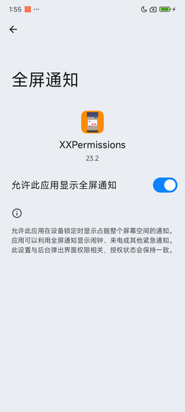
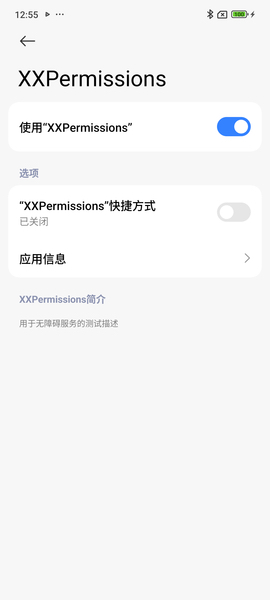
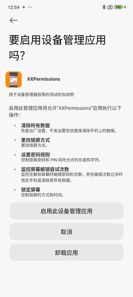
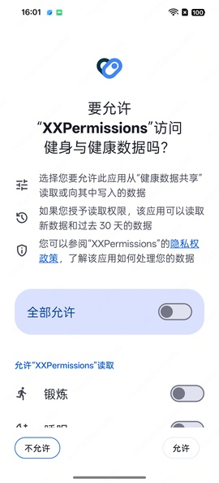
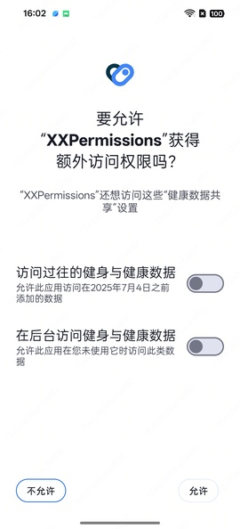

# [English Doc](README-en.md)

# 权限请求框架


* 项目地址：[Github](https://github.com/getActivity/XXPermissions)

* 博文地址：[月下载 40 万次的框架是怎么练成的？](https://juejin.cn/post/7547408384585629711)

* 可以扫码下载 Demo 进行演示或者测试，如果扫码下载不了的，[点击此处可直接下载](https://github.com/getActivity/XXPermissions/releases/download/26.8/XXPermissions.apk)


  

   

   

   

   

   

  

#### 集成步骤

* 如果你的项目 Gradle 配置是在 `7.0` 以下，需要在 `build.gradle` 文件中加入

```groovy
allprojects {
    repositories {
        // JitPack 远程仓库：https://jitpack.io
        maven { url 'https://jitpack.io' }
    }
}
```

* 如果你的 Gradle 配置是 `7.0` 及以上，则需要在 `settings.gradle` 文件中加入

```groovy
dependencyResolutionManagement {
    repositories {
        // JitPack 远程仓库：https://jitpack.io
        maven { url 'https://jitpack.io' }
    }
}
```

* 配置完远程仓库后，在项目 app 模块下的 `build.gradle` 文件中加入远程依赖

```groovy
android {
    // 支持 JDK 1.8 及以上
    compileOptions {
        targetCompatibility JavaVersion.VERSION_1_8
        sourceCompatibility JavaVersion.VERSION_1_8
    }
}

dependencies {
    // 设备兼容框架：https://github.com/getActivity/DeviceCompat
    implementation 'com.github.getActivity:DeviceCompat:2.3'
    // 权限请求框架：https://github.com/getActivity/XXPermissions
    implementation 'com.github.getActivity:XXPermissions:26.8'
}
```

#### Support 库兼容

* 方案一：沿用旧版本框架的远程依赖

```
dependencies {
    // 设备兼容框架：https://github.com/getActivity/DeviceCompat
    implementation 'com.github.getActivity:DeviceCompat:2.3'
    // 权限请求框架：https://github.com/getActivity/XXPermissions
    implementation 'com.github.getActivity:XXPermissions:26.8'
}
```

* 方案二：如果你的项目仍处于 Support 阶段，目前不方便转到 **AndroidX** 中来，但又想用最新版本的框架，可以使用 **Google** 提供的 [JetifierStandalone](https://developer.android.google.cn/tools/jetifier?hl=zh-cn#install) 工具将已发布版本 [Release](https://github.com/getActivity/XXPermissions/releases) 中的 **aar** 包通过反向模式转成 **Support** 版本的 **aar** 包来使用。

* 上述两种方案任选其一即可，但是仍旧不推荐你那样做，因为这些只是权宜之计，并非长久之计，框架后续的版本已不再支持 **Support** 项目，最好的方案是将项目迁移到 **AndroidX**。

* 将项目从 **Support** 迁移 **AndroidX** 相关的教程：[AndroidX 踩坑指南](https://juejin.cn/post/7053773917495754782)

#### 分区存储

* 如果项目已经适配了 Android 10 分区存储特性，请在 `AndroidManifest.xml` 中加入

```xml
<manifest>

    <application>

        <!-- 告知 XXPermissions 当前项目已经适配了分区存储特性 -->
        <meta-data
            android:name="ScopedStorage"
            android:value="true" />

    </application>

</manifest>
```

* 如果当前项目没有适配这特性，那么这一步骤可以忽略

* 需要注意的是：这个选项是框架用于判断当前项目是否适配了分区存储，需要注意的是，如果你的项目已经适配了分区存储特性，可以使用 `READ_EXTERNAL_STORAGE`、`WRITE_EXTERNAL_STORAGE` 来申请权限，如果你的项目还没有适配分区特性，就算申请了 `READ_EXTERNAL_STORAGE`、`WRITE_EXTERNAL_STORAGE` 权限也会导致无法正常读取外部存储上面的文件，如果你的项目没有适配分区存储，请使用 `MANAGE_EXTERNAL_STORAGE` 来申请权限，这样才能正常读取外部存储上面的文件，你如果想了解更多关于 Android 10 分区存储的特性，可以[点击此处查看和学习](https://github.com/getActivity/AndroidVersionAdapter#android-100)。

#### 框架混淆规则

* 框架已经在内部自动帮你添加了框架的混淆规则，在你添加框架的依赖远程库的时候，框架的混淆规则也会一同携带到你的项目中，你无需自己手动添加，具体的混淆规则内容 [可点击此处查看](library/proguard-permissions.pro)

#### 一句代码搞定权限请求，从未如此简单

* Java 用法示例

```java
XXPermissions.with(this)
    // 申请多个权限
    .permission(PermissionLists.getRecordAudioPermission())
    .permission(PermissionLists.getCameraPermission())
    // 设置不触发错误检测机制（局部设置）
    //.unchecked()
    .request(new OnPermissionCallback() {

        @Override
        public void onResult(@NonNull List<IPermission> grantedList, @NonNull List<IPermission> deniedList) {
            boolean allGranted = deniedList.isEmpty();
            if (!allGranted) {
                // 判断请求失败的权限是否被用户勾选了不再询问的选项
                boolean doNotAskAgain = XXPermissions.isDoNotAskAgainPermissions(activity, deniedList);
                // 在这里处理权限请求失败的逻辑
                ......
                return;
            }
            // 在这里处理权限请求成功的逻辑
            ......
        }
    });
```

* Kotlin 用法示例

```kotlin

XXPermissions.with(this)
    // 申请多个权限
    .permission(PermissionLists.getRecordAudioPermission())
    .permission(PermissionLists.getCameraPermission())
    // 设置不触发错误检测机制（局部设置）
    //.unchecked()
    .request(object : OnPermissionCallback {
        
        override fun onResult(grantedList: MutableList<IPermission>, deniedList: MutableList<IPermission>) {
            val allGranted = deniedList.isEmpty()
            if (!allGranted) {
                // 判断请求失败的权限是否被用户勾选了不再询问的选项
                val doNotAskAgain = XXPermissions.isDoNotAskAgainPermissions(activity, deniedList)
                // 在这里处理权限请求失败的逻辑
                // ......
                return
            }
            // 在这里处理权限请求成功的逻辑
            // ......
        }
    })
```

#### 框架其他 API 介绍

```java
// 判断一个或多个权限是否全部授予了
XXPermissions.isGrantedPermission(@NonNull Context context, @NonNull IPermission permission);
XXPermissions.isGrantedPermissions(@NonNull Context context, @NonNull IPermission[] permissions);
XXPermissions.isGrantedPermissions(@NonNull Context context, @NonNull List<IPermission> permissions);

// 从权限列表中获取已授予的权限
XXPermissions.getGrantedPermissions(@NonNull Context context, @NonNull IPermission[] permissions);
XXPermissions.getGrantedPermissions(@NonNull Context context, @NonNull List<IPermission> permissions);

// 从权限列表中获取没有授予的权限
XXPermissions.getDeniedPermissions(@NonNull Context context, @NonNull IPermission[] permissions);
XXPermissions.getDeniedPermissions(@NonNull Context context, @NonNull List<IPermission> permissions);

// 判断两个权限是否相等
XXPermissions.equalsPermission(@NonNull IPermission permission, @NonNull IPermission permission2);
XXPermissions.equalsPermission(@NonNull IPermission permission, @NonNull String permissionName);
XXPermissions.equalsPermission(@NonNull String permissionName1, @NonNull String permissionName2);

// 判断权限列表中是否包含某个权限
XXPermissions.containsPermission(@NonNull List<IPermission> permissions, @NonNull IPermission permission);
XXPermissions.containsPermission(@NonNull List<IPermission> permissions, @NonNull String permissionName);

// 判断某个权限是否为健康权限
XXPermissions.isHealthPermission(@NonNull IPermission permission);

// 判断一个或多个权限是否被勾选了《不再询问》的选项（一定要在权限申请的回调方法中调用才有效果）
XXPermissions.isDoNotAskAgainPermission(@NonNull Activity activity, @NonNull IPermission permission);
XXPermissions.isDoNotAskAgainPermissions(@NonNull Activity activity, @NonNull IPermission[] permissions);
XXPermissions.isDoNotAskAgainPermissions(@NonNull Activity activity, @NonNull List<IPermission> permissions);

// 跳转到权限设置页（Context 版本）
XXPermissions.startPermissionActivity(@NonNull Context context);
XXPermissions.startPermissionActivity(@NonNull Context context, @NonNull IPermission... permissions);
XXPermissions.startPermissionActivity(@NonNull Context context, @NonNull List<IPermission> permissions);

// 跳转到权限设置页（Activity 版本）
XXPermissions.startPermissionActivity(@NonNull Activity activity);
XXPermissions.startPermissionActivity(@NonNull Activity activity, @NonNull IPermission... permissions);
XXPermissions.startPermissionActivity(@NonNull Activity activity, @NonNull List<IPermission> permissions);
XXPermissions.startPermissionActivity(@NonNull Activity activity, @NonNull List<IPermission> permissions, @IntRange(from = 1, to = 65535) int requestCode);
XXPermissions.startPermissionActivity(@NonNull Activity activity, @NonNull IPermission permission, @Nullable OnPermissionCallback callback);
XXPermissions.startPermissionActivity(@NonNull Activity activity, @NonNull List<IPermission> permissions, @Nullable OnPermissionCallback callback);

// 跳转到权限设置页（Android Fragment 版本）
XXPermissions.startPermissionActivity(@NonNull Fragment fragment);
XXPermissions.startPermissionActivity(@NonNull Fragment fragment, @NonNull IPermission... permissions);
XXPermissions.startPermissionActivity(@NonNull Fragment fragment, @NonNull List<IPermission> permissions);
XXPermissions.startPermissionActivity(@NonNull Fragment fragment, @NonNull List<IPermission> permissions, @IntRange(from = 1, to = 65535) int requestCode);
XXPermissions.startPermissionActivity(@NonNull Fragment fragment, @NonNull IPermission permission, @Nullable OnPermissionCallback callback);
XXPermissions.startPermissionActivity(@NonNull Fragment fragment, @NonNull List<IPermission> permissions, @Nullable OnPermissionCallback callback);

// 跳转到权限设置页（AndroidX Fragment 版本）
XXPermissions.startPermissionActivity(@NonNull androidx.fragment.app.Fragment xFragment);
XXPermissions.startPermissionActivity(@NonNull androidx.fragment.app.Fragment xFragment, @NonNull IPermission... permissions);
XXPermissions.startPermissionActivity(@NonNull androidx.fragment.app.Fragment xFragment, @NonNull List<IPermission> permissions);
XXPermissions.startPermissionActivity(@NonNull androidx.fragment.app.Fragment xFragment, @NonNull List<IPermission> permissions, @IntRange(from = 1, to = 65535) int requestCode);
XXPermissions.startPermissionActivity(@NonNull androidx.fragment.app.Fragment xFragment, @NonNull IPermission permission, @Nullable OnPermissionCallback callback);
XXPermissions.startPermissionActivity(@NonNull androidx.fragment.app.Fragment xFragment, @NonNull List<IPermission> permissions, @Nullable OnPermissionCallback callback);

// 设置权限描述器（全局设置）
XXPermissions.setPermissionDescription(Class<? extends OnPermissionDescription> clazz);

// 设置权限申请拦截器（全局设置）
XXPermissions.setPermissionInterceptor(Class<? extends OnPermissionInterceptor> clazz);

// 设置是否开启错误检测模式（全局设置）
XXPermissions.setCheckMode(boolean checkMode);
```

#### 同类权限请求框架之间的对比

|         适配细节         | [XXPermissions](https://github.com/getActivity/XXPermissions)  | [AndPermission](https://github.com/yanzhenjie/AndPermission) | [PermissionX](https://github.com/guolindev/PermissionX) |  [AndroidUtilCode-PermissionUtils](https://github.com/Blankj/AndroidUtilCode)   | [PermissionsDispatcher](https://github.com/permissions-dispatcher/PermissionsDispatcher) | [RxPermissions](https://github.com/tbruyelle/RxPermissions) |  [EasyPermissions](https://github.com/googlesamples/easypermissions) |  [Dexter](https://github.com/Karumi/Dexter) |
|:--------------------:| :------------: | :------------: | :------------: | :------------: | :------------: | :------------: | :------------: | :------------: |
|         对应版本         |  26.8 |  2.0.3  |  1.8.1    |  1.31.0    |   4.9.2  |  0.12   |  3.0.0   |  6.2.3   |
|       issues 数       |  [](https://github.com/getActivity/XXPermissions/issues)  |  [](https://github.com/yanzhenjie/AndPermission/issues)  |  [](https://github.com/guolindev/PermissionX/issues)  |  [](https://github.com/Blankj/AndroidUtilCode/issues)  |  [](https://github.com/permissions-dispatcher/PermissionsDispatcher/issues)  |  [](https://github.com/tbruyelle/RxPermissions/issues)  |  [](https://github.com/googlesamples/easypermissions/issues)  |  [](https://github.com/Karumi/Dexter/issues)  |
|        框架维护状态        |**维护中**|  停止维护 | 停止维护 |  停止维护 | 停止维护 | 停止维护 | 停止维护 | 停止维护 |
|       读取应用列表权限       |  ✅  |  ❌  |  ❌  |  ❌  |  ❌  |  ❌  |  ❌  |  ❌  |
|        闹钟提醒权限        |  ✅  |  ❌  |  ❌  |  ❌  |  ❌  |  ❌  |  ❌  |  ❌  |
|       所有文件管理权限       |  ✅  |  ❌  |  ✅  |  ❌  |  ❌  |  ❌  |  ❌  |  ❌  |
|        安装包权限         |  ✅  |  ✅  |  ✅  |  ❌  |  ❌  |  ❌  |  ❌  |  ❌  |
|        画中画权限         |  ✅  |  ❌  |  ❌  |  ❌  |  ❌  |  ❌  |  ❌  |  ❌  |
|        悬浮窗权限         |  ✅  |  ✅  |  ✅  |  ✅  |  ✅  |  ❌  |  ❌  |  ❌  |
|        系统设置权限        |  ✅  |  ✅  |  ✅  |  ✅  |  ✅  |  ❌  |  ❌  |  ❌  |
|        通知栏权限         |  ✅  |  ✅  |  ❌  |  ❌  |  ❌  |  ❌  |  ❌  |  ❌  |
|       通知栏渠道权限        |  ✅  |  ❌  |  ❌  |  ❌  |  ❌  |  ❌  |  ❌  |  ❌  |
|       通知栏监听权限        |  ✅  |  ✅  |  ❌  |  ❌  |  ❌  |  ❌  |  ❌  |  ❌  |
|         勿扰权限         |  ✅  |  ❌  |  ❌  |  ❌  |  ❌  |  ❌  |  ❌  |  ❌  |
|       忽略电池优化权限       |  ✅  |  ❌  |  ❌  |  ❌  |  ❌  |  ❌  |  ❌  |  ❌  |
|      查看应用使用情况权限      |  ✅  |  ❌  |  ❌  |  ❌  |  ❌  |  ❌  |  ❌  |  ❌  |
|        全屏通知权限        |  ✅  |  ❌  |  ❌  |  ❌  |  ❌  |  ❌  |  ❌  |  ❌  |
|        VPN 权限        |  ✅  |  ❌  |  ❌  |  ❌  |  ❌  |  ❌  |  ❌  |  ❌  |
|        无障碍权限         |  ✅  |  ❌  |  ❌  |  ❌  |  ❌  |  ❌  |  ❌  |  ❌  |
|       设备管理器权限        |  ✅  |  ❌  |  ❌  |  ❌  |  ❌  |  ❌  |  ❌  |  ❌  |
|        管理媒体权限        |  ✅  |  ❌  |  ❌  |  ❌  |  ❌  |  ❌  |  ❌  |  ❌  |
|   Intent 跳转极限兜底机制    |  ✅  |  ❌  |  ❌  |  ❌  |  ❌  |  ❌  |  ❌  |  ❌  |
|   兼容请求权限 API 崩溃问题    |  ✅  |  ❌  |  ❌  |  ❌  |  ❌  |  ❌  |  ❌  |  ❌  |
|    规避系统权限回调空指针问题     |  ✅  |   ✅  |  ❌  |  ❌  |  ❌  |  ❌  |  ❌  |  ❌  |
|      应用商店权限合规处理      |  ✅  |  ❌  |  ❌   |   ✅  |  ❌  |  ❌  |  ❌  |  ❌  |
|      自动拆分权限进行请求      |  ✅  |  ❌  |  ❌  |  ❌  |  ❌  |  ❌  |  ❌  |  ❌  |
|    框架内部完全剥离 UI 层     |  ✅  |  ❌  |  ❌  |  ❌  |  ❌  |  ❌  |  ❌  |  ❌  |
|    核心逻辑和具体权限完全解耦     |  ✅  |  ❌  |  ❌  |  ❌  |  ❌  |  ✅  |  ✅  |  ✅  |
|       自动适配后台权限       |  ✅  |  ❌  |  ❌  |  ❌  |  ❌  |  ❌  |  ❌  |  ❌  |
|     支持在跨平台环境中调用      |  ✅  |  ✅  |  ❌  |  ✅  |  ❌  |  ❌  |  ✅  |  ✅  |
|    回调生命周期与宿主保持同步     |  ✅  |  ❌  |  ❌  |  ❌  |  ❌  |  ❌  |  ❌  |  ❌  |
|      支持自定义权限申请       |  ✅  |  ❌  |  ❌  |  ❌  |  ❌  |  ❌  |  ❌  |  ❌  |
|      支持读取应用列表权限      |  ✅  |  ❌  |  ❌  |  ❌  |  ❌  |  ❌  |  ❌  |  ❌  |
|     新版本权限支持向下兼容      |  ✅  |  ❌  |  ❌  |  ❌  |  ❌  |  ❌  |  ❌  |  ❌  |
|       屏幕旋转场景适配       |  ✅  |  ❌  |  ✅  |  ❌ |  ❌  |  ❌   |  ❌  |  ❌  |
|      后台申请权限场景适配      |  ✅  |  ❌  |  ❌  |  ❌  |  ❌  |  ❌  |  ❌  |  ❌  |
| 修复 Android 12 内存泄漏问题 |  ✅  |  ❌  |  ❌  |  ❌  |  ❌  |  ❌  |  ❌  |  ❌  |
|      第三方厂商兼容性优化      |  ✅  |  ❌  |  ❌  |  ❌  |  ❌  |  ❌  |  ❌  |  ❌  |
|       支持检测代码错误       |  ✅  |  ❌  |  ❌  |  ❌  |  ❌  |  ❌  |  ❌  |  ❌  |

#### [具体实现细节请点击这里查看](Details-zh.md)

#### [其他常见疑问请点击此处查看](HelpDoc-zh.md)

#### 框架亮点

* 一马当先：首款适配 Android 16 的权限请求框架

* 简洁易用：采用链式调用的方式，使用只需一句代码

* 支持全面：首款也是唯一一款适配所有 Android 版本的权限请求框架

* 技术难题攻坚：首款解决权限申请在 Android 12 出现系统内存泄漏的框架

* 适配极端情况：无论在多么极端恶劣的环境下申请权限，框架依然坚挺

* 向下兼容属性：新权限在旧系统可以正常申请，框架会做自动适配，无需调用者适配

* 自动检测错误：如果出现错误框架会主动抛出异常给调用者（仅在 Debug 下判断，把 Bug 扼杀在摇篮中）

#### 作者的其他开源项目

* 安卓技术中台：[AndroidProject](https://github.com/getActivity/AndroidProject)  

* 安卓技术中台 Kt 版：[AndroidProject-Kotlin](https://github.com/getActivity/AndroidProject-Kotlin)  

* 吐司框架：[Toaster](https://github.com/getActivity/Toaster)  

* 网络框架：[EasyHttp](https://github.com/getActivity/EasyHttp)  

* 标题栏框架：[TitleBar](https://github.com/getActivity/TitleBar)  

* 悬浮窗框架：[EasyWindow](https://github.com/getActivity/EasyWindow)  

* 设备兼容框架：[DeviceCompat](https://github.com/getActivity/DeviceCompat)  

* ShapeView 框架：[ShapeView](https://github.com/getActivity/ShapeView)  

* ShapeDrawable 框架：[ShapeDrawable](https://github.com/getActivity/ShapeDrawable)  

* 语种切换框架：[MultiLanguages](https://github.com/getActivity/MultiLanguages)  

* Gson 解析容错：[GsonFactory](https://github.com/getActivity/GsonFactory)  

* 日志查看框架：[Logcat](https://github.com/getActivity/Logcat)  

* 嵌套滚动布局框架：[NestedScrollLayout](https://github.com/getActivity/NestedScrollLayout)  

* Android 版本适配：[AndroidVersionAdapter](https://github.com/getActivity/AndroidVersionAdapter)  

* Android 代码规范：[AndroidCodeStandard](https://github.com/getActivity/AndroidCodeStandard)  

* Android 资源大汇总：[AndroidIndex](https://github.com/getActivity/AndroidIndex)  

* Android 开源排行榜：[AndroidGithubBoss](https://github.com/getActivity/AndroidGithubBoss)  

* Studio 精品插件：[StudioPlugins](https://github.com/getActivity/StudioPlugins)  

* 表情包大集合：[EmojiPackage](https://github.com/getActivity/EmojiPackage)  

* AI 资源大汇总：[AiIndex](https://github.com/getActivity/AiIndex)  

* 省市区 Json 数据：[ProvinceJson](https://github.com/getActivity/ProvinceJson)  

* Markdown 语法文档：[MarkdownDoc](https://github.com/getActivity/MarkdownDoc)  

#### 微信公众号：Android轮子哥


#### Android 技术 Q 群：10047167

#### 如果您觉得我的开源库帮你节省了大量的开发时间，请扫描下方的二维码随意打赏，要是能打赏个 10.24 :monkey_face:就太:thumbsup:了。您的支持将鼓励我继续创作:octocat:（[点击查看捐赠列表](https://github.com/getActivity/Donate)）

 

## License

```text
Copyright 2018 Huang JinQun

Licensed under the Apache License, Version 2.0 (the "License");
you may not use this file except in compliance with the License.
You may obtain a copy of the License at

   http://www.apache.org/licenses/LICENSE-2.0

Unless required by applicable law or agreed to in writing, software
distributed under the License is distributed on an "AS IS" BASIS,
WITHOUT WARRANTIES OR CONDITIONS OF ANY KIND, either express or implied.
See the License for the specific language governing permissions and
limitations under the License.
```