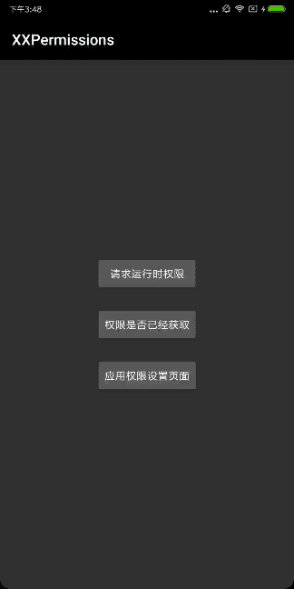

# 权限请求框架

>[点击此处下载Demo](https://raw.githubusercontent.com/getActivity/XXPermissions/master/XXPermissions.apk)，[博文地址：一句代码搞定权限请求，从未如此简单](https://www.jianshu.com/p/c69ff8a445ed)

> 另外想对Android 6.0权限需要深入了解的，可以看这篇文章[Android 6.0运行权限解析（高级篇）](https://www.jianshu.com/p/6a4dff744031)



#### 集成步骤

    dependencies {
        implementation 'com.hjq:xxpermissions:5.2'
    }

#### 一句代码搞定权限请求，从未如此简单

> [点此查看完整的示例代码](https://github.com/getActivity/XXPermissions/blob/master/app/src/main/java/com/hjq/permissions/demo/MainActivity.java)

    XXPermissions.with(this)
            //.constantRequest() //可设置被拒绝后继续申请，直到用户授权或者永久拒绝
            //.permission(Permission.SYSTEM_ALERT_WINDOW, Permission.REQUEST_INSTALL_PACKAGES) //支持请求6.0悬浮窗权限8.0请求安装权限
            .permission(Permission.Group.STORAGE, Permission.Group.CALENDAR) //不指定权限则自动获取清单中的危险权限
            .request(new OnPermission() {

                @Override
                public void hasPermission(List<String> granted, boolean isAll) {
                    
                }

                @Override
                public void noPermission(List<String> denied, boolean quick) {
                    
                }
            });

#### 是否有这个权限

    if (XXPermissions.isHasPermission(this, Permission.Group.STORAGE)) {
		
    }

#### 跳转到设置页面

    XXPermissions.gotoPermissionSettings(this);

#### 框架亮点

* 简洁易用，采用链式调用的方式，使用只需一句代码

* 支持单个权限、多个权限、单个权限组、多个权限组请求

* 不指定权限则自动获取清单文件上的危险权限进行申请

* 如果动态申请的权限没有在清单文件中注册会抛出异常

* 支持大部分国产手机直接跳转到具体的权限设置页面

* 可设置被拒绝后继续申请，直到用户授权或者永久拒绝

* 支持请求6.0及以上的悬浮窗权限和8.0及以上的安装权限

* 本框架不依赖AppCompatSupport库，兼容Eclipse和Studio

#### 混淆规则

    -dontwarn com.hjq.permissions.**

#### 常见问题

> 我们都知道，如果用户全部授予只会调用hasPermission方法，如果用户全部拒绝只会调用noPermission方法。

> 但是还有一种情况，如果在请求多种权限的情况下，这些权限不是被全部授予或者全部拒绝了，而是部分授权部分拒绝这种情况，框架会如何处理回调呢？

> 框架会先调用noPermission方法，再调用hasPermission方法。其中我们可以通过hasPermission方法中的isAll参数来判断权限是否全部授予了。如果想知道回调中的某个权限是否被授权或者拒绝，可以调用List集合类中的contains(Permission.XXX)方法来判断这个集合中是否包含了这个权限。

#### Android技术讨论Q群：78797078

## License

```text
Copyright 2018 Huang Jinqun

Licensed under the Apache License, Version 2.0 (the "License");
you may not use this file except in compliance with the License.
You may obtain a copy of the License at

   http://www.apache.org/licenses/LICENSE-2.0

Unless required by applicable law or agreed to in writing, software
distributed under the License is distributed on an "AS IS" BASIS,
WITHOUT WARRANTIES OR CONDITIONS OF ANY KIND, either express or implied.
See the License for the specific language governing permissions and
limitations under the License.
```
