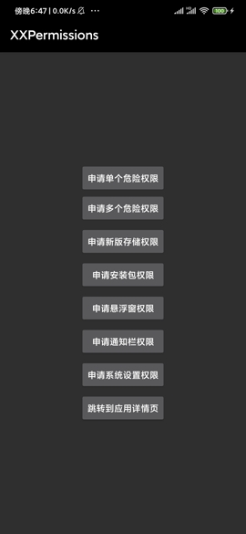
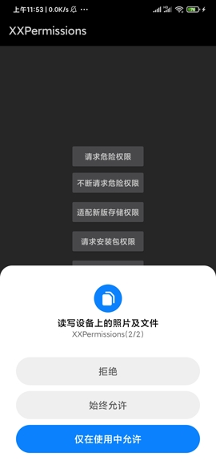
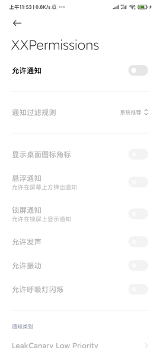
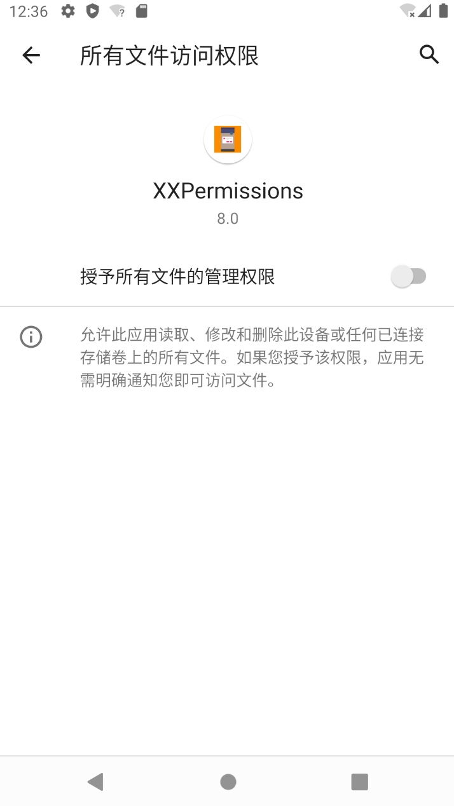
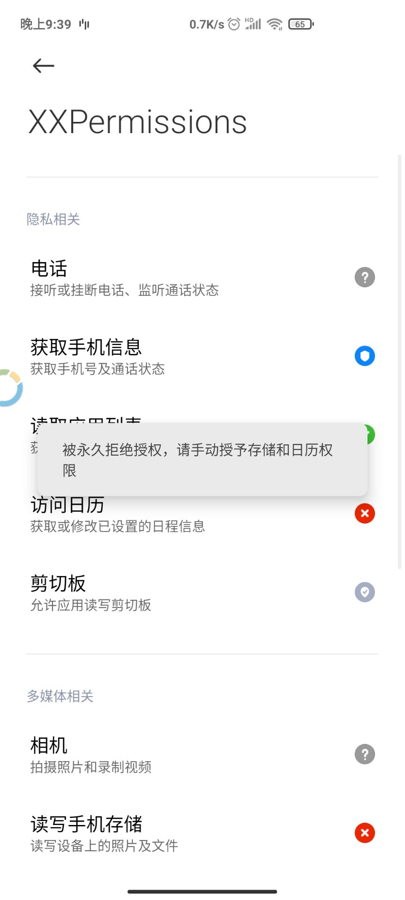
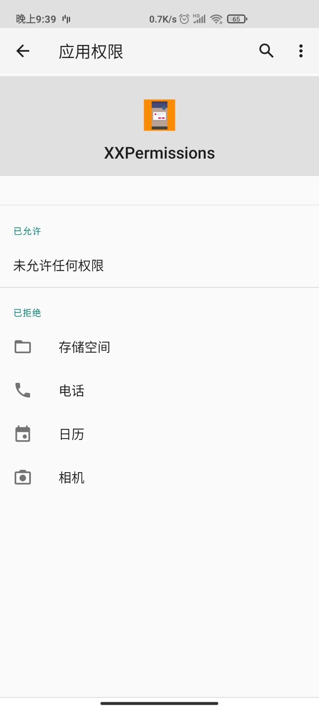

# 权限请求框架

* 码云地址：[Gitee](https://gitee.com/getActivity/XXPermissions)

* [博文地址：一句代码搞定权限请求，从未如此简单](https://www.jianshu.com/p/c69ff8a445ed)

* [点击此处下载Demo](XXPermissions.apk)

* 另外想对 Android 6.0 权限需要深入了解的，可以看这篇文章[Android 6.0 运行权限解析](https://www.jianshu.com/p/6a4dff744031)

  
  

#### 集成步骤

```groovy
dependencies {
    // 权限请求框架：https://github.com/getActivity/XXPermissions
    implementation 'com.hjq:xxpermissions:9.6'
}
```

#### 一句代码搞定权限请求，从未如此简单

```java
XXPermissions.with(this)
        // 申请安装包权限
        //.permission(Permission.REQUEST_INSTALL_PACKAGES)
        // 申请悬浮窗权限
        //.permission(Permission.SYSTEM_ALERT_WINDOW)
        // 申请通知栏权限
        //.permission(Permission.NOTIFICATION_SERVICE)
        // 申请系统设置权限
        //.permission(Permission.WRITE_SETTINGS)
        // 申请单个权限
        .permission(Permission.RECORD_AUDIO)
        // 申请多个权限
        .permission(Permission.Group.CALENDAR)
        .request(new OnPermissionCallback() {

            @Override
            public void onGranted(List<String> permissions, boolean all) {
                if (all) {
                    toast("获取录音和日历权限成功");
                } else {
                    toast("获取部分权限成功，但部分权限未正常授予");
                }
            }

            @Override
            public void onDenied(List<String> permissions, boolean never) {
                if (never) {
                    toast("被永久拒绝授权，请手动授予录音和日历权限");
                    // 如果是被永久拒绝就跳转到应用权限系统设置页面
                    XXPermissions.startPermissionActivity(MainActivity.this, permissions);
                } else {
                    toast("获取录音和日历权限失败");
                }
            }
        });
```
#### 从系统权限设置页返回判断

```java
public class XxxActivity extends AppCompatActivity {

    @Override
    protected void onActivityResult(int requestCode, int resultCode, @Nullable Intent data) {
        super.onActivityResult(requestCode, resultCode, data);
        if (requestCode == XXPermissions.REQUEST_CODE) {
            if (XXPermissions.isGrantedPermission(this, Permission.RECORD_AUDIO) &&
                    XXPermissions.isGrantedPermission(this, Permission.Group.CALENDAR)) {
                toast("用户已经在权限设置页授予了录音和日历权限");
            } else {
                toast("用户没有在权限设置页授予权限");
            }
        }
    }
}
```

#### 关于权限监听回调参数说明

* 我们都知道，如果用户全部授予只会调用 `onGranted` 方法，如果用户全部拒绝只会调用 `onDenied` 方法。

* 但是还有一种情况，如果在请求多组权限的情况下，这些权限不是被全部授予或者全部拒绝了，而是部分授权部分拒绝这种情况，框架会如何处理回调呢？

* 框架会先调用 `onDenied` 方法，再调用 `onGranted` 方法。其中我们可以通过 `onGranted` 方法中的 `all` 参数来判断权限是否全部授予了。

* 如果想知道回调中的某个权限是否被授权或者拒绝，可以调用 `List` 类中的 `contains(Permission.XXX)` 方法来判断这个集合中是否包含了这个权限。

#### Android 11 定位权限适配

* 在 Android 10 上面，定位被划分为前台权限（精确和模糊）和后台权限，而到了 Android 11 上面，需要分别申请这两种权限，如果同时申请这两种权限会惨遭系统无情拒绝，连权限申请对话框都不会弹，直接被系统拒绝，导致定位权限申请失败。

* 如果你使用的是 XXPermissions 最新版本，那么恭喜你，直接将前台定位权限和后台定位权限全部传给框架即可，框架已经自动帮你把这两种权限分开申请了，整个适配过程零成本。

#### Android 11 存储权限适配

* 如果你的项目需要适配 Android 11 存储权限，那么需要先将 targetSdkVersion 进行升级

```groovy
android 
    defaultConfig {
        targetSdkVersion 30
    }
}
```

* 再添加 Android 11 存储权限注册到清单文件中

```xml
<uses-permission android:name="android.permission.MANAGE_EXTERNAL_STORAGE" />
```

* 需要注意的是，旧版的存储权限也需要在清单文件中注册，因为在低于 Android 11 的环境下申请存储权限，框架会自动切换到旧版的申请方式

```xml
<uses-permission android:name="android.permission.READ_EXTERNAL_STORAGE" />
<uses-permission android:name="android.permission.WRITE_EXTERNAL_STORAGE" />
```

* 还需要在清单文件中加上这个属性，否则在 Android 10 的设备上将无法正常读写外部存储上的文件

```xml
<application
    android:requestLegacyExternalStorage="true">
```
    
* 最后直接调用下面这句代码

```java
XXPermissions.with(this)
        // 不适配 Android 11 可以这样写
        //.permission(Permission.Group.STORAGE)
        // 适配 Android 11 需要这样写，这里无需再写 Permission.Group.STORAGE
        .permission(Permission.MANAGE_EXTERNAL_STORAGE)
        .request(new OnPermissionCallback() {

            @Override
            public void onGranted(List<String> permissions, boolean all) {
                if (all) {
                    toast("获取存储权限成功");
                }
            }

            @Override
            public void onDenied(List<String> permissions, boolean never) {
                if (never) {
                    toast("被永久拒绝授权，请手动授予存储权限");
                    // 如果是被永久拒绝就跳转到应用权限系统设置页面
                    XXPermissions.startPermissionActivity(MainActivity.this, permissions);
                } else {
                    toast("获取存储权限失败");
                }
            }
        });
```



#### 不同权限请求框架之间的对比

|     功能及细节    | [XXPermissions](https://github.com/getActivity/XXPermissions)  | [AndPermission](https://github.com/yanzhenjie/AndPermission) | [RxPermissions](https://github.com/tbruyelle/RxPermissions) | [PermissionsDispatcher](https://github.com/permissions-dispatcher/PermissionsDispatcher) |  [EasyPermissions](https://github.com/googlesamples/easypermissions) | [PermissionX](https://github.com/guolindev/PermissionX)
| :--------: | :------------: | :------------: | :------------: | :------------: | :------------: | :------------: |
|    对应版本  |  9.6 |  2.0.3  |  0.12   |   4.8.0  |  3.0.0   |  1.4.0    |
|    minSdk 要求  |  API 11+ |  API 14+  |  API 14+   |   API 14+   |  API 14+   |  API 15+    |
|    class 文件数量  |  7 个  | 110 个  |  3 个  |   37 个  |   15 个  |  16 个   |
|    aar 包大小  |  [19 KB](https://bintray.com/getactivity/maven/xxpermissions#files/com/hjq/xxpermissions)  | [127 KB](https://mvnrepository.com/artifact/com.yanzhenjie/permission)  |  [28 KB](https://jitpack.io/#com.github.tbruyelle/rxpermissions)  |   [22 KB](https://bintray.com/hotchemi/org.permissionsdispatcher/permissionsdispatcher#files/org/permissionsdispatcher/permissionsdispatcher)  |  [48 KB](https://bintray.com/easygoogle/EasyPermissions/easypermissions#files/pub/devrel/easypermissions)   |   [32 KB](https://bintray.com/guolindev/maven/permissionx#files/com/permissionx/guolindev/permissionx)  |
|   安装包权限   |  ✅  |  ✅  |  ❌  |  ❌   |  ❌   |  ❌   |
|   悬浮窗权限   |  ✅  |  ✅  |  ❌  |  ❌   |  ❌   |  ❌   |
|   通知栏权限   |  ✅  |  ✅  |  ❌  |  ❌   |   ❌  |  ❌   |
|   系统设置权限   |  ✅  |  ✅  |  ❌  |  ❌   |   ❌  |  ❌   |
|   Android 8.0 权限适配   |  ✅  |  ✅  |  ❌  |   ✅  |  ❌   |   ✅  |
|   Android 9.0 权限适配   |  ✅  |  ❌  |  ❌  |   ✅  |  ❌   |   ❌  |
|   Android 10.0 权限适配  |  ✅  |  ✅  |  ❌  |   ✅  |  ❌   |   ✅  |
|   Android 11 新版存储权限   |  ✅  |  ❌  |  ❌  |   ❌  |  ❌   |   ❌  |
|   Android 11 新版定位策略   |  ✅  |  ❌  |  ❌  |   ❌  |  ❌   |   ❌  |

#### 框架亮点

* 首款也是唯一一款适配 Android 11 的权限请求框架

* 首款也是唯一一款适配所有安卓版本的权限请求框架

* 简洁易用，采用链式调用的方式，使用只需一句代码

* 支持单个权限、多个权限、单个权限组、多个权限组请求

* 支持申请安装包、悬浮窗、通知栏、系统设置权限

* 支持所有危险权限的申请，包含 6.0 之后出现的新权限

* 向下兼容属性，新权限在旧系统可以正常申请，无需调用者适配

* 本框架不依赖任何第三方库，整个框架大小只有 19 kb（是同类框架中体积最小的）

* 如果申请的权限没有在清单文件中注册会抛出异常（仅在 Debug 模式下判断）

* 如果申请的权限和项目 targetSdkVersion 不符合要求会抛出异常（仅在 Debug 模式下判断）

#### 为什么不兼容 Android 6.0 以下的权限申请？

* 因为 Android 6.0 以下的权限管理是手机厂商做的，那个时候谷歌还没有统一权限管理的方案，所以就算我们的应用没有适配也不会有任何问题，因为手机厂商对这块有自己的处理，但是有一点是肯定的，就算用户拒绝了授权，也不会导致应用崩溃，只会返回空白的通行证。

* 如果 XXPermissions 做这块的适配也可以做到，通过反射系统服务 AppOpsManager 类中的字段即可，但是并不能保证权限判断的准确性，可能会存在一定的误差，其次是适配的成本太高，因为国内手机厂商太多，对这块的改动参差不齐。

* 考虑到 Android 6.0 以下的设备占比很低，后续也会越来越少，会逐步退出历史的舞台，所以我的决定是不对这块做适配。

#### 新版 XXPermissions 为什么移除了国产手机权限设置页功能？

* XXPermissions 9.0 及之前是有存在这一功能的，但是我在后续的版本上面将这个功能移除了，原因是有很多人跟我反馈这个功能其实存在很大的缺陷，例如在一些华为新机型上面可能跳转的页面不是应用的权限设置页，而是所有应用的权限管理列表界面。

* 其实不止华为有问题，小米同样有问题，有很多人跟我反馈过同一个问题，XXPermissions 跳转到国产手机权限设置页，用户正常授予了权限之后返回仍然检测到权限仍然是拒绝的状态，这个问题反馈的次数很多，但是迟迟不能排查到原因，终于在最后一次得到答案了，[有人](https://github.com/getActivity/XXPermissions/issues/38)帮我排查到是 miui 优化开关的问题（小米手机 ---> 开发者选项 ---> 启用 miui 优化），那么问题来了，这个开关有什么作用？是如何影响到 XXPermissions 的？

* 首先这个问题要从 XXPermissions 跳转到国产手机设置页的原理讲起，从谷歌提供的原生 API 我们最多只能跳转到应用详情页，并不能直接跳转到权限设置页，而需要用户在应用详情页再次点击才能进入权限设置页。如果从用户体验的角度上看待这个问题，肯定是直接跳转到权限设置页是最好的，但是这种方式是不受谷歌支持的，当然也有方法实现，网上都有一个通用的答案，就是直接捕获某个品牌手机的权限设置页 `Activity` 包名然后进行跳转。这种想法的起点是好的，但是存在许多问题，并不能保证每个品牌的所有机型都能适配到位，手机产商更改这个 `Activity` 的包名的次数和频率比较高，在最近发布的一些新的华为机型上面几乎已经全部失效，也就是 `startActivity` 的时候会报 `ActivityNotFoundException` 或 `SecurityException ` 异常，当然这些异常是可以被捕捉到的，但是仅仅只能捕获到崩溃，一些非崩溃的行为我们并不能从中得知和处理，例如我刚刚讲过的华为和小米的问题，这些问题并不能导致崩溃，但是会导致功能出现异常。

* 而 miui 优化开关是小米工程师预留的切换 miui 和原生的功能开关，例如在这个开关开启的时候，在应用详情页点击权限管理会跳转到小米的权限设置页，如果这个开关是关闭状态（默认是开启状态），在应用详情页点击权限管理会跳转到谷歌原生的权限设置页，具体效果如图：





* 最大的问题在于：这两个界面是不同的 Activity，一个是小米定制的权限设置页，第二个是谷歌原生的权限设置页，当 miui 优化开启的时候，在小米定制的权限设置页授予权限才能有效果，当这个 miui 优化关闭的时候，在谷歌原生的权限设置页授予权限才能有效果。而跳转到国产手机页永远只会跳转到小米定制的那个权限设置页，所以就会导致当 miui 优化关闭的时候，使用代码跳转到小米权限设置页授予了权限之后返回仍然显示失败的问题。

* 有人可能会说，解决这个问题的方式很简单，判断 miui 优化开关，如果是开启状态就跳转到小米定制的权限设置页，如果是关闭状态就跳转到谷歌原生的权限设置页，这样不就可以了？其实这个解决方案我也有尝试过，我曾委托联系到在小米工作的 miui 工程师，也有人帮我反馈这个问题给小米那边，最后得到答复都是一致的。


* 另外值得一提的是 [Android 11 对软件包可见性进行了限制](https://developer.android.google.cn/about/versions/11/privacy/package-visibility)，所以这种跳包名的方式在未来将会完全不可行。

* 最终决定：这个功能的出发点是好的，但是我们没办法做好它，经过慎重考虑，决定将这个功能在 XXPermissions 9.2 版本及之后的版本进行移除。

#### 作者的其他开源项目

* 安卓技术中台：[AndroidProject](https://github.com/getActivity/AndroidProject)

* 网络框架：[EasyHttp](https://github.com/getActivity/EasyHttp)

* 日志框架：[Logcat](https://github.com/getActivity/Logcat)

* 吐司框架：[ToastUtils](https://github.com/getActivity/ToastUtils)

* 标题栏框架：[TitleBar](https://github.com/getActivity/TitleBar)

* 国际化框架：[MultiLanguages](https://github.com/getActivity/MultiLanguages)

* 悬浮窗框架：[XToast](https://github.com/getActivity/XToast)

* Gson 解析容错：[GsonFactory](https://github.com/getActivity/GsonFactory)

#### Android技术讨论Q群：78797078

#### 如果您觉得我的开源库帮你节省了大量的开发时间，请扫描下方的二维码随意打赏，要是能打赏个 10.24 :monkey_face:就太:thumbsup:了。您的支持将鼓励我继续创作:octocat:

 

#### [点击查看捐赠列表](https://github.com/getActivity/Donate)

## License

```text
Copyright 2018 Huang JinQun

Licensed under the Apache License, Version 2.0 (the "License");
you may not use this file except in compliance with the License.
You may obtain a copy of the License at

   http://www.apache.org/licenses/LICENSE-2.0

Unless required by applicable law or agreed to in writing, software
distributed under the License is distributed on an "AS IS" BASIS,
WITHOUT WARRANTIES OR CONDITIONS OF ANY KIND, either express or implied.
See the License for the specific language governing permissions and
limitations under the License.
```
